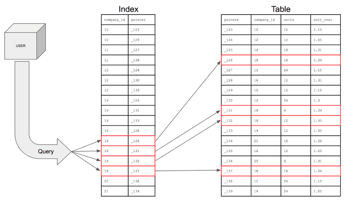
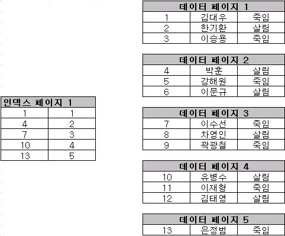
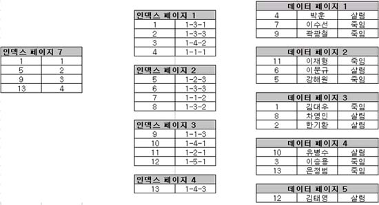
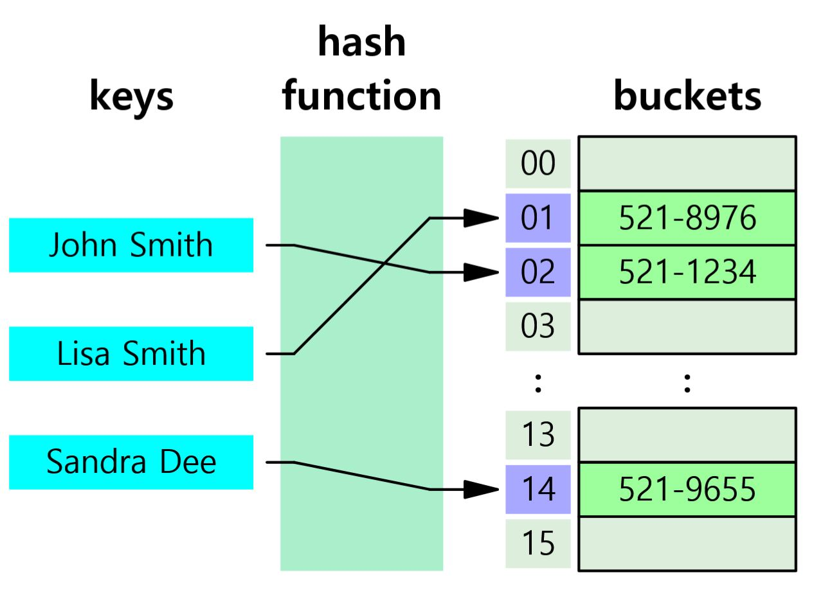
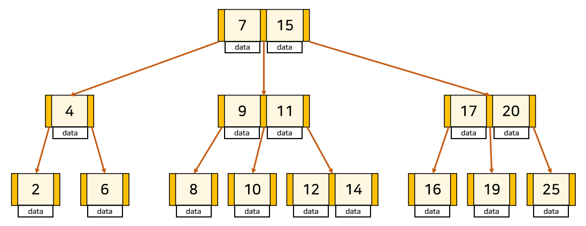

# 제목 없음

# 1. 인덱스란?

Index라는 영어 단어를 한글로 해석해보면 **목차**이다. 목차라는 것은 책에서 특정 내용이 어디에 위치해있는지에 대한 정보를 제공해주는 페이지로 독자가 원하는 내용을 쉽고 빠르게 찾을 수 있도록 도와주는 역할을 한다.

	 
	<em>그림 1) DB 인덱스</em>

DB에서의 인덱스도 마찬가지이다. 특정 테이블에서 원하는 데이터를 조회할 때 인덱스라는 특별한 자료 구조를 이용하여 내가 원하는 정보를 검색할 때 테이블 전체를 탐색하지 않고 해당 인덱스를 바탕으로 원하는 데이터의 위치를 빠르게 검색할 수 있다.

# 2. 인덱스의 장단점

## 장점

인덱스의 장점은 위에서 설명했듯이 테이블의 검색 속도를 향상시켜준다. 기존에는 데이터가 어디에 위치해있는지를 알 수 없어서 테이블 전체를 비교해야 하는 `풀 테이블 스캔` 작업이 필요했는데 인덱스를 이용해 데이터들을 정렬하여 조건에 맞는 데이터를 빠르게 찾을 수 있다.

## 단점

인덱스는 항상 정렬을 시켜놓아야 한다. 그렇기 때문에 위의 장점이 생기지만, 단점도 존재한다.

1. 인덱스를 관리하기 위한 유지보수 작업이 추가로 필요하다.

   - INSERT : 새로운 데이터에 대한 인덱스를 추가한다.
   - DELETE : 삭제하는 데이터의 인덱스를 `사용하지 않음` 작업을 수행한다.
   - UPDATE : 기존의 인덱스를 `사용하지 않음`으로 처리한다. 또한 갱신된 데이터에 대한 인덱스를 추가한다.

   `사용하지 않음` → 이 처리가 된 인덱스는 `change buffer`에 저장된 후 추후에 한번에 `flush`한다.

2. 추가 저장 공간이 필요하다.
   - 기존 데이터가 저장되는 테이블 뿐만 아니라 인덱스도 기억 장치에 저장해야 한다.
3. 잘못 사용하는 경우 검색 성능이 저하된다.

# 3. Clustered vs Non-Clustered

## Clustered Index

클러스터드 인덱스는 데이터가 클러스터드 인덱스의 키로 정렬이 된다. 즉, 테이블 자체가 물리적으로 정렬되는 것이고 따라서 인덱스의 구조와 일치해지는 것이다. 따라서 클러스터드 인덱스는 테이블 당 하나만 가질 수 있다.

	 
	<em>그림 2) 클러스터드 인덱스</em>

## Non-Clustered Index

넌 클러스터드 인덱스는 테이블의 구조를 변경하지는 않는다. 테이블과 별개로 인덱스 키로만 구성된 별도의 인덱스 영역이 새로 생기는 것이다.

	 
	<em>그림 3) 넌클러스터드 인덱스</em>

# 4. 인덱스 자료 구조

인덱스에 사용되는 자료 구조는 Hash Table, B-Tree, B+Tree 등이 있다.

## Hash Table

해시 테이블은 Key-Value로 이루어진 데이터를 저장하는데 특화된 자료 구조이다. 해시 테이블 기반의 인덱스는 특정 컬럼의 값과 데이터의 위치를 Key-Value로 사용한다.

해시 테이블은 내부에 버켓이라고 하는 배열이 존재한다. 해시 함수를 통해 Key를 고유한 해시 값으로 변환시킨 후 버켓 배열의 인덱스로 사용한다.

	 
	<em>그림 4) 해시 테이블</em>

그런데 해시 테이블은 등호 연산에만 최적화되어있기 때문에 부등호 연산이 자주 사용되는 DB 검색에서는 해시 테이블이 적합하지 않다.

## B-Tree

B-Tree는 모든 노드가 여러 키를 포함하고 2개 이상의 자식을 갖는 자체 균형 탐색 트리이다. 이진 검색 트리 처럼 각 Key의 왼쪽 자식은 항상 Key보다 작은 값을, 오른쪽 자식은 큰 값을 가지는 것은 같지만 특징을 더 가지고 있다.

- 노드 하나에 여러 데이터가 저장될 수 있다.
- 각 노드 내 데이터들은 항상 정렬된 상태이다.
- 데이터와 데이터 사이의 범위를 이용하여 자식 노드를 가진다
  → 따라서 자식 노드의 개수는 (N+1)만큼 가질 수 있다.

	 
	<em>그림 5) B-Tree</em>

    
B-Tree는 해시 테이블보다 부등호를 이용한 검색 연산 성능이 좋다. 그런데 풀스캔을 하는 경우 트리의 모든 노드를 방문해야 하므로 비효율적인데, 이러한 B-Tree의 단점을 개선시킨 자료구조 B+Tree이다.

## B+Tree

B+Tree는 B-Tree의 형태에 다음과 같은 특징을 추가한 것이다.

- leaf 노드에만 데이터를 저장하고 leaf 노드가 아닌 노드에는 Key만 저장한다.
- 그리고 leaf 노드끼리는 연결 리스트로 연결되어있다.

	 
	<em>그림 6) B+Tree</em>

이러한 형태로 인해 B+Tree에서는 풀 스캔을 하는 경우 leaf 노드끼리 연결 리스트로 되어있어 선형 시간이 소모된다는 장점을 가지게 된다.
