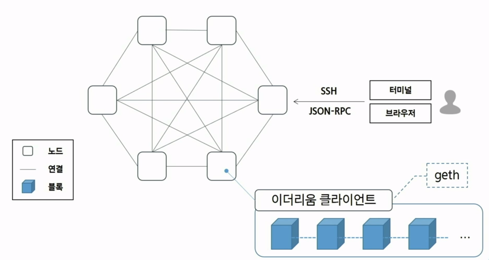
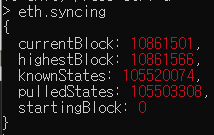
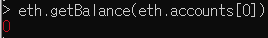
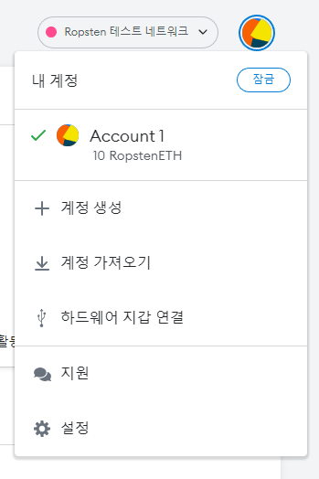
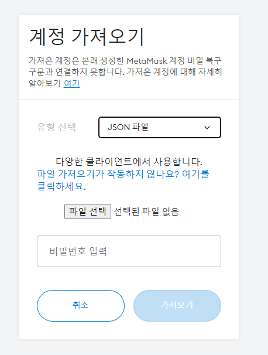

# 1. 이더리음 블록체인 네트워크의 분류

이더리움 네트워크는 프라이빗 네트워크와 퍼블릭 네트워크로 분류된다.

프라이빗 네트워크는 ganache와 geth를 이용해 개인 PC에서 네트워크를 생성하여 블록체인에 대해 실습해볼 수 있다.

실제 필드에 나가서 블록체인으로 작업하게 되면 퍼블릭 네트워크를 사용해야 한다!

<br>

# 2. 이더리움 네트워크 개념도

<p align="center">
    
</p>

<br>

# 3. 환경설정

## Ropsten 네트워크 동기화 상태 확인

- Geth 접속
    
    ```
    geth attach http://localhost:8545
    ```
    
- 상태 확인 명령
    
    ```
    net.listening
    
    net.peerCount
    
    eth.syncing
    
    eth.syncing.currentBlock / eth.syncing.highestBlock * 100
    ```
    
    - eth.syncing 명령은 동기화 완료 시 false가 됨

    <p align="center">
        
    </p>

## 동기화 완료

- 이더 잔고 확인
    
    ```
    eth.getBalance(eth.accounts[0])
    ```

    <p align="center">
        
    </p>
    
    - 나는 왜 1이더가 안들어오는거야,,

<br>

# 4. 퍼블릿 네트워크 활용 및 실습

## 지갑을 통해 네트워크 활용하기

1. 메타마스크와 노드 연결
    - 메타마스크 열기
    - 메타마스크 Ropsten 네트워크에 연결하기
2. 계정 등록하기
    - 키스토어 가져오기(import)

    <p align="center">
        
    </p>

    <br>
        
    - Ropsten Faucet으로부터 이더를 수령한 계정

    <p align="center">
        
    </p>
        
3. 메타마스크로 트랜잭션 생성하기
    - 메타마스크에서 다른 계정으로 0.1 Ether 전송
    - 메타마스크에서 계정 추가

## 노드 서비스로 네트워크 활용하기

1. 노드 서비스 가입하기
    - Infura 회원 가입 및 프로젝트 생성 : [링크](https://infura.io/)
    - 프로젝트 페이지 → Settings
    - 엔드포인트를 Ropsten으로 변경
2. 노드 서비스 이용하기
    - 노드 클라이언트 조회
        - Powershell 혹은 cmd에서 수행
        
        ```
        $body='{"jsonrpc": "2.0","method":"web3_clientVersion","params":[],"id":100}'
        
        $R=Invoke-WebRequest https://ropsten.infura.io/v3/PROJECT_ID -method post -body $body -contenttype "application/json"
        
        $R
        ```
        

## 노드로 직접 참여하기

1. 네트워크 동기화 완료 확인
2. geth console 이용하기
    - 연결성 확인
    - 계정 생성
        
        ```
        personal.newAccount("password")
        ```
        
    - 트랜잭션 생성
        - 트랜잭션 생성을 위한 계정 보안 해제 (unlock)
            
            ```
            personal.unlockAccount(eth.accounts[0])
            ```
            
        - 트랜잭션 오브젝트 구조
            
            ```
            tx = { from: eth.accounts[0], to: eth.accounts[1], value: 1e17, gas: 90e3, gasPrice: 20e9, nonce:0 }
            ```
            
        - 트랜잭션 보내기