# 1. 스마트 컨트랙트란?

- Nick Szabo에 의해 최초로 정의
- 블록체인에서의 정의 - 불변의 컴퓨터 프로그램
    - `컴퓨터 프로그램`
    - `불변` 한번 배포되면 변경 불가
    - `결정적` 실행한 결과가 모두 같음
    - `EVM 위에서 동작`
    - `탈중앙화된 World Computer` 동일한 상태를 유지

## 배포와 호출 과정

### 배포

1. 스마트 컨트랙트 코드 작성 (보통 Solidity라는 언어를 이용해 코드를 작성함)
2. 컴파일을 통해 바이트 코드로 변환
3. 컨트랙트 배포용 트랜잭션을 생성함
4. 블록에 담김
5. 네트워크에 블록을 전파하면서 블록 동기화

### 호출

1. 사용자 계정(EOA), 컨트랙트 계정(CA), ABI, 함수의 주소, 매개변수로 스마트 컨트랙트를 호출하는 트랜잭션을 생성한다.
2. 블록에 담김
3. 블록에 동기화한다.

<br>

# 2. 환경 설정

## Remix IDE

스마트 컨트랙트 IDE - 별도의 개발 환경 설정 없이 스마트 컨트랙트를 작성하고 배포 및 호출 할 수 있다.

링크 : [remix.ethereum.org](http://remix.ethereum.org)

<br>

# 과제 1. Ballot.sol 예제 코드 배포 & 호출

Ballot은 투표권을 대표자에게 맡기는 프로세스를 블록체인으로 간단하게 구성한 코드이다.

## 배포

우선 배포 프로세스를 한번 알아보자.

1. [http://remix.ethereum.org/](http://remix.ethereum.org/)로 접속한다.

2. `FILE EXPLORER`에서 contracts - 3_Ballot.sol을 클릭한다

<p align="center">
    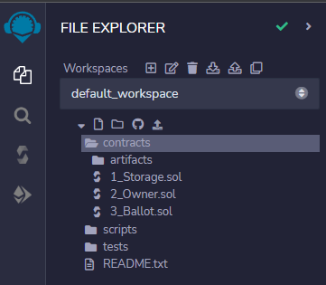
    <br>
    <em>그림 1) Remix File Explorer</em>
</p>

<br>

3. 왼쪽 탭에서 세 번째를 클릭하고 `Compile 3_Ballot.sol`을 클릭한다.

<p align="center">
    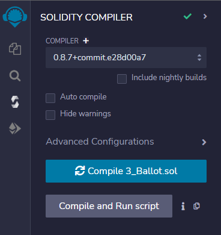
    <br>
    <em>그림 2) Remix Compiler</em>
</p>

<br>

1. 네 번째 탭을 클릭한 후 주황색 `Deploy` 버튼 옆에 proposalNames을 입력해야 한다.
    
    proposalNames는 `foo`와 `bar`를 bytes32로 변환시킨  `["0x666f6f0000000000000000000000000000000000000000000000000000000000", "0x6261720000000000000000000000000000000000000000000000000000000000"]`를 입력하면 된다. 입력 후 `Deploy` 버튼을 누른다.

<p align="center">
    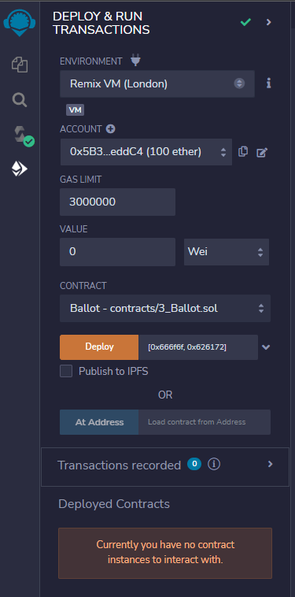
    <br>
    <em>그림 3) Remix 배포 및 호출</em>
</p>    

<br>

## 호출

배포를 마치면 아래 Deployed Contracts에 `Storage`가 생긴다.

<p align="center">
    
    <br>
    <em>그림 4) Remix Storage</em>
</p>

<br>

각 버튼을 누르면 스마트 컨트랙트를 호출할 수 있다.

<br>

# 과제 2. 리믹스에서 Ganache 테스트넷에 컨트랙트 배포 & 호출

## 배포

1. Ganache를 구동한다.
    
    ```
    ganache-cli -d -m -a 5 -p 7545
    ```
    

2. Remix 좌측 네 번째 탭에서 Environment를 `Ganache Provider`로 변경한다. 그리고 `Ganache JSON_RPC Endpoint`의 포트를 8545에서 7545로 수정해준다.

<p align="center">
    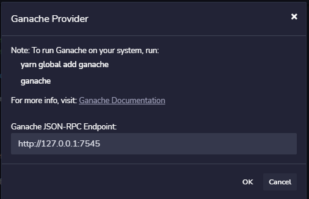
    <br>
    <em>그림 5) Remix Environment 변경</em>
</p>

<br>

3. 그런데 이런 에러가 뜬다 ㅠ

<p align="center">
    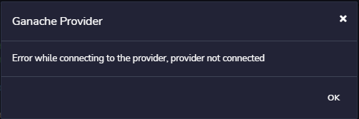
    <br>
    <em>그림 6) Ganache Provider 에러</em>
</p>

<br>

4. [레딧](https://www.reddit.com/r/ethdev/comments/okrr0f/connecting_ganache_to_remixethereumorg/)을 보니 CORS에 의해 막힌다고 한다. 해당 [링크](https://alfilatov.com/posts/run-chrome-without-cors/)에 들어가 CORS 없이 크롬 브라우저를 실행하는 방법을 이용해보았다.

<p align="center">
    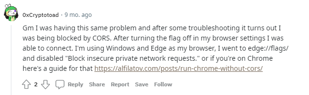
</p>

<br>

5. 크롬 브라우저 바로가기에서 우클릭 후 속성에 들어가면 실제 크롬의 위치를 확인한다. 나같은 경우에는 `C:\Program Files (x86)\Google\Chrome\Application\chrome.exe`이다.

<p align="center">
    
    <br>
    <em>그림 7) Chrome 바로가기 속성</em>
</p>

<br>

6. 바탕화면에서 우클릭 후 바로가기를 하나 생성한다.

<p align="center">
    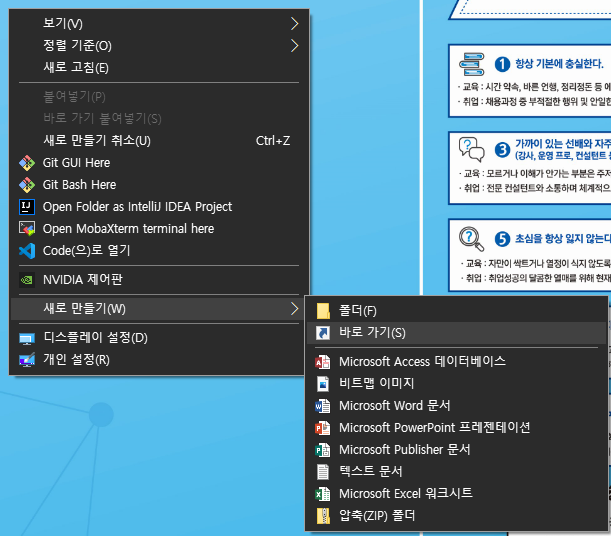
    <br>
    <em>그림 8) 바로가기 생성</em>
</p>

<br>

7. 항목 위치 입력을 다음과 같이 입력한다. `PATH_TO_CHROME`에는 아까 확인한 실제 크롬의 위치를 입력한다.
즉, 나같은 경우 `"C:\Program Files (x86)\Google\Chrome\Application\chrome.exe" --disable-web-security --disable-gpu --user-data-dir=~/chromeTemp`라고 입력한다.

```
"[PATH_TO_CHROME]" --disable-web-security --disable-gpu --user-data-dir=~/chromeTemp
```

<p align="center">
    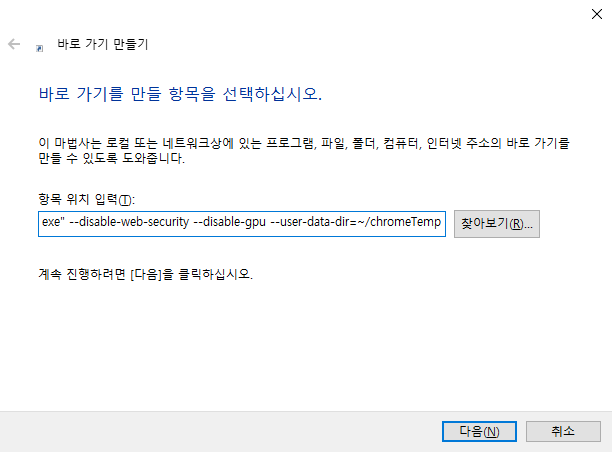
    <br>
    <em>그림 9) 바로가기 생성</em>
</p>

<br>

8. 바로가기를 만들고 해당 크롬으로 다시 Remix에 접속하여 Environment를 실행해본다. 연결이 잘 되는 것을 확인할 수 있다.

<p align="center">
    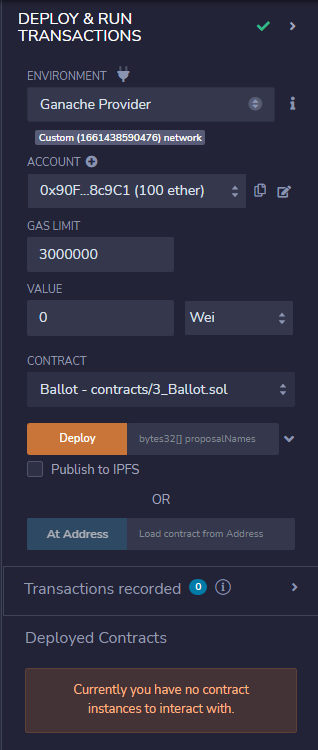
    <br>
    <em>그림 10) Environment 변경 성공</em>
</p>

<br>

9. 값을 지정하고 배포해보자.

<p align="center">
    
    <br>
    <em>그림 11) Ganache에 배포</em>
</p>

<br>

10. 트랜잭션이 정상 실행 된 것을 확인할 수 있다!

<p align="center">
    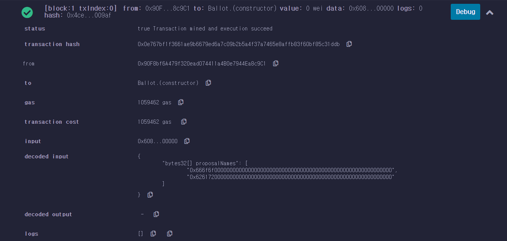
    <br>
    <em>그림 12) Remix 트랜잭션 전송 성공</em>
</p>

<br>

<p align="center">
    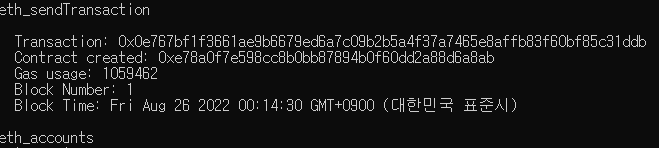
    <br>
    <em>그림 13) ganache-cli에서도 확인할 수 있다.</em>
</p>

<br>

# 과제 3) geth console을 이용하여 Ganache 테스트넷에 컨트랙트 배포하기

1. `geth attach http://localhost:7545` 명령어를 통해 ganache에 접근한다.

<p align="center">
    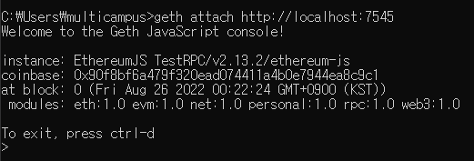
    <br>
    <em>그림 14) geth console로 ganache 테스트넷 접속</em>
</p>

<br>

2. `ABI`와 `bytecode`를 geth console에 변수로 등록한다. 해당 값은 Remix에서 Ballot.sol을 컴파일 한 후 버튼을 눌러 가져올 수 있음!

<p align="center">
    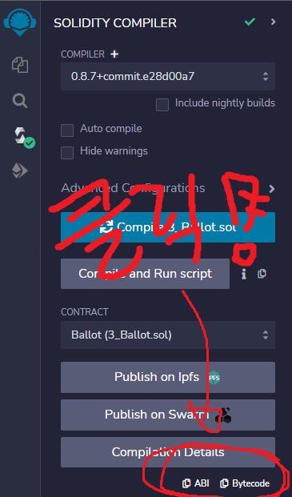
    <br>
    <em>그림 15) ABI 가져오기</em>
</p>

<br>

추가) bytecode는 위 사진의 버튼으로 복사하지말고 아까 생성해놓은 트랜잭션에서 `input`을 복사해준다. (Ganache Provider로 배포한 트랜잭션에서 복사해야합니다!!!!)

<p align="center">
    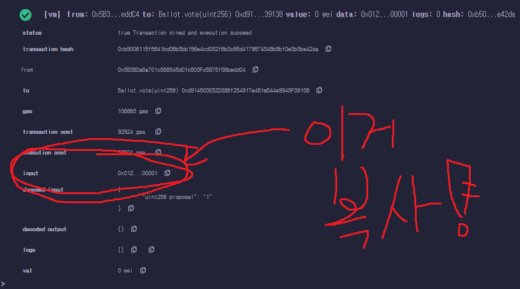
</p>

<br>

3. 근데 이걸 그대로 geth console에 붙여넣으면 개행 문자와 띄어쓰기 때문에 오류가 뜬다.

<p align="center">
    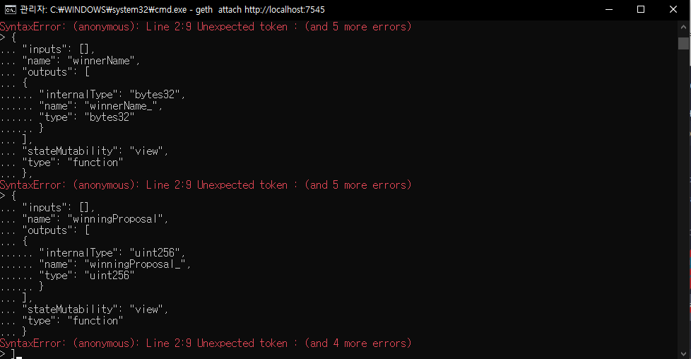
    <br>
    <em>그림 16) 개행 문자로 인한 에러</em>
</p>

<br>

4. [removelinebreaks](https://removelinebreaks.net/)라는 사이트에 들어가서 개행 문자를 싹 다 제거해준다. 옵션은 아래 사진대로 선택한 후 convert 버튼을 클릭!

<p align="center">
    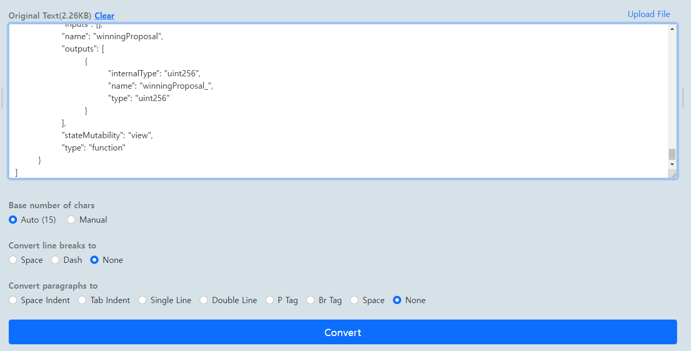
    <br>
    <em>그림 17) 개행 문자 제거 사이트</em>
</p>

<br>

5. 결과를 복사한 후 geth console에 다음과 같이 입력한다.

```
abi = 복사한 ABI 값
```

<p align="center">
    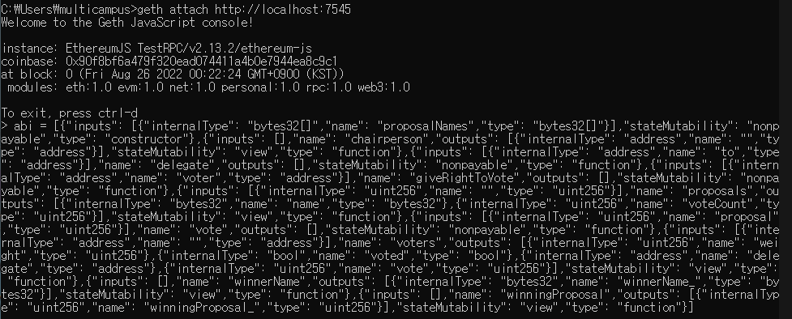
    <br>
    <em>그림 18) ABI 변수 등록</em>
</p>

<br>

```
bytecode = 복사한 bytecode 값
```

<aside>
💡 주의!!! 반드시 큰 따옴표(””)를 붙여 문자열 형태로 변수로 등록해야합니다!

</aside>

<p align="center">
    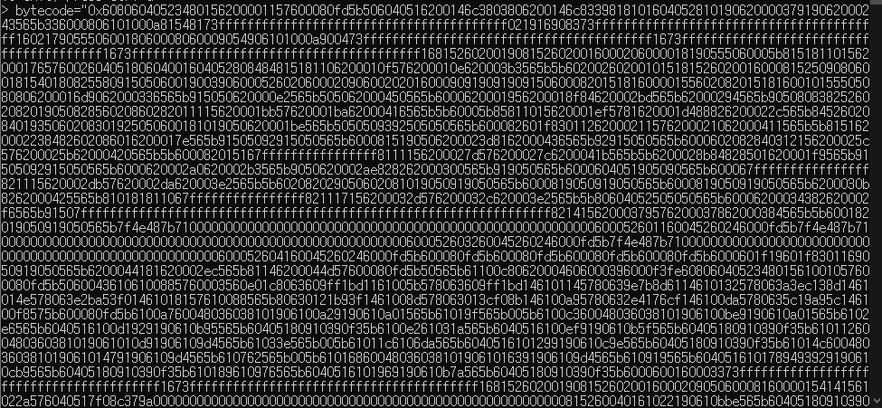
    <br>
    <em>그림 19) bytecode 변수 등록</em>
</p>

<br>

6. `web3.eth.contract(abi)` 명령어를 통해 contract를 생성한다. 해당 contract는 변수로 저장해둔다.

```
contract = web3.eth.contract(abi)
```

7. 트랜잭션 메시지를 생성한다.

```
tx = {from: eth.accounts[0], data: bytecode, gas: 3000000}
```

8. 트랜잭션을 배포한다.

```
contract.new(tx)
```

9. 트랜잭션 배포가 성공한 것을 확인할 수 있다.

<p align="center">
    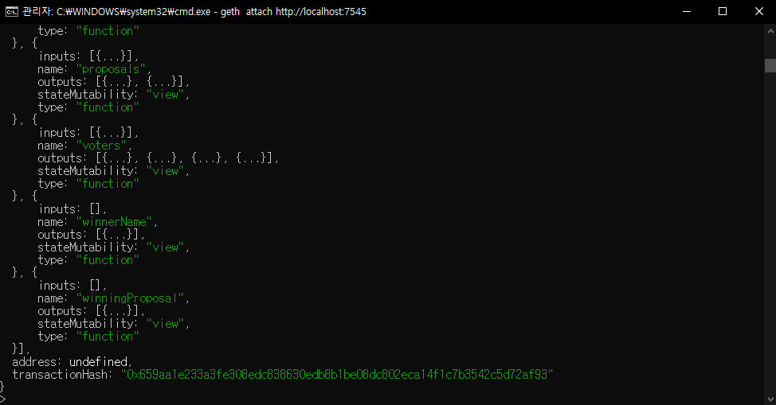
    <br>
    <em>그림 20) geth console에서 트랜잭션 배포 확인</em>
</p>

<br>

<p align="center">
    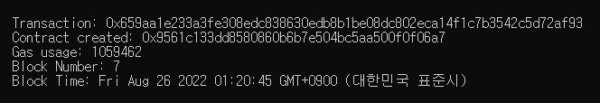
    <br>
    <em>그림 21) ganache-cli에서 트랜잭션 배포 확인</em>
</p>

<br>

# 과제 4. Remix와 Metamask 계정을 통해서 ganache 네트워크로 컨트랙트 배포

1. Remix 왼쪽 네 번째 탭에서 `Injected Provider - Metamask`를 클릭한다.

<p align="center">
    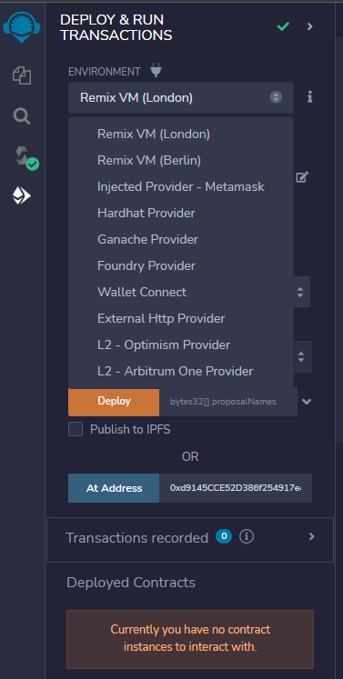
    <br>
    <em>그림 22) Environment 설정</em>
</p>

<br>

2. proposalNames를 입력하고 `Deploy` 버튼을 누른다.

```
["0x666f6f0000000000000000000000000000000000000000000000000000000000", "0x6261720000000000000000000000000000000000000000000000000000000000"]
```

1. Metamask에서 배포를 할 것인지 확인한다. (근데 지금 지갑 상태가 0 ETH가 수수료를 못내서 배포를 못함 ㅠ) → 확인만 누르면 배포가 된다!!