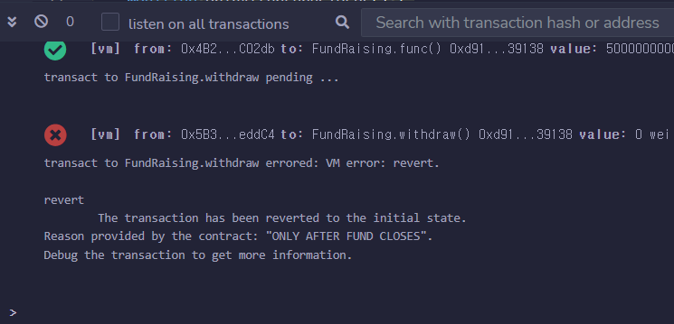
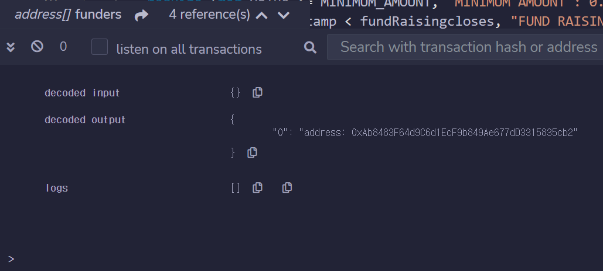
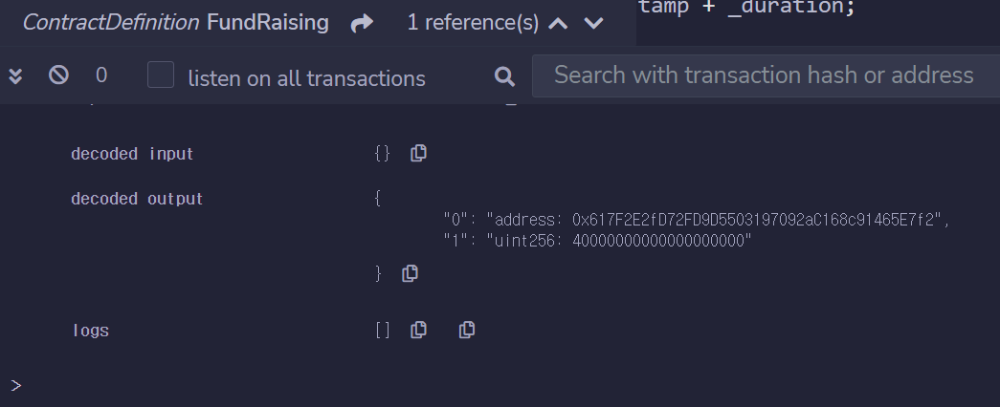
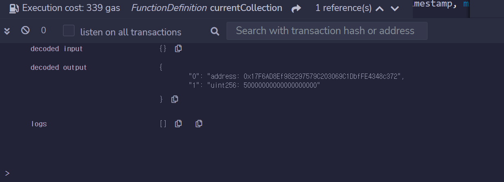

# 1. 솔리디티 컨트랙트 기본 구조

- 소스코드의 SPDX 라이선스를 명시
    
    ```
    // SPDX-License_Identifier: GPL-3.0 
    ```
    
- 소스코드가 이용하는 솔리디티 컴파일러 버전 명시
    
    ```
    pragma solidity >=0.7.0 <0.8.0
    ```
    
- 컨트랙트의 범위
    
    ```
    contract ContractName { ... }
    ```
    
- 상태변수
- 함수

<br>

# 2. 구현하면서 기본기 익히기

## Fund Raising - 모금 컨트랙트

```solidity
// SPDX-License-Identifier: GPL-3.0 

pragma solidity >=0.7.0 <0.9.0;

contract FundRaising {
    uint public constant MINIMUM_AMOUNT = 1e16;
    uint public fundRaisingcloses;
    address public beneficiary;
    address[] funders;

    constructor (uint _duration, address _beneficiary) {
        fundRaisingcloses = block.timestamp + _duration;
        beneficiary = _beneficiary;
    }

    function func() public payable {
        require (msg.value >= MINIMUM_AMOUNT, "MINIMUM AMOUNT : 0.01 ether");
        require (block.timestamp < fundRaisingcloses, "FUND RAISING CLOSED");

        funders.push(msg.sender);
    }

    function currentCollection() public view returns(uint256) {
        return address(this).balance;
    }

    modifier onlyBeneficiary() {
        require(msg.sender == beneficiary, "ONLY BENEFICIARY");
        _;
    }

    function withdraw() public payable onlyBeneficiary {
        require(block.timestamp > fundRaisingcloses, "HAVEN'T FINISH YET");

        payable(msg.sender).transfer(address(this).balance);
    }
}
```

### 상태 변수 추가

- 컨트랙트 배포 시 모금 기간과 모금액 수령자 지정
    - uint duration → 몇 초 동안 모금 유효한 지 의미함
    - 정수형 연산자 `+` → 현재 타임스탬프 + duration을 ticketCloses의 값으로 지정
    - block.timestamp → 특수 전역 변수 중 하나 (현재 시각의 유닉스 타임스탬프

### 상태 추가 - 최소 모금액

- 최소 모금액 = 0.01 ether
- 이더리움 기본 단위 wei
- 10^18 wei = 1 ether

### 함수 선언

1. 모금 - fund()
    - 0.01 ether 이상으로 모금에 참여할 수 있다.
        - 이더를 받을 수 있는 payable 함수
        - msg.value - 트랜잭션에 얼마를 보냈는지 알 수 있는 전역 변수
    - 지정된 모금 시간 이내에만 참여할 수 있다.
        - 유효성 체크 require 함수 `require(판별문, "에러 메시지");`
    - 모금이 완료되면 모금자를 저장한다.
        - 주소형 address - 이더리움 주소를 저장할 수 있는 자료형
2. 현재 모금액 - currentCollection()
    - 현재까지 모금된 금액을 누구나 확인할 수 있다.
        - 함수의 반환문 작성
        - view → 상태 변수를 readonly로 만든다.
3. 모금액 수령 - withdraw()
    - 지정된 수령자만 호출할 수 있다.
        - 함수 modifier 작성
    - 모금 종료 이후에만 호출할 수 있다.
    - 수령자에게 컨트랙트가 보유한 이더를 송금한다.

<br>


# 과제 1. withdraw 함수 변경

### 요구사항

- withdraw 함수의 require문을 modifier로 변경한다
- modifier 이름은 `onlyAfterFundCloses`로 정한다.

### 원 코드

```solidity
function withdraw() public payable onlyBeneficiary {
    require(block.timestamp > fundRaisingcloses, "ONLY AFTER FUND CLOSES");

    payable(msg.sender).transfer(address(this).balance);
}
```

### 변경 코드

```solidity
modifier onlyAfterFundCloses() {
    require(block.timestamp > fundRaisingcloses, "ONLY AFTER FUND CLOSES");
    _;
}

function withdraw() public payable onlyBeneficiary onlyAfterFundCloses {
    payable(msg.sender).transfer(address(this).balance);
}
```

변경된 코드로 withdraw() 함수를 실행해도 modifier에 의해 적절히 걸러지는 것을 확인할 수 있다.

<p align="center">
    
    <br>
    <em>그림 1) 과제 1 실행 결과</em>
</p>

<br>

# 과제 2. 추가 함수 구현 `selectRandomFunder()`

### 요구사항

- Funder 중 한 명의 주소를 랜덤하게 반환한다.
- SHA-3인 keccak256 내장 함수를 이용한다.

### 코드

```solidity
function selectRandomFunder() public view returns(address) {
	  uint randIndex = 
				uint(keccak256(abi.encodePacked(block.timestamp, msg.sender))) % funders.length;

	  return funders[randIndex];
}
```

- 해싱에 사용될 arguments를 `abi.encodePacked()`로 인코딩하여 keccak256에 파라미터로 넘겨준다.
- keccak256을 사용하면 내부에서 특별한 해시 함수를 이용해 랜덤 bytes가 나온다. bytes를 uint 타입으로 캐스팅해준다.
- 현재 모금자들의 수 만큼 나눠준 후 나머지를 funders의 인덱스로 하고 해당 주소를 반환한다.

### 결과

decoded output에 결과가 잘 나오는 것을 확인할 수 있다.

<p align="center">
    
    <br>
    <em>그림 2) 과제 2 실행 결과</em>
</p>

<br>

# 과제 3. `selectRandomFunder()` 수정

### 요구사항

- `selectRandomFunder()` 함수를 해당 모금자의 모금액도 함께 반환하도록 수정한다.
- Array를 이용하여 해결한다.

### 원 코드

```solidity
address[] funders;

function func() public payable {
    require (msg.value >= MINIMUM_AMOUNT, "MINIMUM AMOUNT : 0.01 ether");
    require (block.timestamp < fundRaisingcloses, "FUND RAISING CLOSED");

    funders.push(msg.sender);
}

function selectRandomFunder() public view returns(address) {
	  uint randIndex = 
				uint(keccak256(abi.encodePacked(block.timestamp, msg.sender))) % funders.length;

	  return funders[randIndex];
}
```

### 수정 코드

```solidity
address[] funders;
uint[] fundValues;

function func() public payable {
    require (msg.value >= MINIMUM_AMOUNT, "MINIMUM AMOUNT : 0.01 ether");
    require (block.timestamp < fundRaisingcloses, "FUND RAISING CLOSED");

    funders.push(msg.sender);
    fundValues.push(msg.value);
}

function selectRandomFunder() public view returns(address, uint) {
    uint randIndex = 
				uint(keccak256(abi.encodePacked(block.timestamp, msg.sender))) % funders.length;

    return (funders[randIndex], fundValues[randIndex]);
}
```

- 필드에 `fundValues`라는 uint 배열을 추가한다.
- `func()` 함수에서 `fundValues`에 모금자가 기부한 이더리움 값을 push하는 코드를 추가한다.
- Solidity는 여러 값을 반환할 수 있다. returns에 uint 타입을 추가하고 `fundValues[randIndex]`를 반환한다.

### 결과

decoded output에 결과가 잘 나오는 것을 확인할 수 있다.

<p align="center">
    
    <br>
    <em>그림 3) 과제 3 실행 결과</em>
</p>

<br>

# 과제 4) `selectRandomFunder()` 개선

### 요구사항

- 이전 결과는 모금자 계정과 모금액이 따로 관리되기 때문에 비효율적이다.
- 효율을 위해 mapping을 사용하도록 변경한다.

### 원코드

```solidity
address[] funders;
uint[] fundValues;

function func() public payable {
    require (msg.value >= MINIMUM_AMOUNT, "MINIMUM AMOUNT : 0.01 ether");
    require (block.timestamp < fundRaisingcloses, "FUND RAISING CLOSED");

    funders.push(msg.sender);
    fundValues.push(msg.value);
}

function selectRandomFunder() public view returns(address, uint) {
    uint randIndex = 
				uint(keccak256(abi.encodePacked(block.timestamp, msg.sender))) % funders.length;

    return (funders[randIndex], fundValues[randIndex]);
}
```

### 수정코드

```solidity
address[] funders;
mapping(address => uint) public funderInfos;

function func() public payable {
    require (msg.value >= MINIMUM_AMOUNT, "MINIMUM AMOUNT : 0.01 ether");
    require (block.timestamp < fundRaisingcloses, "FUND RAISING CLOSED");

    funders.push(msg.sender);
    funderInfos[msg.sender] = msg.value;
}

function selectRandomFunder() public view returns(address, uint) {
    uint randIndex = 
				uint(keccak256(abi.encodePacked(block.timestamp, msg.sender))) % funders.length;

		address randomFunder = funders[randIndex];

		return (randomFunder, funderInfos[randomFunder]);
}
```

- uint 배열로 되어있던 필드를 mapping으로 변경하였다.
    - mapping은 자바의 Map과 비슷한 Key-Value 형태의 자료구조이다. (여기서는 address가 key가 되고 uint 타입의 값을 value로 받음)
- `func()` 메서드에서 mapping 자료구조로 값을 받을 수 있는 형태로 코드를 수정했다.
    - `fundValues.push(msg.value);` → `funderInfos[msg.sender] = msg.value;`
- `selectRandomFunder()` 메서드에서 반환값을 수정하였다.
    - `return (funders[randIndex], fundValues[randIndex]);` 
    → `return (randomFunder, funderInfos[randomFunder]);`

### 결과

decoded output에 결과가 잘 나오는 것을 확인할 수 있다.

<p align="center">
    
    <br>
    <em>그림 4) 과제 4 실행 결과</em>
</p>

<br>