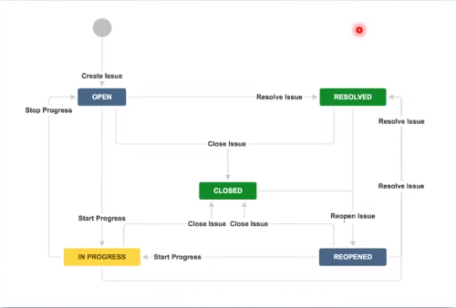

# [1012] JIRA의 활용

날짜: 2022년 10월 12일
속성: 유라
참석자: 익명, 익명, 익명, 익명, 익명, 익명

# ✅ JIRA의 Work flow

- Ticket이 생성되고 완료될 때까지의 상태 변화
- 프로젝트 진행상황을 한 눈에 파악 가능
- 불필요한 커뮤니케이션 감소

# 컨님이 생각하는 잘 만든 JIRA

## IssueType

- Epic
    - 프론트 : 페이지 별로 티켓 생성
    - 백 : 기능 별로 티켓 생성

## Bulk

벌크 기능을 통해 티켓 일괄 수정 가능

## Label vs Component

라벨은 프로젝트 전체에서 다 쓸 수 있음 → 우리 프로젝트 멤버뿐만 아니라 다른 멤버들이 등록해놓은 것도 사용할 수 있는듯??

컴포넌트는 우리 프로젝트에서만 씀

## Release

배포 버전을 설정함

그리고 각 티켓이 어떤 배포 버전에 구현되어야하는지 표시할 수 있음

되게 유용한 기능이니까 자율 프로젝트에서만큼은 이 버전 관리를 해보자!