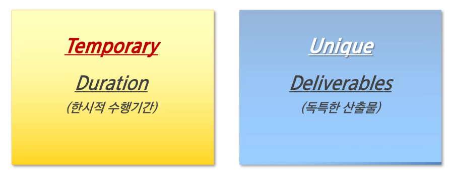
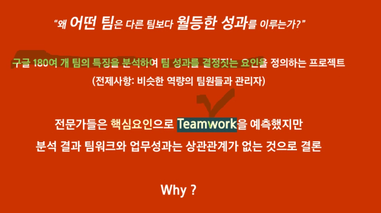
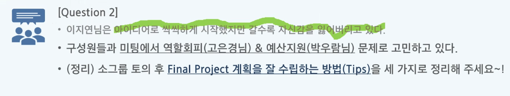
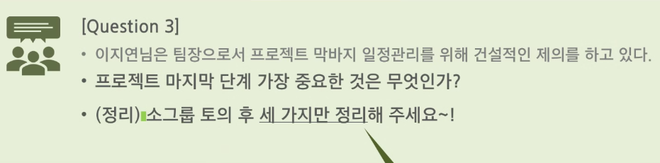

# PM

# 1. 개요

수평적 조직 문화에 걸림돌이 되고 커뮤니케이션을 어렵게 하는 요소 → 중간 관리자가 문제라고 생각함

하지만 실제로 프로젝트에 팀장을 없앴을 때에는 팀원들이 더 힘들어했음(Google Oxygen Project)

팀장이 커뮤니케이션의 중심이 되어 허브 역할을 해줘야 전체 효율이 커진다.

## 1.1. 프로젝트란?

프로젝트는 `Temporary`와 `Unique`라는 특징을 가지고 있다.

	 

팀장은 제한된 일정에 맞춰 프로젝트가 기간에 따라 얼마나 진행되어 있어야 할지 구상해두어야 하며, 프로젝트가 다른 프로젝트에 비해 어떤 독특한 특징을 가지고 있는지 파악해야 한다.

## 1.2. PM 지식영역 → 구성요소

- Scope Management(범위 관리)
    - 해야 할 일과 하지 말아야 할 일을 정리한다.
- Time Managerment(시간 관리)
- Cost Management(원가 관리)
    - 기획 단계에서 필요한 교보재를 빠르게 파악해서 신청하자.
- Quality Managemenet(품질 관리)
    - 품질의 대한 욕심을 많이 내면 6주 간 감당하기 어려울 수 있다.
- Resource Management(자원 관리)
- Communication Management(의사소통 관리)
- Risk Management(위험 관리)
- Procurement Management(조달 관리)
- Stakeholder Management(이해관계자 관리)
- Integration Management(통합 관리)
    - 시간이 얼마 남지 않았을 때, 어떤 기능을 끝까지 가져갈 지 선택을 해야 한다.
    - 여러 가지 대안을 제시해주어야 함.

## 1.3. Project Management Body of Knowledge

- PMBOK Guide(자격증)
- 경영학 지식
- 🌟대인관계 스킬🌟 → 가장 중요
- 프로젝트 수행 경험
- 최신 기술 이해

### 구글 아리스토텔레스 프로젝트

	 

팀웍이 좋은 경우 의료 사고가 많이 난다는 통계가 있다 → 팀웍이 좋은 경우에는 의료 사고를 인정하고 나쁜 경우에는 의료 사고를 은폐해서

- **월등한 성과를 이루는 팀의 요소**
    1. `심리적 안전감(Psychological Safety)` : 자신의 약점을 공개해도 불이익 받지 않는 팀 분위기
    2. `상호의존성(Dependability)` : 신뢰할 수 있는 구성원(역량에 대한 믿음)
    3. `체계와 명확성(Structure & Clarity)` : 분명한 목표와 역할
    4. `일의 의미(Meaning)` : 자신의 업무에 대하여 개인적인 의미를 부여
    5. `일의 영향(Impact)` : 팀의 업무가 중요하고 변화를 만드는 것이라는 믿음
    
    특히 `**심리적 안전감**`은 프로젝트 팀 성과에 유의미한 영향을 준다.
    
- **심리적 안전감이란?**
    1. 심리적 안전감(Safety) ≠ 심리적 안정감(Stability)
        - 심리적 안정감은 친절함과 편안함에서 오는 개인의 심리
        - 심리적 안전감은 약점 or 실패에 대하여 포용하는 팀 분위기
    2. 심리적 안전감(Safety) ≠ 신뢰
        - 일반적인 신뢰는 개인과 개인, 개인과 조직에 대한 감정 (장기적 관점)
        - 반면 신리적 안전감은 프로젝트 팀 조직에 대한 감정 (단기적 관점)

# 2. 프로젝트 관리

	 

- 남은 인원들에게 양해를 구하고 역할 배분을 다시 한다.
- 선결제 프로세스 (팀원들에게 양해를 구할 때 1:1로 이야기한다)

### 단기간 프로젝트 계획을 잘 수립하려면?

- 초기 계획은 전체 화상회의 전 → 1:1 회의(전화통화)
- 목표 & 기본 규칙을 공유하자 → 의견 수렴 + Team Charter
- 개인 단위 `역할 = 결과물` 명확하게 해야 한다.
- 팀장은 큰 틀에서 Back Scheduling + Project Buffer
- 일 단위 Scrum Meeting + 주 단위 Prototype 확인

	 

### 프로젝트 후반 심리적 갈등을 예방하는 것이 팀장의 역할이다

1. 심리적 안전감 → 구성원 존중에서 시작
2. 1:1 대화 → Group meeting
3. 공식 회의 → Empowerment(역할 위임)
4. 강력한 동조자를 확보하라
5. 계속 비협조적이라면 영향력을 축소하라

### 프로젝트 종료 단계 팀장에게 중요한 마음가짐

- 종료는 프로젝트 안에서 다른 프로젝트의 시작
- 품질에 대한 직접적인 확인
- 리더로서 책임감