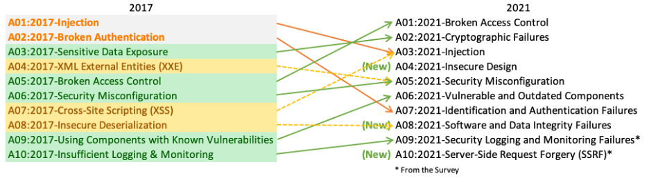

# 개발자가 꼭 알아야 할 애플리케이션 보안

# 1. 최근 서비스 개발 트렌드

- 서버 부하를 줄이기 위한 클라이언트에서 처리하는 기능이 증가
    
    → 하지만 서버에서 반드시 처리해야 하는 기능을 클라이언트에서 처리하면서 취약점이 발생하는 경우가 있다.
    
- 효율적인 개발을 할 수 있게 도움을 주는 프레임워크를 사용
    
    → 프레임워크에서 제공하는 기능에 대한 설정을 부적절하게 하여 취약점이 발생한다.
    
    → 프레임워크 자체에서 발생하는 취약점으로 인해 영향도가 커짐
    
- On-premise 환경보다는 인프라 구성이 쉽고, 서비스 확장성이 좋은 클라우드 환경을 이용.
    
    → 클라우드 환경 특성으로 인한 공격이 유입된다.
    

# 2. OWASP TOP 10

<p align="center">
    <a href="https://owasp.org/www-project-top-ten/">
        
        <br>
        <em>그림 1) OWASP Top 10</em>
    </a>
</p>


- `Injection` : SQL, LDAP, NoSQL들의 쿼리를 DB나 서버 스크립트 코드에 삽입하는 것을 말한다. (2021년 기준 XSS도 Injection에 포함되었다.)
Injection은 2017년까지 쭉 보안 위험 1위를 차지하고 있었는데, 최근에는 프레임워크들이 해당 위협을 자동으로 막아주는 기능을 제공하기 때문에 개발자가 신경을 크게 신경을 쓰지 않아도 미리 방지할 수 있게 되었기 때문에 위험도가 3위로 떨어지게 되었다. 하지만 아직까지도 위험한 보안 위협 중 하나이다.
- `Broken Access Control` : 인가, 접근 제어에 대한 보안 위협이다. 권한이 없는 사용자의 경우 서버에서 접근을 제한해야 하는데, 이 부분에 대한 처리를 클라이언트에 맡기면서 문제가 발생하는 경우가 많다.
- `Server-Side Request Forgery (SSRF)` : 서버가 클라우드 환경으로 변하면서 생기는 문제점이다.

# 3. 추가 이슈들

## 3.1. IDOR 취약점

- IDOR(Insecure direct object reference) : 안전하지 않은 직접 객체 참조, 혹은 부적절한 인가라고도 표현한다. `Broken Access Control`과 연관이 있다.
- 서버에서 수행해야 할 권한 검증 및 접근 제어를 클라이언트에서 수행하는 경우에 자주 발견되는 취약점이다.
- 수평적, 수직적 권한 상승이 발생하며, 이를 통해 타 사용자의 객체에 접근하여 정보를 유출시키거나 기존 권한으로는 사용 불가능한 기능을 멋대로 이용한다.
    - 수평적 권한 상승 : 동일한 권한을 가진 다른 사용자의 객체에 접근할 수 있는 경우를 말한다.
    - 수직적 권한 상승 : 본인이 지닌 권한을 넘어서는 기능을 수행할 수 있는 경우를 말한다.

### 조치방안

- 클라이언트 사이드에서 검증을 수행할 경우 공격자가 모두 우회할 수 있기 때문에 검증은 반드시 세션 또는 서버에서 발급한 토큰을 통해 서버에서 수행해야 한다.

## 3.2. SSRF 취약점

- SSRF(Server-Side Request Forgery) : 서버단에서 요청을 발생시켜 내부 시스템에 접근하는 취약점이다..
- 서비스에서 URI를 전달받고 서버에서 해댱 URI에 직접 요청하여 데이터를 받아오는 형태의 기능에서 주로 발생한다.
- Public Cloud 환경에서는 가상 서버의 메타데이터를 확인할 수 있는 API가 있어서 SSRF를 통해 해당 API를 요청하여 가상 서버의 정보를 확인할 수 있다.

### 조치방안

- 접근 가능한 주소를 whitelist 방식으로 필터링한다.
- Localhost, 127.0.0.1 등의 Loopback URI가 들어올 경우 필터링
- Private IP, Link-local address 형태의 URI가 들어올 경우 필터링
- 불필요한 특수문자(@, %0a 등)이 URI에 포함되어 있을 경우 필터링

## 3.3. JWT를 이용한 인증

JWT(Json Web Token)은 통신을 수행하는 두 대상이 서로 보낸 데이터에 대하여 신뢰할 수 있게 데이터가 인코딩된 토큰을 의미한다.

- `Header` : Token의 타입, 서명에 사용된 암호화 알고리즘
- `Payload` : 데이터
- `Singature` : Header에 명시된 암호화 알고리즘과 secret key를 이용하여 Header와 Payload를 서명한 값

**[장점]**

Stateless Tokenn으로 서버가 인증 작업을 수행하지 않아 인증 로직으로 인한 서버의 부하를 줄일 수 있다.

**[단점]**

Stateless Tokenn으로 서버가 인증 작업을 수행하지 않아 서버가 인증 토큰에 대한 제어권을 잃어 관리할 방법이 없다.

### JWT 인증 문제

- 사용자가 로그아웃을 하고 싶어도 만료 시간이 되지 않으면 토큰이 만료되지 않아 실질적으로 로그아웃이 되지 않는다.
- 토큰이 탈취되었을 경우 임의로 서버에서 토큰을 만료시킬 수 없다.
- JWT를 JS를 이용하여 base64 디코딩해서 사용해야 하다보니 토큰을 쿠키로 받을 경우 httponly 옵션을 추가할 수 없으며 쿠키가 아닌 경우 로컬 스토리지와 같은 브라우저 내장 스토리지를 사용해야 하기 때문에 XSS로 인한 토큰 탈취 가능성이 높아진다.

### 조치방안

- JWT 블랙리스트를 구현하여 같이 운영함으로써 서버에서 토큰에 대한 제어를 수행할 수 있도록 구현한다.
    
    → Redis를 자주 사용하는 듯?
    
- JWT Payload내 stateful한 토큰을 추가하여 서버에서 stateful 토큰을 통해 제어를 수행할 수 있도록 구현한다.

## 3.4. Actuator Misconfiguration

- 스프링 부트의 서브 프로젝트
- 스프링 부트를 이용하여 운영되고 있는 서비스를 모니터링하고 관리하기 위한 기능들을 포함하고 있다.
- HTTP 방식과 JMX라는 Java API를 이용하는 방식이 있으며 다양한 역할을 지닌 엔드포인트들이 존재한다.

### 문제

- 불필요한 엔드포인트를 활성화 시켜두어 예상치 못한 Actuator의 기능으로 인해 서비스 기밀성, 무결성, 가용성을 침해당할 수 있다.
    - 환경 변수로 중요 정보를 저장해 둔 경우 (Actuator env endpoint)
    - 중요 정보가 메모리에 올라가 있는 경우 (Actuator heapdump endpoint)

### 조치방안

- Actuator endpoint는 필요한 것만 활성화한다.
    - Actuator는 shutdown endpoint 제외 나머지는 default값이 `enable`이다. 이렇게 하는 경우 불필요한 endpoint가 활성화되어 잠재적으로 취약점이 발생할 수 있다.
    - 따라서 default 설정을 따르지 않고 모든 endpoint들을 `disable` 상태로 유지하고, 필요한 endpoint만을 `enable` 해주어야 한다.
- Actuator endpoint는 필요한 것만 노출한다.
    - JMX는 기본적으로 모든 endpoint가 노출되어있고, HTTP는 그와 반대로 health endpoint만이 노출되어 있다.
    - JMX 형태로 Actuator 사용이 필요하지 않은 경우 모든 endpoint가 JMX를 통해 사용 불가하게 설정해야 한다.
- Shutdown endpoint는 `enable`하지 않는다.
    - 말 그대로 시스템을 shutdown 시킬 수 있기 때문에 서비스 가용성을 침해할 우려가 있다.
    - 기본적으로 `disable` 되어있고 expose 되지도 않기 때문에 그냥 건드리지 말자!
- 서비스 운영 포트와 다른 포트를 사용한다.
    - Actuator가 다양한 기능을 가진 만큼 공격자들은 웹 사이트를 공격할 때 Actuator 관련 endpoint가 존재하는지를 스캐닝한다.
    - 서비스 운영 포트와 Actuator 포트를 분리할 경우, 외부에서의 접근을 차단하고 내부에서만 접근하도록 방화벽 설정 등이 가능하기 때문에 외부 공격자들로부터 보호받을 수 있다.
- Actuator에 접근할 수 있는 IP 주소를 제한한다.
    - Actuator의 경우 서비스 운영자, 개발자가 주로 이용하기 때문에 오로지 인가된 사용자만이 접근 가능하도록 IP 제어를 수행함으로써 내외부 공격자들로부터 보호받을 수 있다.
    - WAF, L7 방화벽, IPS, 방화벽 등의 방법으로도 제한할 수 있다.
- Actuator 기본 경로를 변경한다.
    - Actuator의 경우 기본적으로 `/actuator/[endpoint]`와 같은 형태로 외부에 노출된다.
    - 공격자는 이미 알려져 있는 기본 형태를 이용하여 스캐닝을 수행한다.
    - 경로 변경시 유추하기 어려운 문자열의 경로로 설정할 것을 권고한다.
- Actuator 접근 시 권한 검증을 수행한다.

### 조치방안 설정 요약 `application.properties`

```
# actuator setting

# 1. Endpoint all disable
management.endpoints.enabled-by-default = false

# 2. Enable specific endpoints
management.endpoint.info.enabled = true
management.endpoint.health.enabled = true

# 3. Exclude all endpoint for JMX and Expose specific endpoints
management.endpoints.jmx.exposure.exclude = *
management.endpoints.web.exposure.include = info, health

# 4. Use other port for Actuator
management.server.port = [다른 포트 번호]

# 5. Allow specific IP address for access Actuator
management.server.address = [사용할 IP 주소]

# 6. Change Actuator Default path
management.endpoint.web.base-path = [/변경된 경로]
```