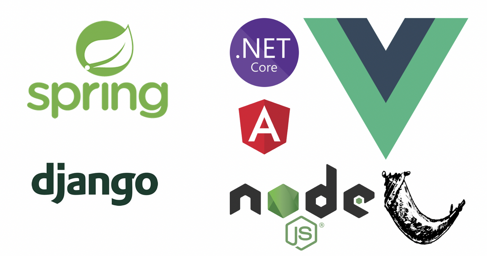

# 1. 프레임워크란?

	 
	<em>그림 1) 프레임워크의 종류</em>

프레임워크란 뼈대이다. 말 그대로 개발자가 어떤 목적을 위한 애플리케이션을 제작할 때 적절한 틀을 제공해서 그 틀에 맞춰 개발을 하도록 해서 더욱 편리하게 만들어주는 도구이다. 자바의 경우에는 국내에서 자주 쓰이는 스프링이 있고 자바 서블릿 기술 등을 추상화하여 프레임워크가 스스로 제어함으로써 엔터프라이즈 애플리케이션을 쉽게 개발할 수 있도록 도와준다.

# 2. 라이브러리란?

라이브러리는 특정 기능에 대한 메서드의 집합이다. 프로그램에서 자주 쓰일만한 기능을 미리 구현해놓고, 개발자가 필요할 때 가져다 쓰는 메서드들을 모아놓은 것이다.

# 3. 프레임워크와 라이브러리의 차이

스프링의 3대 요소 중에는 IoC(제어의 역전)라는 요소가 있다. 이 말은 코드의 진행이나 제어를 개발자가 아닌 프레임워크가 그 역할을 맡는다는 의미인데, 이 특징이 프레임워크와 라이브러리를 가르는 특징이 된다.

프레임워크는 전체적인 프로그램의 흐름을 자체적으로 가지고 있어서 개발자는 그 틀 안에서 개발할 수 있는 반면, 라이브러리는 개발자가 자신만의 코드로 만들어 놓은 흐름 안에 필요한 라이브러리의 메서드를 추가하는 방식으로 사용하는 것이다. 이처럼 흐름에 대한 주도권을 누가 가지고 있느냐가 주요한 차이점이다.
