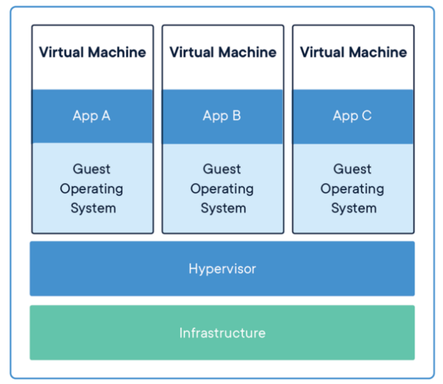
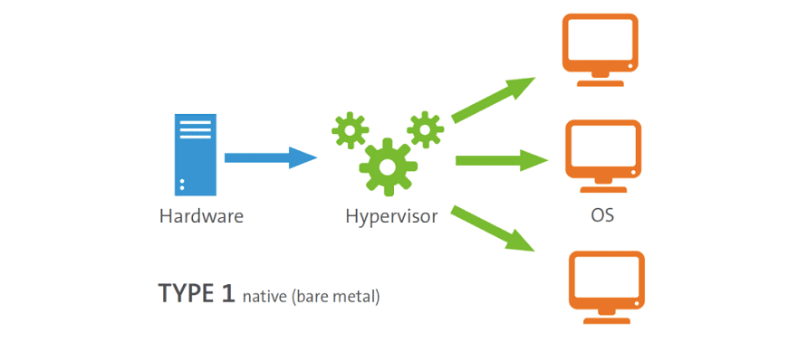
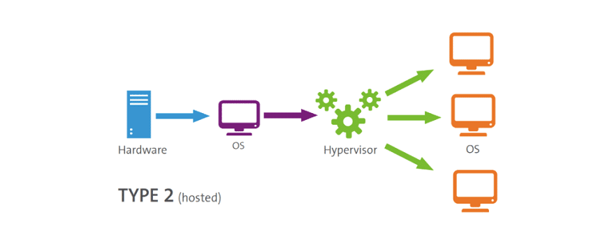
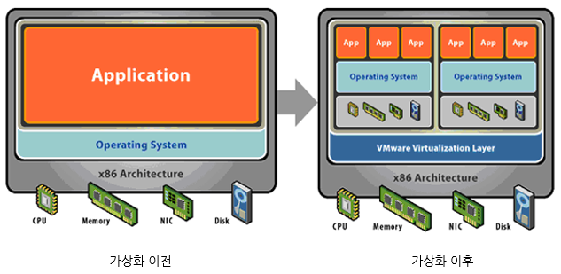
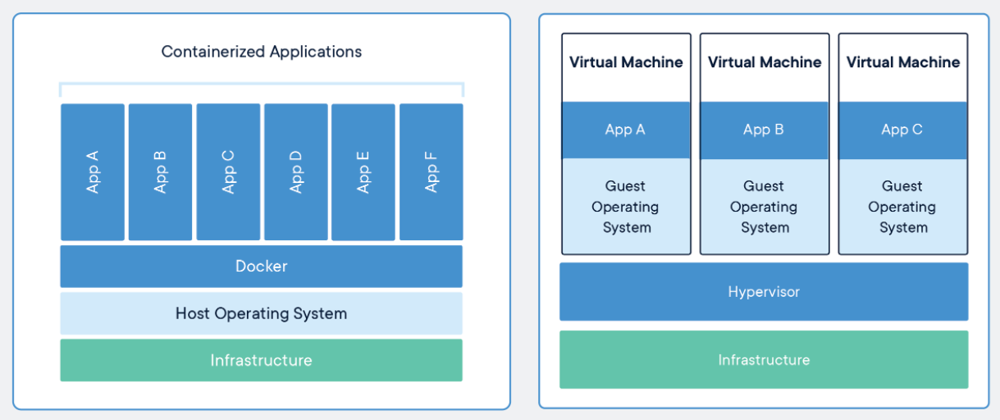
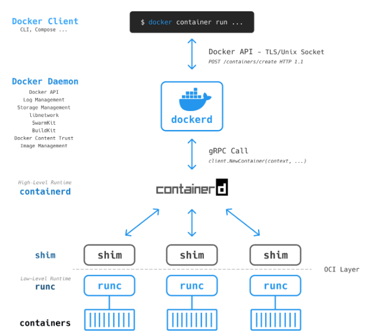

# 1. 가상머신(Virtual Machine)이란?

우리가 값 비싸고 성능이 아주 좋은 서버를 구매했다고 가정해보자. 이 서버로 어떤 애플리케이션을 개발하고 빌드 및 배포했는데 서버의 성능의 30%만 사용하고 나머지 70%는 사용하지 않아 낭비되는 상황이 발생했다.

	 
	<em>그림 1) 가상화 이전의 서버 활용</em>

그래서 원래 있었던 이메일 서버를 새로 산 서버와 통합하려고 한다. 그런데 새로운 서버 환경에서 이메일 서비스가 제대로 동작하지 않는 문제가 생겼다. 참 답답한 상황이었다. 기껏 비싼 돈 주고 산 서버를 제대로 활용하지 못하고 있기 때문이었다. 이 때 가상머신이라는 개념이 등장했다. 하나의 컴퓨터에 가상 머신이라는 독립된 새로운 컴퓨터를 만드는 기술이라는데 이 기술을 사용하면 서버에 이메일 서비스를 통합할 수 있을 것 같다.

	 
	<em>그림 2) 가상화 이후의 서버 활용</em>

서비스 통합은 성공적이었고, 더 이상 사용하지 않는 서버는 당근 마켓에 중고로 팔아 소고기를 사먹을 수 있게 되었다.

	 
	<em>그림 3) 가상 머신</em>

## Hypervisor

우선 가상 머신을 올리기 위해서는 하이퍼바이저라는 가상 머신 매니저가 필요하다. 하이퍼바이저는 하드웨어 혹은 OS 위에 설치된 소프트웨어로 물리적 머신을 다수의 가상 머신으로 분할할 수 있도록 해준다. 그리고 분할된 가상 머신은 각자 독립적인 OS를 가질 수 있기 때문에 동일한 컴퓨터에서 여러 운영체제를 실행할 수 있다.

보통 가상 머신을 실행하는 OS가 호스트 OS가 되고 각 가상 머신들은 게스트 OS가 된다.

하이퍼바이저에는 두가지 유형이 있다.

Type-1 하이퍼바이저는 네이티브 혹은 베어메탈(Bare Metal : 하드웨어 상에 어떤 소프트웨어도 설치되어 있지 않은 상태) 하이퍼바이저라고도 불린다.

	 
	<em>그림 4) Type-1 하이퍼바이저</em>

하드웨어에 직접 설치되고 하드웨어를 게스트 OS를 설치할 수 있는 여러 개의 가상 머신으로 분할해준다. 그런데 이 경우에는 호스트 OS가 없기 때문에 게스트 OS를 관리하기 위한 별도의 기능이 필요하다.

Type-2 하이퍼바이저는 호스트 하이퍼바이저라고도 불리며 호스트 OS 내에 설치되기 때문에 하이퍼바이저 관리 콘솔이 따로 필요하지 않다. 대신 정해진 메모리를 초과해서 할당하지 않기 때문에 가상 머신에 리소스를 할당할 때 주의해야한다.

	 
	<em>그림 5) Type-2 하이퍼바이저</em>

그래서 하이퍼바이저를 통해 가상머신을 생성한 후의 모습은 다음과 같다.

	 
	<em>그림 6) 가상화 이전과 가상화 이후</em>

기본적으로 컴퓨터는 세 가지 스택으로 나뉜다.

- CPU, Memory, NIC 등 물리적 장치들이 동작하는 하드웨어
- 시스템 소프트웨어를 통해 프로세스와 하드웨어 리소스를 관리하는 커널
- 실제 유저가 사용하는 애플리케이션이 동작하는 유저 모드

이러한 부분을 소프트웨어적으로 구현해서 사용자가 **또 다른 컴퓨터를 사용하는 것처럼** 느끼게 만든 소프트웨어가 바로 `가상 머신(Virtual Machine)`이다.

# 2. 도커란?

위에서 가상 머신에 대해 간단하게 알아보았다. 그런데 가상 머신은 하나의 머신에 유저 모드, 커널, 하드웨어 전부 들어가기 때문에 각각의 머신이 너무 무겁다. 사용자는 유저 모드에서 동작하는 실제 애플리케이션에만 사용하기 때문에 커널이나 하드웨어는 관심이 없는데도 불구하고 머신을 동작시키기 위해 항상 같이 붙어있어야 한다. 그래서 가상 머신의 커널 영역과 하드웨어를 분리해보자는 아이디어가 바로 `컨테이너 가상화`이고 대표적인 서비스가 바로 `도커`이다.

	 
	<em>그림 7) 도커와 가상 머신 비교</em>

컨테이너 가상화는 말 그대로 컨테이너라는 프로세스 단위의 격리 환경을 제공한다. 컨테이너는 호스트 OS를 공유하면서 하드웨어를 따로 가상화할 필요도 없게되어 막대한 양의 시스템 리소스를 확보할 수 있게 된다. 그래서 컨테이너는 시동도 빠르고, 가볍기 때문에 휴대성도 뛰어나다.

컨테이너의 장점을 정리해보면 다음과 같다.

- 가상화 기술이 비교적 가볍다.
- 이미지 크기가 비교적 작다.
- 휴대성이 높다.
- 실행 시간이 빠르다.
- 독립 환경을 제공한다.
- 배포가 편하다.

## 도커 엔진

여기까지 컨테이너에 대해 알아봤으니 이 컨테이너들을 관리하는 도커 엔진에 관해 알아보자.

도커 엔진은 여러 도커 컴포넌트들을 통해 컨테이너를 구축하고 실행하는 핵심 소프트웨어이다.

	 
	<em>그림 8) 도커 엔진의 구조</em>

컨테이너를 빌드, 실행, 배포하는 무거운 작업은 Docker Daemon이 하고, Docker Client는 이러한 Docker Daemon과 통신한다. 이 때 통신은 Unix socket 혹은 네트워크 인터페이스를 통해 REST API를 사용하여 통신한다.

### docker client

우리가 cmd나 powershell을 통해 `docker run`과 같은 명령어를 입력하면 docker client가 REST API 형태로 변환하여 dockerd에게 전달하는 역할을 한다.

### dockerd(= docker daemon)

도커 데몬은 API 요청을 수신하고 또 다른 데몬과 통신하며 도커 서비스를 관리한다. 또한 도커 이미지들을 관리하고 빌드하며 인증과 보안에 관한 부분도 이 영역에서 맡는다.

unix, tcp, fd의 세 가지 소켓 유형을 통해 도커 API 요청을 수신할 수 있다.

### containerd

containerd에 대해 이야기하기 전 컨테이너 런타임에 대해 먼저 알아보겠다. 컨테이너를 실행하기 위해서는 다음과 같은 세 단계를 거친다.

1. 이미지를 다운로드한다.
2. 이미지를 압축 해제하여 컨테이너의 파일 시스템인 `Bundle`을 생성한다.
3. 번들에서 컨테이너를 생성한다.

도커는 여기서 세 번째 단계인 컨테이너 생성 기술에 대한 표준을 정해 `runC`라는 이름으로 OCI에 제공했다. 하지만 앞의 두 단계는 표준화가 되지 않은 상태로 꽤 오랜 시간이 지났고, 컨테이너 시장은 1, 2단계를 합친 고수준(high-level) 컨테이너 런타임과 3단계를 담당하는 저수준(low-level)컨테이너로 나뉘어지게 되었다. 이 때 고수준 컨테이너 런타임 역할을 해주는 것이 바로 `containerd`이다.

### runc

OCI(Open Container Initiative) 런타임 스펙을 구현하고 있는 저수준(low-level) 컨테이너 런타임이다. 오직 실행 중인 컨테이너 관리에만 집중한다. 또한 리눅스 커널의 `namespace` 격리와 `cgroups`을 통한 리소스 제어로 격리된 환경에서 프로세스를 실행시킨다.

# 참고자료

[하이퍼바이저 개념 정리](https://dora-guide.com/%ED%95%98%EC%9D%B4%ED%8D%BC%EB%B0%94%EC%9D%B4%EC%A0%80/)
