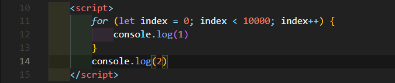
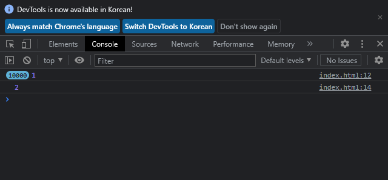
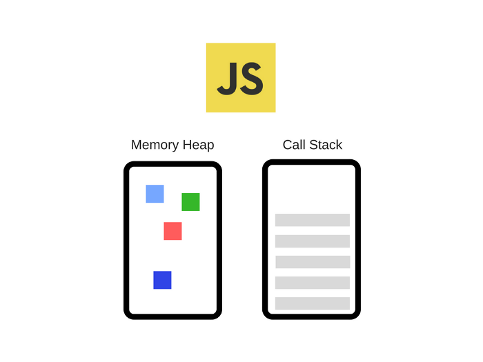
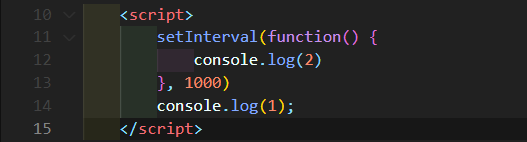
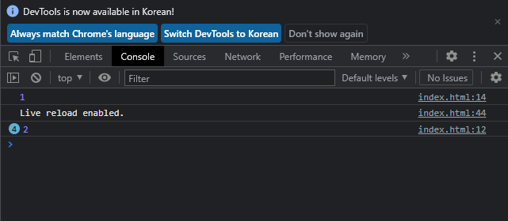

# 콜백 함수에 대해

# 0. 개요

자바스크립트에는 콜백 함수(Callback Function)가 있다. 이름 그대로 나중에 호출되는 함수이다. 개발자가 등록해놓은 어떤 이벤트가 발생하면 그때서야 실행되는 함수이다. 그리고 이러한 이벤트들은 보통 비동기(Asynchronous) 방식으로 실행되는 경우가 많다.

그런데 의문점이 들었다. 어디에선가 자바스크립트는 싱글 쓰레드 방식을 채택하고 있다는 말을 들었다. 그런데 어떻게 이벤트를 비동기 방식으로 구현한다는거지? 그리고 어떻게 쓰레드가 콜백 함수가 있는 곳으로 돌아와 실행시킬 수 있는가에 대한 부분이 이해가 되지 않았다.

그래서 오늘은 그에 대해서 한번 알아보고자 한다!!!!

# 1. 자바스크립트에서의 비동기

우선 기본적으로 자바스크립트는 싱글 스레드로 동작하는 동기 방식 언어이다.

     
    <em>그림 1) Synchronous 방식</em>

     
    <em>그림 2) Chrome Console → for문이 실행된 이후 아래의 console.log(2)가 실행되었다.</em>

위의 js 코드와 Console창을 보면 알 수 있듯이 다른 언어처럼 위에서 아래로 진행하며 실행된다. 메모리도 자바의 JVM처럼 스택을 이용하여 함수 처리를 한다.

     <a href="https://blog.sessionstack.com/how-does-javascript-actually-work-part-1-b0bacc073cf)">
           
          <em>그림 3) 자바 스크립트 V8 엔진의 구성요소. </em>
     </a>

어떤 이벤트가 완전히 실행되는데 30초 이상이 걸린다고 가정해보자. 동기(Synchronous) 방식의 경우 이 이벤트가 끝나기 전에는 사용자가 다른 동작을 할 수 없게 된다.

예를 들면 처리하는 데 오랜 시간이 걸리는 복잡한 이미지 변환 메서드를 수행한다고 가정해보자. 이 때 스택에서 복잡한 메서드를 수행하는 동안 브라우저는 어떠한 다른 일도 진행할 수 없다. 화면을 렌더링할 수도 없고 또 다른 이벤트도 진행할 수도 없고 그냥 멈춰있다는 뜻이다.

이러한 점은 사용성 면에서 매우 불편한다. 그래서 사용자는 웹 페이지가 비동기(Asynchronous) 방식으로 실행되면 좋을 것 같다고 생각한다. 그리고 실제로 javascript는 비동기 방식으로 실행이 가능하다!

그런데 기본적으로 js 엔진은 싱글 스레드에 스택을 이용해 함수를 호출하기 때문에 js만으로는 여러 이벤트를 동시에 동작하도록 만들기는 어렵다.

여기서 등장하는게 Web API이다. Web API는 자바스크립트가 실행될 때 웹 브라우저에서 제공하는 별도의 API이다. ajax나 setInterval과 같은 비동기 방식 메서드 지원을 위한 인터페이스를 제공한다.

그럼 여기서 Web API는 어떻게 비동기 방식을 지원할까? 웹 브라우저는 Callback Queue(혹은 Message Queue, 이름 부르는 방식이 다양한 듯)라는 메모리와 Event Loop라는 것이 존재하고 이를 이용해 우리는 비동기 방식 메서드를 활용할 수 있다.

우선 Callback Queue는 비동기적으로 실행된 콜백 함수가 보관되는 영역이다.

Event Loop는 Call Stack과 Callback Queue의 상태를 수시로 체크하며, Call Stack이 빈 상태가 되면, Callback Queue의 첫번째 콜백을 Call Stack으로 push한다. 이러한 반복적인 행동을 틱(tick)이라고 부른다.

그럼 setInterval() 메서드를 활용한 코드를 통해 웹 브라우저가 어떤 방식으로 비동기 방식을 지원하는지 알아보자.

     
    <em>그림 4) setInterval 메서드를 이용한 비동기 방식 코드</em>

### 실행 순서(V8 엔진 시점)

1. 먼저 setInterval() 메서드를 **Call Stack**에 push한다.
2. setInterval() 메서드의 경우 Web API에서 제공하는 메서드이므로 **Call Stack**에서 빼낸 후 Web API를 호출한다.
3. console.log(1)을 **Call Stack**에 push한다.
4. **Call Stack**에서 빼내면서 메서드를 실행해 웹 브라우저의 console에 1을 출력한다.
5. **Callback Queue**에서 받은 콜백 함수를 **Call Stack**에 push한다.
6. 콜백 함수 내부에 console.log(2)를 **Call Stack**에 push한다.
7. **Call Stack**에서 console.log(2)를 빼내면서 웹 브라우저의 console에 2를 출력한다.
8. 콜백 함수도 **Call Stack**에서 빼낸다.

### 실행 순서(Web API 시점)

1. V8 엔진으로부터 setInterval 메서드 실행을 요청받는다.
2. 실행 후 콜백 함수를 **Callback Queue**에 밀어넣는다.
3. Event Loop가 **Call Stack**이 비었는지 확인한다.
4. **Call Stack**이 비면 콜백 함수를 **Call Stack**에 push한다.

     
    <em>그림 5) 자바스크립트 실행 결과</em>

# 👀 참고 자료

[[10분 테코톡] 🎧 우의 Block vs Non-Block & Sync vs Async](https://www.youtube.com/watch?v=IdpkfygWIMk)

[How JavaScript works - Alexander Zlatkov](https://blog.sessionstack.com/how-does-javascript-actually-work-part-1-b0bacc073cf)

[How JavaScript works - Bipin Rajbhar](https://dev.to/bipinrajbhar/how-javascript-works-web-apis-callback-queue-and-event-loop-2p3e)

[Event Loop (이벤트 루프)](https://velog.io/@thms200/Event-Loop-%EC%9D%B4%EB%B2%A4%ED%8A%B8-%EB%A3%A8%ED%94%84)

[자바스크립트 - 동기? 비동기?](https://ljtaek2.tistory.com/142)