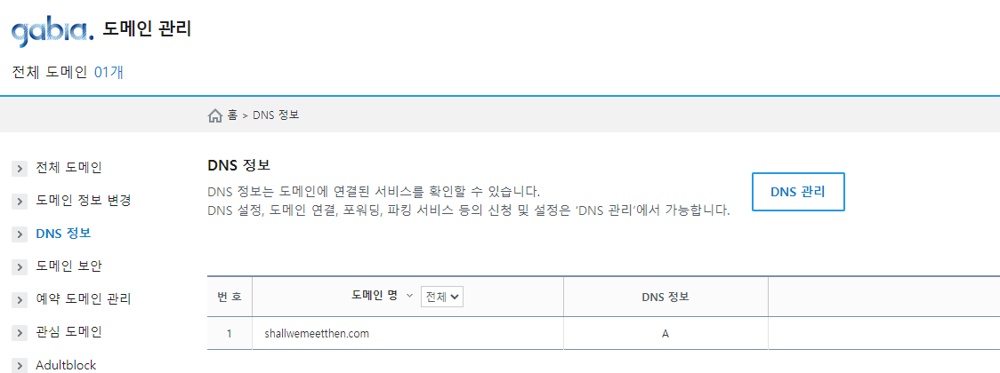
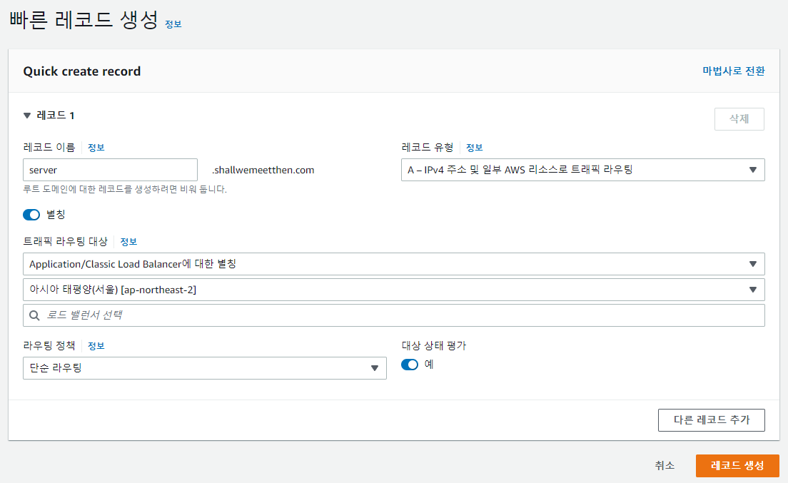

# ACM을 활용한 SSL 인증서 요청

날짜: 2022년 11월 13일
태그: 공부

## ACM이란?

ACM이란 AWS Cerificate Manager로 웹 사이트에서 사용하는 SSL/TLS 인증서를 발급 및 관리해주는 서비스이다. SSL은 클라이언트와 서버 간 구간 암호화를 적용해주는 기술이다. 웹사이트에서 나가고 들어오는 데이터를 암호화하는 기능을 가진 보안 인증서로 클라이언트와 서버 간의 통신을 제 3자가 보증해주는 전자 문서다. https를 사용하기 위해서는 SSL 인증이 필수이다.

## ACM으로 SSL 인증서 요청 방법

1. AWS ACM 접속 후 `인증서 요청` 버튼을 클릭한다.
    
    
    
2. `퍼블릭 인증서`를 선택 후 `다음`을 클릭한다.
    
    
    
3. 도메인 이름을 적은 후 DNS 검증을 선택한다. 키 알고리즘은 `RSA 2048`로 유지한다.
    
    
    
4. 생성 후 인증서로 들어가보면 `CNAME` 정보를 확인할 수 있다. `Route 53에서 레코드 생성`을 클릭한다.
    
    
    
5. 레코드를 생성한다.
    
    
    
6. 가비아로 접속해준다. `가비아` > `My가비아` > `도메인통합관리툴` > `도메인관리` > `DNS 정보`에 들어가서 `DNS 관리`를 클릭해준다.
    
    
    
7. `DNS 설정`의 `레코드 수정`을 클릭한다. `레코드 추가` 후 값을 입력하고 저장한다.
    
    
    
    - `타입` : `CNAME`으로 입력한다.
    - `호스트` : `aws`로 입력한다.
    - `값/위치` : 위에서 생성한 AWS `레코드`의 CNAME 값을 입력해준다.
    - `TTL` : 600으로 그대로 둔다.
    - `상태` : `확인` 버튼을 누른다.
8. 모든 과정을 끝마치고 10~20분을 기다리면 인증서의 상태가 `발급됨`으로 변한다.
    
    
    

## AWS 로드밸런서에 인증서 적용

1. `EC2` → `로드밸런서` → `적용할 로드밸런서 선택` → `리스너`로 이동한다. 그리고 `리스너 추가` 버튼을 누른다.
2. 리스너를 생성한다.
    
    
    
    - `Protocol` : HTTPS
    - `Port` : 443
    - `Default actions` : `Forward to`를 클릭한다. 그리고 `Target Group`은 로드밸런서가 적용되는 타겟 그룹을 선택한다.
    - `Default SSL/TLS certificate` : `From ACM`을 선택한 후 위에서 생성한 인증서를 선택한다.
3. 다시 `Route 53`으로 돌아간다. `호스팅 영역` → `레코드 생성`을 클릭한다.
    
    
    
    - `레코드 이름` : 원하는 subdomain을 입력한다.
    - `레코드 유형` : A - IPv4 주소 및 일부 AWS 리소스로 트래픽 라우팅
    - `별칭` 체크 박스를 켜준다.
        - `트래픽 라우팅 대상` : Application/Classic Load Balancer에 대한 별칭
        - `지역` : 아시아 태평양(서울)
        - `로드 밸런서` : 라우팅할 로드밸런서를 선택한다.