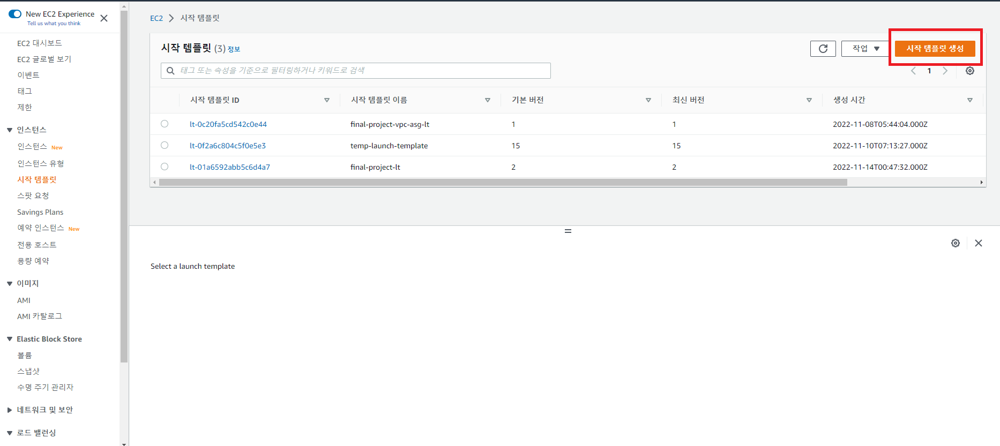
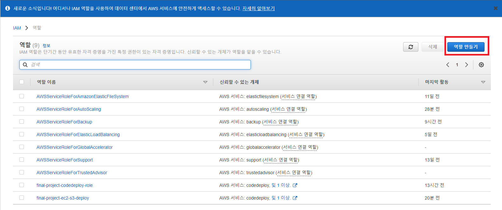
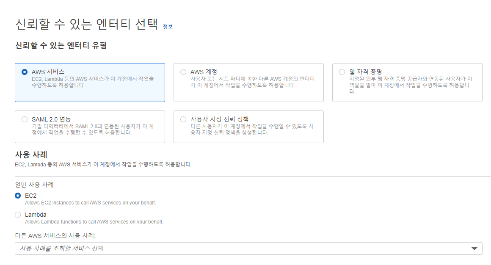
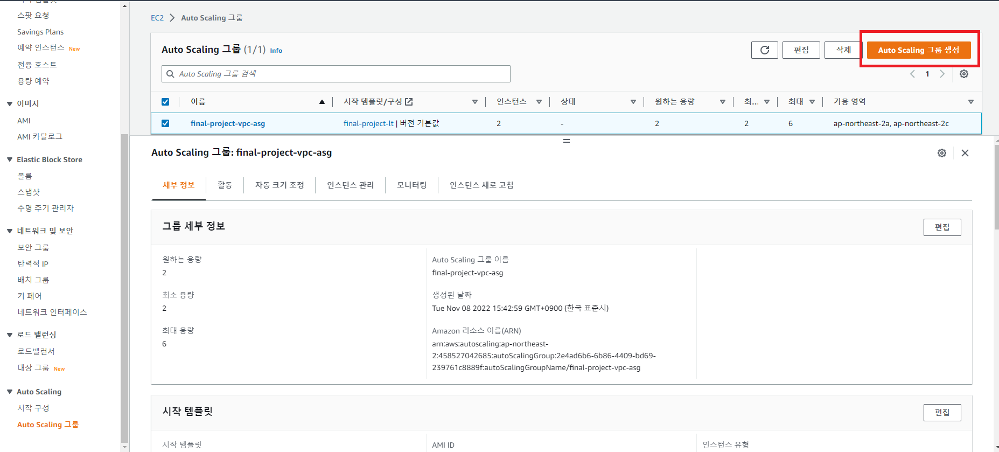

# AWS Auto Scaling 그룹 생성

날짜: 2022년 11월 19일
카테고리: infra
태그: 공부

## 시작 템플릿 생성

1. `EC2` → `인스턴스` → `시작 템플릿` → `시작 템플릿 생성`
    
    
    
2. 시작 템플릿 이름은 원하는 걸로 입력한다. 나의 경우에는 `final-project-lt`로 했음
3. AMI는 오토 스케일링을 위해 생성한 이미지를 사용한다. 나의 경우에는 `deploy-server-image`이다.
4. 인스턴스 유형은 `t2.micro`로 한다. (프로젝트 할 때는 교보재로 받아 `t2.small`을 이용했음)
5. `private-subnet`에 접속할 전용 pem 키를 하나 생성한다. `public-subnet`에 있는 인스턴스에 넣어두고 ssh로 접속할 수 있다.
6. 네트워크 설정에서 `서브넷`은 따로 설정하지 않는다.
7. 보안 그룹은 `private-subnet`용 보안 그룹을 사용한다. 나의 경우에는 `private-ec2-sg`임.
8. 스토리지(볼륨)은 그대로 둔다.
9. 리소스 태그도 따로 포함하지 않는다.
10. `고급 세부 정보` → `IAM 인스턴스 프로파일`에서 새로운 IAM 프로파일을 생성한다.
    
    
    
    - 이 작업은 추후에 CodeDeploy를 이용해 CI/CD 환경을 구축할 때 EC2가 S3에 있는 배포 파일을 다운로드 하기 위해 사용되는 IAM 역할을 만드는 작업이다.
11. 신뢰할 수 있는 엔티티 유형에 `AWS 서비스`를 선택하고 사용 사례에 `EC2`를 체크한다.
    
    
    
12. 권한 정책에서 `AmazonEC2RoleforAWSCodeDeploy`를 추가한다.
13. 역할 이름을 입력하고 역할을 생성한다. 나의 경우에는 `final-project-ec2-s3-deploy`라고 이름 지었다.
14. 생성 후 다시 시작 템플릿 생성 페이지로 돌아와서 `IAM 인스턴스 프로파일` 옆에 있는 새로고침 이미지를 클릭하고, 방금 생성한 `final-project-ec2-s3-deploy` 프로파일로 설정한 후 저장한다.

## Auto Scaling 그룹 생성

1. `EC2` → `Auto Scaling` → `Auto Scaling 그룹` → `Auto Scaling 그룹 생성`
    
    
    
2. Auto Scaling 그룹 이름을 설정한다. 나의 경우에는 `final-project-vpc-asg`라고 이름지었다.
3. 시작 템플릿은 위에서 생성한 `final-project-lt`를 선택한다.
4. VPC는 생성했던 VPC를 이용한다. 나의 경우에는 `final-project-vpc`이다.
5. 가용 영역 및 서브넷은 `private-subnet-a1`, `private-subnet-c1`로 설정한다.
6. 로드 밸런싱은 `기존 로드 밸런서에 연결` 선택 후 `로드 밸런서 대상 그룹에서 선택` → 예전에 생성했던 대상 그룹인 `final-project-alb-asg-tg`를 선택한다.
7. 그룹 크기는 원하는 용량 2, 최소 용량 2, 최대 용량 3으로 설정한다. 최소 용량은 2로 하고 나머지는 입맛에 맞추면 된다.
8. 크기 조정 정책은 `대상 추적 크기 조정 정책`을 선택한다.
    - 지표 유형 : `평균 CPU 사용률`
    - 대상 값 : `80`
    - 인스턴스 요구 사항 : `300`
    
    → 위와 같이 설정하면 대상 그룹에 속한 인스턴스의 평균 CPU 사용률이 80%가 넘어서면 자동으로 스케일 아웃되고, 사용률이 줄어들면 스케일 인된다.
    
9. 나머지는 필요에 따라 선택하고 Auto Scaling 그룹을 생성한다.