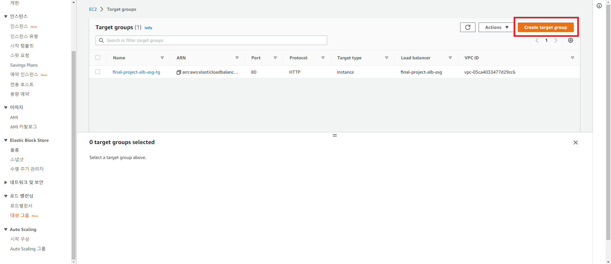
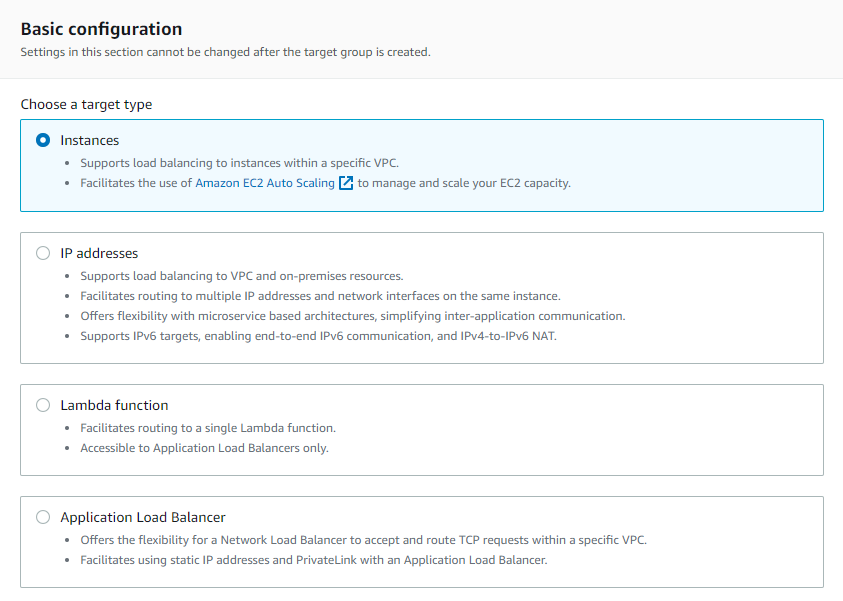
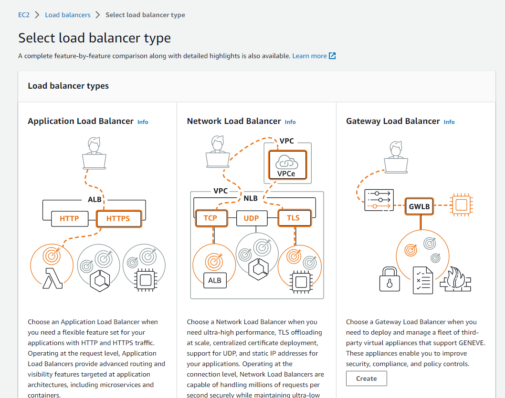
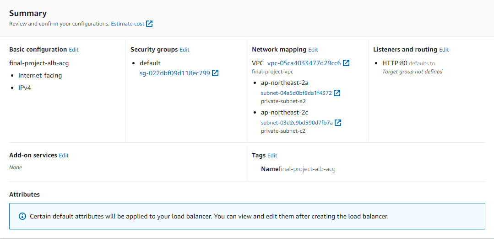

# AWS EC2 로드밸런서 설정

날짜: 2022년 11월 18일
카테고리: infra
태그: 공부

## 타겟 그룹 생성

1. `EC2` → `로드 밸런싱` → `대상 그룹` → `대상 그룹 생성`
    
    
    
2. `Basic configuration`은 `Instances`로 선택한다.
    
    
    
3. `Target group name`은 원하는 이름으로 한다. 나는 `final-project-alb-acg-tg`로 했다.
4. `Protocol`은 `HTTP`, `Port`는 `80`으로 한다.
    - 참고로 대상 그룹은 로드밸런서와 통신하기 때문에 SSL 인증서를 적용하지 않아도 된다. 클라이언트와 서버 간 구간 암호화는 로드밸런서에 적용할 것이다.
5. `VPC`는 기존에 생성한 `final-project-vpc`로 한다.
6. `Protocol Version`은 `HTTP1`으로 한다.
7. `Health Check`에서 `Advanced health check settings`를 눌러 `Success Code`에 `200,401`로 변경해준다.
    - 우리 서비스는 JWT를 이용하기 때문에 헬스 체크용 요청이 401로 반환된다. 추후에 200으로 받을 수 있도록 리팩토링하자.
8. `Register targets`에서 아무것도 건드리지 않고 바로 `Create target group`을 클릭한다. 

## 로드밸런서 생성

1. `EC2` → `로드 밸런싱` → `로드밸런서` → `로드 밸런서 생성`
2. `Application Load Balancer`로 선택
    
    
    
3. `Load balancer name`은 원하는 이름으로 설정한다. 나는 `final-project-alb-acg`로 설정했다.
4. `Scheme`은 `Internet-facing`으로 설정한다.
5. `IP address type`은 `IPv4`로 설정한다.
6. `VPC`는 본인이 생성한 VPC로 설정한다. 나의 경우에는 `final-project-vpc`로 설정했다.
7. `Mappings`는 `ap-northeast-2a`, `ap-northeast-2c` 둘 다 체크해준다. 그 후 Subnet은 각각 `private-subnet-a1`, `private-subnet-c1`으로 설정한다.
8. `Security Group`은 새로 생성해준다. 인바운드 규칙은 `SSH`, `HTTP`, `HTTPS`를 모든 대상으로 열어준다.
9. `Listeners and routing`은 우선 HTTP만 등록해둔다. 추후에 ACM 설정 후 HTTPS로 등록한다.
10. `Tag`에 Key에 Name, Value에 Load balancer name에 입력한 값을 똑같이 입력한다.
11. Summary 확인 후 로드밸런서를 생성한다.
    
    