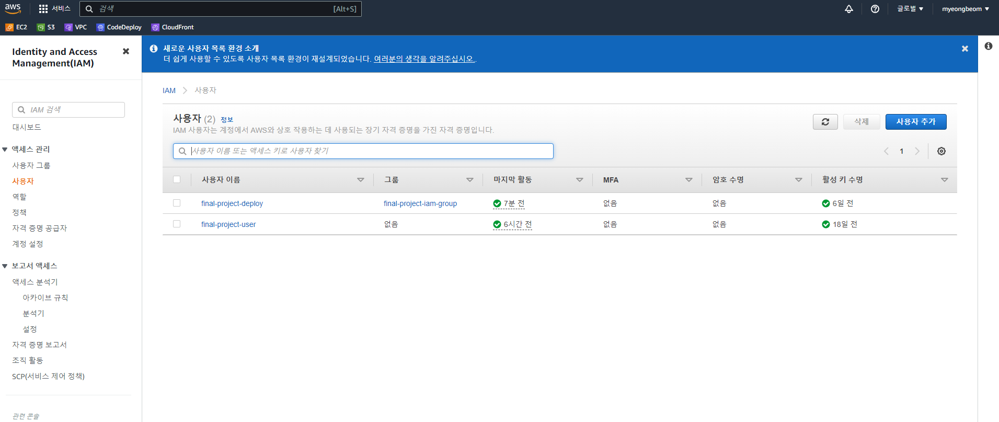
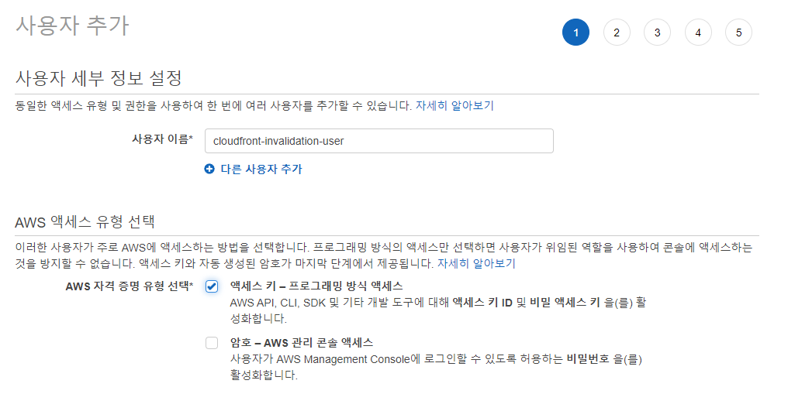
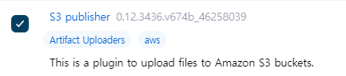
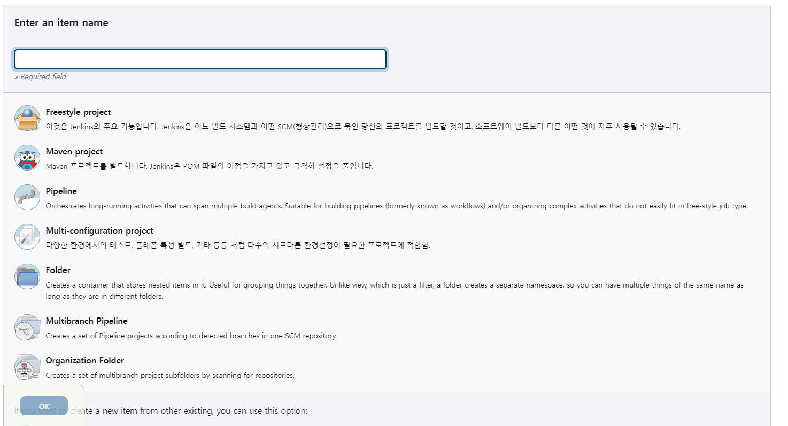
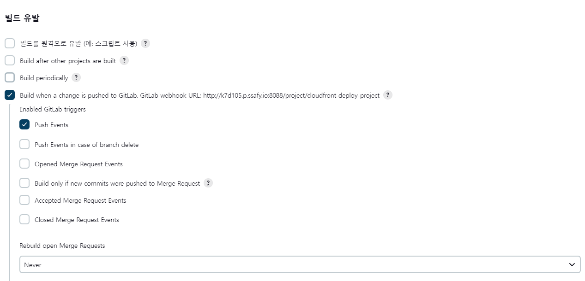
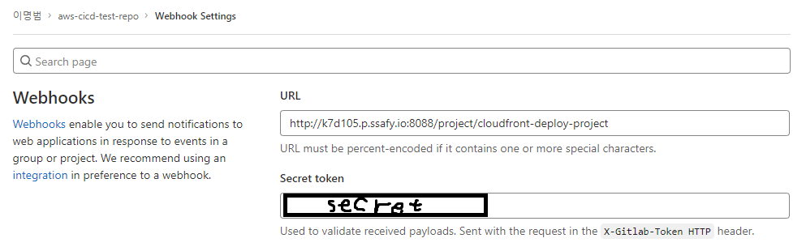

# Jenkins로 리액트 프로젝트 Cloudfront CI/CD 환경 구축

날짜: 2022년 11월 14일
태그: 공부

## Cloudfront 무효화 설정

1. Cloudfront 무효화를 위한 설정을 해야한다. 
2. Cloudfront의 invalidation을 생성하기 위한 IAM 사용자를 생성해야한다. `IAM` → `사용자` → `사용자 추가`
    
    
    
3. `사용자 이름`을 아무거나 입력하고 `액세스 키`는 프로그래밍 방식 액세스로 선택한다.
    
    
    
4. `기존 정책 직접 연결` → `정책 생성` 버튼을 누른다.
5. `시각적 편집기`에서 다음과 같이 설정한다.
    - 서비스 : cloudfront
    - 작업 : CreateInvalidation
    - 리소스 : `ARN 추가` → `CloudFront_distribution ARN 지정`에 무효화할 cloudfront의 ARN 입력
    - 요청 조건 : 그대로
6. 나머지 입력 후 정책 생성

## 젠킨스 컨테이너에 aws cli 설치

1. 젠킨스 컨테이너의 sh로 들어간다. → `docker exec -it {젠킨스 컨테이너 이름} sh`
2. 우선 jenkins container에 aws cli를 설치해준다.
    
    ```bash
    apt-get update
    apt install python3-pip -y
    pip3 install awscli
    ```
    
3. awscli의 유저 설정을 해준다. → aws configure
    
    ```bash
    AWS Access Key ID [****************TUMF]: {아까 생성한 IAM 사용자 access key}
    AWS Secret Access Key [****************uAgT]: {아까 생성한 IAM 사용자 secret key}
    Default region name [ap-northeast-2]: ap-northeast-2
    Default output format [json]: json
    ```
    

## Cloudfront CI/CD 환경 구축 (리액트 배포)

1. Jenkins에 접속한다.
2. `플러그인` 중 `NodeJS`와 `S3 publisher`를 설치해준다. 
    
    
    
3. `NodeJS`는 GlobalConfiguration으로 가서 `Install Automatically` 체크 후 저장해준다. 그리고 S3 publisher는 시스템 설정에서 `Amazon S3 profiles`에서 IAM에서 생성한 access key와 secret key를 등록해야한다. `profile name`은 aws-s3-profile로 한다.
4. `Pipeline`으로 아이템을 생성한다.
    
    
    
5. `빌드 유발`에서 `Build when a change is pushed to GitLab. GitLab webhook URL: ~~` 선택
    
    
    
6. `Gitlab`에서 웹 훅 설정도 해주기! URL은 `Gitlab webhook URL`뒤에 URL 주소를 적어주고 Secret token은 더 보기 후 밑으로 내려가면 생성할 수 있다.
    
    
    
7. Pipeline 스크립트를 입력한다.
    
    ```bash
    pipeline {
        agent any
        tools {nodejs "NodeJS"}
    
        stages {
            stage('prepare') {
                steps {
                    git credentialsId: 'this', url: 'https://lab.ssafy.com/mungmnb777/aws-cicd-test-repo.git'
                }
            }
            
            stage('build') {
                steps {
                    dir('FE/shall-we-meet-then') {
                        sh 'npm install'
                        sh 'CI=false npm run build'
                    }
                }
            }
            
            stage('upload S3') {
                steps {
                    s3Upload consoleLogLevel: 'INFO', 
                    dontSetBuildResultOnFailure: false, 
                    dontWaitForConcurrentBuildCompletion: false, 
                    entries: [[
                        bucket: 'final-project-react-deploy-kr', 
                        excludedFile: '', 
                        flatten: false, 
                        gzipFiles: false, 
                        keepForever: false, 
                        managedArtifacts: false, 
                        noUploadOnFailure: true, 
                        selectedRegion: 'ap-northeast-2', 
                        showDirectlyInBrowser: false, 
                        sourceFile: 'FE/shall-we-meet-then/build/**', 
                        storageClass: 'STANDARD', 
                        uploadFromSlave: false, 
                        useServerSideEncryption: false]], 
                    pluginFailureResultConstraint: 'FAILURE',
                    profileName: 'aws-s3-profile', 
                    userMetadata: []
                }
            }
            
            stage('cloudfront invalidation') {
                steps {
                     sh 'aws cloudfront create-invalidation --distribution-id E325L50895MPE4 --paths "/*"'
                }
            }
        }
    }
    ```