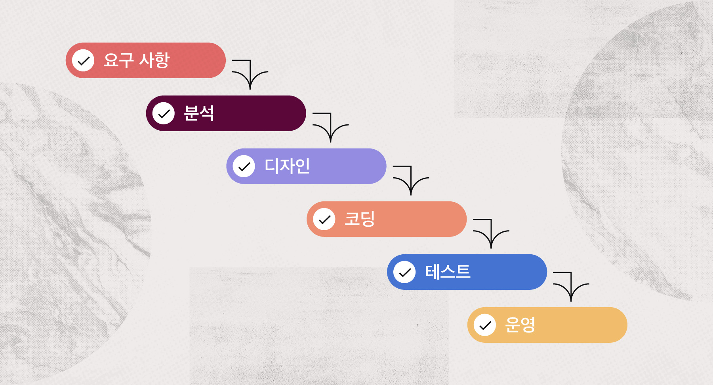
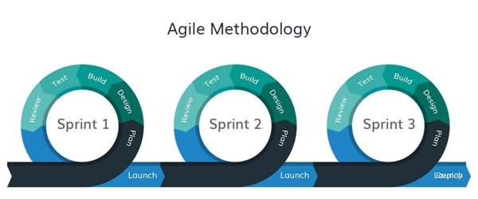
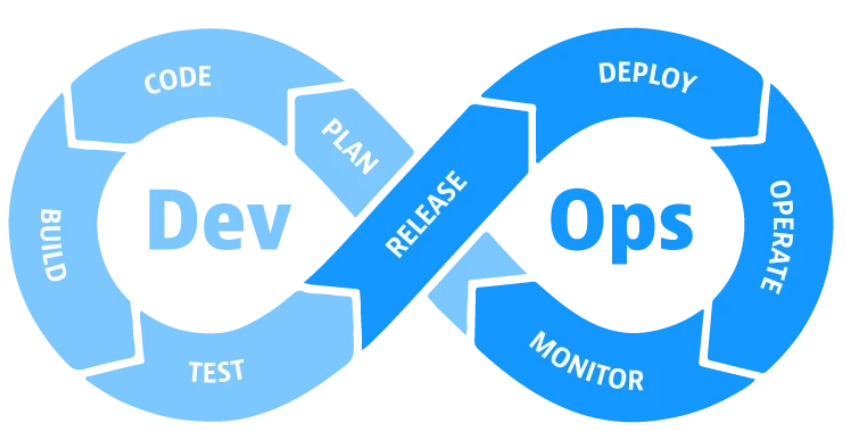
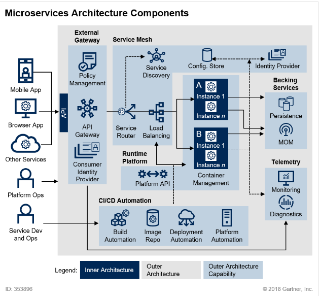
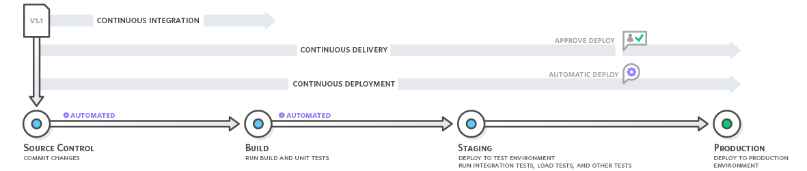

# 1. DevOps와 CI/CD의 이해

## 1.1. Waterfall vs Agile

### Waterfall 방식

워터폴은 프로젝트의 단계 구분이 뚜렷하게 나누어진 순차적 [프로젝트 관리 방법론](https://asana.com/ko/resources/project-management-methodologies)이다.

	 

소프트웨어 개발 라이프 사이클(Software development life cycle, SDLC)이라고도 하는 [워터폴 방법론](https://asana.com/ko/resources/waterfall-project-management-methodology)은 업무가 폭포와 같이 아래로 떨어지는 선형 프로세스이며 순차적으로 진행됩니다.

	 

순서는 위와 같다.

- 요구사항 정의
- 분석 및 설계
- 구현(디자인 및 코딩)
- 테스트
- 운영

워터폴은 직관적이고 매우 디테일하게 각각의 단계를 처리하기 때문에 대규모 프로젝트에서 좋다. 하지만 이전 단계로 돌아가기가 어렵기 때문에 변경을 반영하기가 매우 어렵다.

### Agile 방식

애자일은 신속한 반복 작업을 통해 실제 작동 가능한 소프트웨어를 개발하여 지속적으로 제공하기 위한 소프트웨어 개발 방식이다.

	 

애자일은 라이프사이클이 워터폴 방식에 비해 짧기 때문에 변경을 반영하기가 쉽다. 아래는 애자일 소프트웨어 개발에 대한 선언문(The Manifesto for Agile Software Development)이다.

> Individuals and interactions over processes and tools
> 
> 
> Working software over comprehensive documentation
> 
> Customer collaboration over contract negotiation
> 
> Responding to change over following a plan
> 
> 개인과 그들의 상호작용이 프로세스와 도구보다 우선하기를
> 
> 작동하는 소프트웨어가 포괄적인 문서보다 우선하기를
> 
> 고객과의 소통이 계약 협상보다 우선하기를
> 
> 변화에 대응하는 것이 계획을 따르는 것보다 우선하기를
> 

## 1.2. Cloud Native Application

### 클라우드 네이티브란?

클라우드 제공 모델에서 제공하는 분산 컴퓨팅을 활용하기 위해 애플리케이션을 구축 및 실행하는 개념을 의미한다.

### 클라우드 네이티브 애플리케이션의 요소

- CI/CD
- DevOps
    
    

         
    

    
    - 엔지니어가 프로그래밍하고, 빌드하고, 직접 시스템에 배포 및 서비스를 한다.
- Microservices
    
    아래 사진은 2018년 `Gartner`에서 발표한 MSA이다.
    
    

	     
    
    
    
    - `Inner Architecture` : 도메인을 이용해 비즈니스 로직을 구현하는 부분
    - `Outer Architecture Capability` : `Inner Architecture`들이 정상적으로 작동될 수 있도록 운영하고 지원하는 서포트 시스템
- Containers

## 1.3. CI/CD

	 

- Continuous Integration
    - 개발자들은 형상 관리 시스템을 이용한다. 같은 코드를 여러 개발자가 사용하는 경우 버전 관리를 해야하기 때문에 사용하게 된다.
    - 젠킨스는 깃에 푸쉬된 코드를 가져오고, 빌드, 테스트 그리고 패키징을 자동으로 해준다.
        - 빌드는 Maven, Gradle을 사용할 수 있다.
- Continuous Delivery
- Continuous Deployment

## 1.4. Jenkins

- 지속적인 통합과 배포 → Work Flow를 제어
- 다양한 플러그인을 연동할 수 있다.