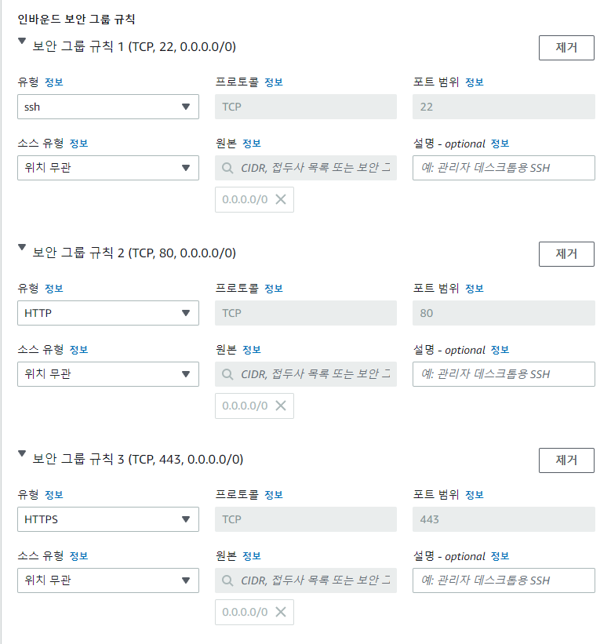
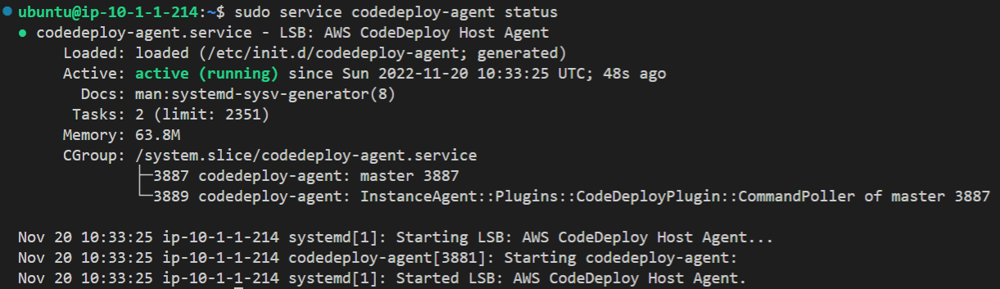
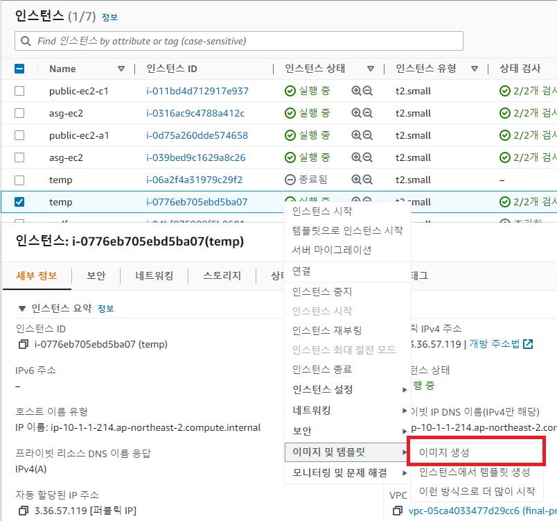

# EC2 인스턴스 생성 및 커스텀 AMI 생성

날짜: 2022년 11월 17일
태그: 공부

## public-subnet EC2 인스턴스 생성

1. `EC2` → `인스턴스` → `인스턴스` → `인스턴스 시작`
    - 총 2개의 public 인스턴스를 만들 것이다. 우선 public-subnet-a1의 인스턴스를 만들어보도록 하겠다.
2. 이름 및 태그에 원하는 이름을 설정한다. 나의 경우에는 `public-ec2-a1`으로 설정
3. 애플리케이션 및 이미지(Amazon Machine Image)
    - `Quick Start` → `Ubuntu`
    - AMI를 `Ubuntu Server 20.04 LTS (HVM), SSD Volume Type`으로 설정
    - 아키텍처는 `64비트(x86)`
4. 인스턴스 유형은 `t2.micro`
5. 키 페어(로그인)은 `새 키페어 생성` 버튼을 클릭하고 .pem으로 만든다. 이 키는 ssh로 인스턴스에 원격 접속할 때 사용된다.
6. 네트워크 설정에서 우측에 있는 `편집` 버튼을 누른다. 
    - VPC : 이전에 생성한 VPC를 선택한다. 나의 경우에는 `final-project-vpc`이다.
    - 서브넷 : `public-subnet-a1`
    - 퍼블릭 IP 자동 할당 : `비활성화` → 추후에 Elastic IP로 퍼블릭 IP를 할당할 것이다.
    - 보안 그룹 : 새로 생성한다. 인바운드 규칙은 총 3개이다.
        
        
        
        - 보안 그룹 이름 : `public-ec2-sg`
        - 설명 : 원하는 문장을 작성한다.
        - 인바운드 보안 그룹 규칙
            1. 유형 : `ssh`, 소스 유형 : `위치 무관` 혹은 `Anywhere`로 한다.
            2. 유형 : `HTTP`, 소스 유형 : `위치 무관` 혹은 `Anywhere`로 한다.
            3. 유형 : `HTTPS`, 소스 유형 : `위치 무관` 혹은 `Anywhere`로 한다.
7. 완료 후 인스턴스를 생성한다.
8. `public-subnet-c1`에 대한 ec2 인스턴스도 생성해준다. 6번 과정에서 서브넷을 public-subnet-c1으로 해준다.

## Elastic IP 할당

1. `EC2` → `네트워크 및 보안` → `탄력적 IP` → `탄력적 IP 주소 할당`
2. 탄력적 IP 주소 설정
    - 네트워크 경계 그룹 : `ap-northeast-2`
    - 퍼블릭 IPv4 주소 풀 : `Amazon의 IPv4 주소 풀`
3. 태그
    - Key : `Name`
    - Value : `eip-public-ec2-a1`
4. 생성한 IP 주소를 클릭하고 `작업` → `탄력적 IP 주소 연결`
5. 리소스 유형 : `인스턴스`
6. 인스턴스 : 위에서 생성한 ec2 인스턴스를 선택한다.

## 배포용 커스텀 AMI 생성

EC2 인스턴스를 임시로 새로 생성해서 ssh로 원격 접속한다.

### CodeDeploy Agent 설치

1. 우선 다음 명령을 차례로 입력한다.
    
    ```bash
    sudo apt-get update
    ```
    
    ```bash
    sudo apt install ruby-full
    ```
    
    ```bash
    sudo apt install wget
    ```
    
2. 전부 설치가 끝나면 우분투 터미널에서 다음 명령을 입력한다.
    
    ```bash
    cd /home/ubuntu
    ```
    
3. 다음 명령을 입력해준다.
    
    ```bash
    wget https://aws-codedeploy-ap-northeast-2.s3.ap-northeast-2.amazonaws.com/latest/install
    ```
    
4. install 폴더가 생성되면 실행 권한을 부여한다.
    
    ```bash
    chmod +x ./install
    ```
    
5. Ubuntu 20.04에서 최신 버전의 CodeDeploy 에이전트를 설치하려면 다음을 수행한다.
    
    ```bash
    sudo ./install auto > /tmp/logfile
    ```
    
6. 제대로 설치되었는지 확인한다.
    
    ```bash
    sudo service codedeploy-agent status
    ```
    
    
    

### Docker 설치

1. 오래된 버전 삭제하기
    
    ```bash
    sudo apt-get remove docker docker-engine docker.io containerd runc
    ```
    
2. repository를 설정한다.
    
    ```bash
    sudo apt-get update
    ```
    
    ```bash
    sudo apt-get install \
        ca-certificates \
        curl \
        gnupg \
        lsb-release
    ```
    
3. Docker의 Official GPG Key 를 등록한다.
    
    ```bash
    curl -fsSL https://download.docker.com/linux/ubuntu/gpg | sudo gpg --dearmor -o /usr/share/keyrings/docker-archive-keyring.gpg
    ```
    
4. Stable Repository를 등록한다.
    
    ```bash
    echo \
      "deb [arch=amd64 signed-by=/usr/share/keyrings/docker-archive-keyring.gpg] https://download.docker.com/linux/ubuntu \
      $(lsb_release -cs) stable" | sudo tee /etc/apt/sources.list.d/docker.list > /dev/null
    ```
    
5. Docker Engine을 설치한다.
    
    ```bash
    sudo apt-get update
    ```
    
    ```bash
    sudo apt-get install docker-ce docker-ce-cli containerd.io
    ```
    
6. 설치가 완료되었는지 확인한다.
    
    ```bash
    docker --version
    ```
    
7. sudo 명령어 없이 도커를 사용하기 위해 도커 그룹에 유저를 추가한다.
    
    ```bash
    sudo usermod -aG docker $USER
    ```
    

### 도커파일 생성

1. 도커 파일과 백엔드 배포 파일이 저장될 폴더를 생성한다.
    
    ```bash
    mkdir ~/server
    ```
    
    ```bash
    cd ~/server
    ```
    
2. vim 편집기로 도커 파일을 생성한다.
    
    ```bash
    vim Dockerfile
    ```
    
3. `i`를 누르고 다음 코드를 입력한다.
    
    ```docker
    FROM openjdk:17-jdk-alpine
    ENV ARTIFACT_NAME=shall-we-meet-then-0.0.1-SNAPSHOT.jar
    
    COPY $ARTIFACT_NAME .
    
    EXPOSE 80
    ENTRYPOINT exec java -jar ${ARTIFACT_NAME} --spring.profiles.active=prod
    ```
    
4. `esc`를 누르고 `:wq`를 입력한 후 저장한다.

### AMI 생성하기

1. 임시로 생성한 인스턴스에 우클릭한다.
2. `이미지 및 템플릿` → `이미지 생성`
    
    
    
3. 이미지 이름과 이미지 설명을 입력하고 이미지를 생성한다.