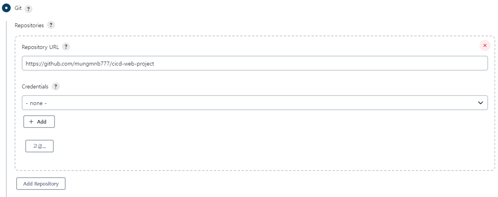

# 2. Jenkins를 이용한 CI/CD 사용

## 2.1. Git, Maven 설정

### 깃 플러그인 설정

1. 젠킨스 메인 화면에서 `Jenkins 관리`를 클릭한다.
2. `System Configuration`에서 `플러그인 관리`로 들어간다.
3. 설치 가능 탭에서 `github`를 검색한다.
4. 만약 `Github plugin`이 뜬다면 다운로드해준다.
    - 참고로 없으면 이미 설치된거임!! 최신 버전은 기본적으로 `Github plugin`이 다운되어있기 때문에 사용자가 추가로 다운할 필요가 없다.

### Maven 플러그인 설정

1. 젠킨스 메인 화면에서 `Jenkins 관리`를 클릭한다.
2. `System Configuration`에서 `플러그인 관리`로 들어간다.
3. 설치 가능 탭에서 `maven`를 검색한다.
4. `Maven Integration`을 설치해준다.
5. 다시 메인 화면으로 돌아와서 `Jenkins 관리`를 클릭한다.
6. `Global Tool Configuration`에 들어간다.
7. `Maven` 탭에서 Maven을 설치해준다. `Install automatically`를 체크해두면 설정한 버전으로 Maven이 설치된다.

## 2.2. Maven 프로젝트 생성

1. 젠킨스 메인 화면에서 `새로운 Item` 클릭
2. `Maven Integration` 플러그인을 다운로드하면 `Maven project` 아이템이 생긴다. 해당 아이템으로 프로젝트를 생성하자.

	 

1. 생성한 프로젝트 상세 정보로 들어가 `구성`을 클릭한다.
2. `소스 코드 관리` 탭에서 관리할 깃 리포지토리 주소를 입력한다.

	 

1. `Pre Steps` 탭에서 빌드 전에 실행할 작업에 대한 설정을 해준다. `Root POM`에는 pom.xml의 위치를 입력해주고, `Goals and options`에는 수행할 작업을 입력하면 된다.
    - clean : 빌드를 이전에 했다면 그 정보를 지운다.
    - compile : 컴파일한다.
    - package : 컴파일한 내용을 `pom.xml`의 내용을 반영하여 패키징한다.

## 2.3. 톰캣 서버 연동

### 플러그인 설정

1. 젠킨스 메인 화면에서 `Jenkins 관리`를 클릭한다.
2. `System Configuration`에서 `플러그인 관리`로 들어간다.
3. 설치 가능 탭에서 `deploy`를 검색한다.
4. `Deploy to container` 플러그인을 다운로드한다.

### 프로젝트 설정

1. 새로운 Maven Project를 생성해 위 `2.2`의 과정을 똑같이 해준다.
2. `빌드 후 조치`에서 `빌드 후 조치 추가` → `Deploy war/ear to a container`를 클릭해준다.
3. `WAR/EAR files` 입력란에 `**/*.war`라고 입력해준다.
4. 그리고 `Containers`에 대한 설정을 변경해야 한다. 톰캣 버전은 `9.x`로 하고 `Credentials`를 등록해야 한다. 해당 내용은 톰캣 설정 중 `tomcat-users.xml`에 있는 유저 정보의 `username`과 `password`를 입력해준다. 
5. `Tomcat URL`에 톰캣의 호스트 주소를 입력해준다.

## 2.4. PollSCM 설정

PollSCM은 `cron`을 이용해서 스케줄링 하는 기능이다.

1. `Project` → `구성` → `빌드 유발`로 들어가준다.
2. `Poll SCM`을 체크한다.
3. Schedule을 입력한다. Schedule에 관련된 cron 문법은 구글에서 검색!