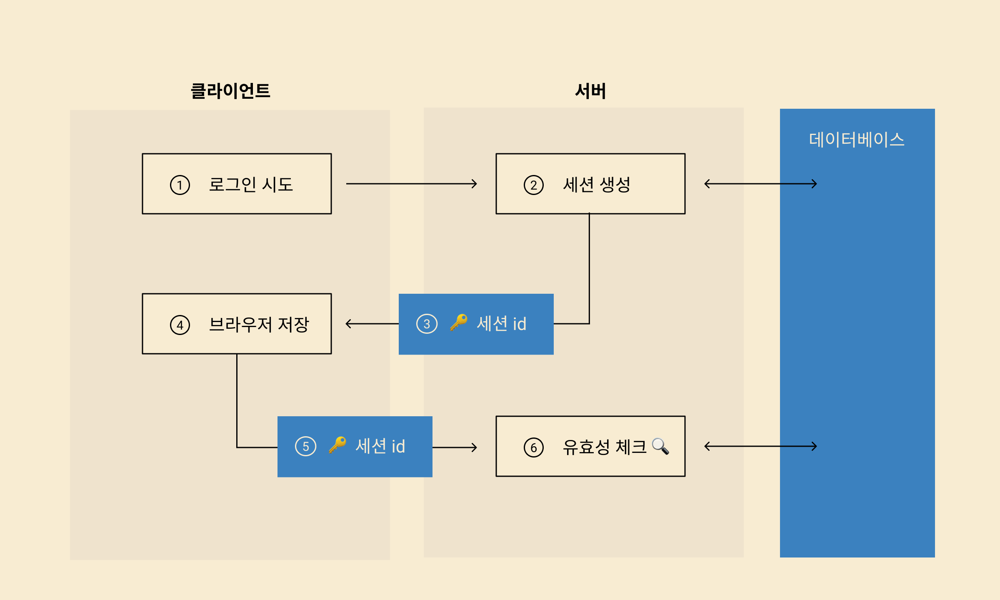

# OAuth 2.0

날짜: 2022년 11월 30일
카테고리: infra

## 등장 배경

1. 기존 세션 방식

- **문제점**
    - 일반적으로 `Stateful`하다. 서버에 요청이 들어올 때마다 DB에서 현재 상태에 대한 확인을 해야한다. 이에 따라 서버 측에서 권한의 유효성을 반복적으로 확인하는 비용이 발생한다.
    - 쿠키는 보통 도메인에 속한 경우가 많다. 여러 도메인과 상호작용하는 앱일 경우 추가적으로 설정해야 할 사항들이 생길 수 있다.
    - 세션은 모바일 앱에 적합하지 않다.
    - 세션은 사용자가 서로 다른 서비스 간에 자신의 데이터를 공유하기 어렵다.

## OAuth 2.0의 네 가지 역할

1. **앱(Client)**
    
    앱은 사용자 데이터를 활용하여 서비스를 제공하려는 응용프로그램이다. 앱이 사용자 데이터에 접근할 권한을 요청하면서 OAuth 2.0 프로세스가 시작되고, 앱이 사용자 데이터를 받게 되면 끝난다.
    
2. ******************************************************************************데이터 제공기관(Resource Server)******************************************************************************
    
    데이터 제공기관은 사용자의 데이터를 보유하고 유효한 접근 권한을 부여 받은 앱이 요청하면 사용자 데이터를 제공하기도 하는 서버를 의미한다.
    
3. **권한 제공기관(Authorization Server)**
    
    권한 제공기관은 사용자 데이터에 접근한 권한을 제공하는 서버이다. 앱의 접근 요청에 따라 사용자에게 앱에 대해 등록된 정보 및 앱이 요청한 데이터 항목, 활용하려는 목적 및 기간 등에 대한 정보를 제시하고 사용자의 동의 여부를 문의하는 역할을 한다.
    
4. **사용자(Resource Owner)**
    
    사용자는 OAuth 2.0의 최고 권력자이다. 데이터 제공기관 입장에서는 데이터 보호를 부탁한 고객이고, 앱의 입장에서는 가치를 창출하기 위해 필요한 데이터의 주인이다.
    

## OAuth 2.0에 사용되는 데이터

1. **앱의 등록정보**
    
    OAuth 2.0이 작동하기 위해서 앱은 사전에 권한 제공기관에 등록해야 한다. 새로운 앱이 등록할 때 일반적으로 앱이 제공할 서비스의 명칭, 웹사이트, 로고 등의 기본 정보를 제출한다.
    
2. **Redirect URI**
    
    권한 제공 기관은 사용자가 앱에게 권한 부여하는 것에 사용자가 동의하면 사용자를 앱의 등록된 Redirect URI로 이동시킨다. 만일 등록되지 않은 Redirect URI를 담은 요청을 받게되면 그 요청은 무효처리된다. 기존에 등록된 Redirect URI의 범위에 한해서 사용자를 연결시킴으로써 방지할 수 있는 공격들이 있기 때문이다. 또한, 모든 HTTP 기반 Redirect URI는 반드시 TLS로 보안이 되어있어야 하므로 `https`로 시작하는 URI만 등록이 가능하다.
    
3. **Client ID와 Client Secret**
    
    새로 등록하는 앱은 권한 제공기관으로부터 Client ID와 Client Secret을 발급받는다. Client ID는 공개하는 정보로서 로그인 웹 페이지 또는 JS에 포함될 수 잇는 정보인데, Client Secret은 노출되면 안되는 정보이다. Client Secret의 노출을 방지할 수 없는 Single-Page JS 앱 또는 Native 앱의 경우 Client Secret을 사용하지 않는다. 이럴 경우 애초에 Client Secret을 발급하지 않는게 바람직하다.
    

## OAuth 2.0의 프로토콜 흐름

