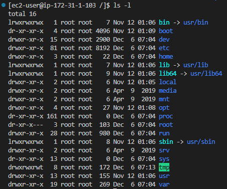
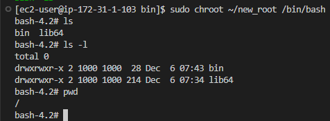
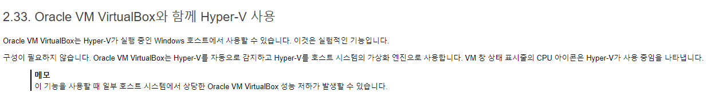

# 1. 도커란?

날짜: 2022년 12월 6일
카테고리: infra

## 1.1. 가상 머신과 도커 컨테이너

### 가상화

- Paravirtualization
    - 반가상화
    - 호스트 OS에서 PV를 지원해야함
- Hardware Virtual Machine
    - 전가상화
    - 완전히 가상화된 게스트에는 커널 지원이 필요하지 않음 → Windows를 게스트 OS로 띄울 수 있다.
    - HVM은 CPU를 가상화하여 제어를 요구하는 과정이 추가적으로 들어가기 때문에 일반적으로 PV보다 느림
    - 근데 최근에는 Xen에서 HVM의 속도 문제를 해결하기 위해 HVM에서 PV 드라이버를 사용할 수 있도록 업데이트함
    - AWS는 최근에 HVM 방식으로 대부분의 인스턴스를 제공한다.

### 도커 원리

리눅스의 `chroot`, `namespace`, `cgroup`을 활용했다.

- chroot : root의 위치를 변경하는 것
    - Usage
        
        ```bash
        Usage: chroot [OPTION] NEWROOT [COMMAND [ARG]...]
        ```
        
    - 현재 root
        
        
        
    - 변경 후 root
        
        
        
    - 왜 쓸까?
        
        <aside>
        💡 호스트 OS로부터 격리시킨다. root를 변경하게 되면 상위 폴더로는 이동할 수 없기 때문에 게스트 OS에서 호스트 OS의 파일 및 폴더에 접근하지 못한다.
        
        </aside>
        
    
    [컨테이너 기초 - chroot를 사용한 프로세스의 루트 디렉터리 격리](https://www.44bits.io/ko/post/change-root-directory-by-using-chroot)
    

- namespace : 시스템의 리소스를 분리
    - cgroup
    - ipc : 프로세스간의 독립적인 통신통로 할당
    - network : 새로운 네트워크 인터페이스 구성 (도커의 -p 옵션을 이걸로 하지 않을까??)
    - mnt : 호스트 파일시스템에 구애받지 않고 독립적으로 파일시스템을 마운트하거나 언마운트 가능 (마운트의 의미는 하드웨어 장치를 운영체제에 인식시키는 것)
    - pid : linux에서 pid는 항상 1로 시작한다. 그 외에 프로세스는 항상 1보다 큰 PID를 부여받는데, namespace를 분리하면 다시 1부터 시작
    - uts : 호스트네임 부여 (리눅스에서는 네트워크 시스템을 사용하기 위해 호스트네임이 필요함 → 새로운 컨테이너에서 네트워크 환경을 구성하기 위해서는 호스트네임을 새로 부여해줘야함)
    - user
    - time
    - 왜 쓸까?
        
        <aside>
        💡 호스트 OS와 게스트 OS가 사용하는 리소스가 겹치면 안되니 격리시킨다. 가상메모리와 비슷한 방식으로 리소스를 분리하는걸까??
        
        </aside>
        

[리눅스 네임스페이스(Linux Namespace)란?](https://www.44bits.io/ko/keyword/linux-namespace)

- cgroup : 리소스를 제한하는 것
    - 메모리, CPU, Network, Device, I/O 격리에 사용됨
    - namespace로 분리하고 cgroup을 이용해 리소스 사용을 제한 하는 방식으로 사용할 것 같다.
    
    [Drooling Over Docker #1 - The Genesis of Containers](https://medium.com/@paccattam/drooling-over-docker-1-the-genesis-d4e01ab8c6cf)
    

## 1.2. 도커를 시작해야 하는 이유

- 도커 컨테이너
    - 호스트 OS 위에서 실행되는 격리된 공간
    - 개발 환경과 운영 환경을 간단하게 통합할 수 있다.
    - 커널 미포함 → 이미지 크기가 작음 → 배포 속도가 빨라진다.

## 1.3. 도커 설치

- libcontainer : 도커의 컨테이너 형식
    - 순수한 GO 언어로 만들어진 컨테이너
- Windows 10, 맥 OS X 10.10.3 이전 버전에서는 따로 가상화 공간을 만들어줘야함
    
    → 왜?? → 하드웨어 단에서 가상화를 지원하지 않음 → Windows 10은 Hyper-V를 이용하여 하드웨어 가상화 가능
    
- 책에는 VirtualBox와 호환되지 않는다고 하는데 최근에는 VirtualBox가 Hyper-V를 지원한다는 글을 봄.
    
    