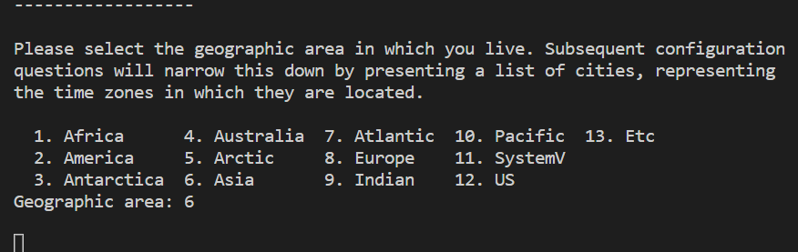

# 2.4. Dockerfile

날짜: 2022년 12월 27일
책: 시작하세요! 도커/쿠버네티스
카테고리: infra

Dockerfile로 이미지 빌드 실습

`RUN apt-get install apache2 -y` 명령을 통해 아파치 서버를 까는 중

근데 아파치 서버 패키지를 다운받을 때 timezone을 사용자로부터 입력받아야함

그냥 yes or no 였으면 -y 옵션으로 처리가 될텐데 이거 같은 경우에는 숫자를 입력해야해서 상호작용을 해줘야 하는듯

CI/CD 환경을 구축할 때 자동으로 이런 처리를 다 하게 구성해야하는데 자동으로 입력되게 할 수 있을까?? → `DEBIAN_FRONTEND=noninteractive`를 붙여주게 되면 패키지 설치시에 사용자 상호작용을 패스할 수 있음

Dockerfile의 각 Step마다 새로운 컨테이너가 생성됨 → 이미지 커밋 → 컨테이너 삭제

→ 이런식으로 새로운 레이어를 생성한다고 함

→ 그래서 Dockerfile을 다시 빌드할 때는 이 레이어를 가지고 캐싱하기 때문에 빌드가 빠르게 진행됨