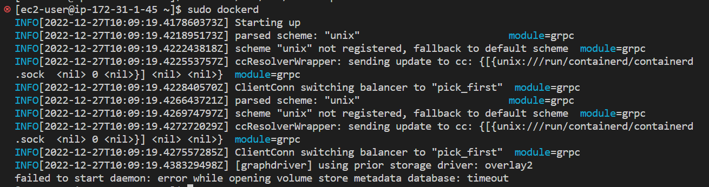

# 2.5 도커 데몬

날짜: 2022년 12월 27일
책: 시작하세요! 도커/쿠버네티스
카테고리: infra

## 도커 명령어를 실행할 때 벌어지는 일

1. docker로 시작하는 명령어를 입력함(docker version) → 이 부분이 도커 클라이언트가 하는 일(/usr/bin/docker)
2. 그리고 유닉스 소켓을 열어서 도커 데몬 프로세스에 명령어를 전달함
3. 도커 데몬이 명령어를 파싱하고 작업 수행
4. 결과를 다시 클라이언트에 반환
5. 결과 출력

## 도커 데몬 실습

```bash
sudo dockerd
```


명령어를 입력했을 때 pid file이 있다고 자꾸 에러가 뜸

우선 `/var/run/docker.pid` 파일을 삭제하라고 해서 삭제한 후 다시 실행



이번에는 timeout이 뜸

`systemctl stop docker`를 통해 도커 클라이언트를 종료


그 후 다시 실행해보니 도커 데몬이 정상적으로 실행됨

→ 나중에 다시 해보니 docker 프로세스만 종료시켜주면 dockerd를 실행시킬 수 있었음

→ 내 EC2 환경 같은 경우에는 재부팅할때마다 docker를 자동으로 실행함

→ 그래서 dockerd가 이미 실행되어있는 상태였고 dockerd를 하나 더 실행시키는게 안되어서 발생한 문제인듯?

### /var/run/docker.pid

근데 아까 보면 처음에 pid 파일을 발견해서 데몬을 실행시킬 수 없다고 했음

도커 데몬을 실행시킬 때 pid 파일이 있는지 없는지 먼저 확인하는듯

pid 파일 안에는 dockerd의 pid가 적혀있음


docker pid를 쉽게 찾을 수 있게 하는 역할을 하는것 같은데 그렇게 하면서 생기는 이득이 뭐가 있을까,,????

→ 리눅스는 file로 프로세스간 통신을 할 수 있음

→ 도커 데몬이 죽었을 때 pid 파일이 남아있으면 pid 파일을 보고 되살리기 위함인듯?

## 도커 --tlsverify

도커 클라이언트와 도커 데몬 사이의 구간 암호화를 실시하는듯 약간 https 느낌

실제 브라우저에서도 https로 dockerd와 통신할 수 있을까?? 원래 https 할때는 서버에서 공개키를 보내줬어야 했는데 이때 도커 데몬이 보내줄 수 있을까??

→ 가능