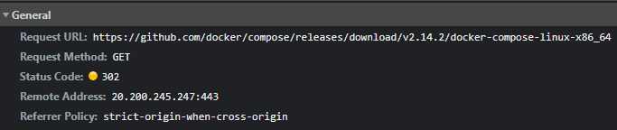
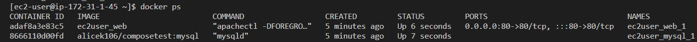

# 4. 도커 컴포즈

날짜: 2023년 1월 3일
책: 시작하세요! 도커/쿠버네티스
카테고리: infra

```bash
sudo curl -L "https://github.com/docker/compose/releases/download/1.11.0/docker-compose-$(uname -s)-$(uname -m)" -o /usr/local/bin/docker-compose
```

- `-L` : redirect
- `uname -s` : Linux
- `uname -m` : x86_64 → 아키텍처 정보가 담겨있는 듯
    - 즉 `https://github.com/docker/compose/releases/download/1.11.0/docker-compose-Linux-x86_64`으로 리다이렉트
- `-o` : 응답을 stdout이 아니라 file로 출력 → 형식이 `-o <file>` 형태로 되고 <file>이라는 이름으로 저장되는듯

→ 근데 왜 굳이 리다이렉트를 할까?? 깃허브에서 파일 다운로드를 하기 위해서는 리다이렉트를 해야하나??



Remote Address가 Location의 역할을 하는건가? 어떻게 리다이렉트해서 파일을 다운받는지 모르겠음

```yaml
version: '3.0'
services:
  web:
    image: alicek106/composetest:web
    ports:
      - "80:80"
    links:
      - mysql:db
    command: apachectl -DFOREGROUND
  mysql:
    image: alicek106/composetest:mysql
    command: mysqld
```

도커 컴포즈 실습 때 이런 에러가 뜸

```
web_1    | AH00558: apache2: Could not reliably determine the server's fully qualified domain name, using 172.20.0.3. Set the 'ServerName' directive globally to suppress this message
Web_1    | httpd (pid 7) already running in apache2 container
```

해결하려면 `/etc/apache2/apache2.conf`의 ServerName을 명시해줘야 하는듯

또 pid가 이미 실행중이라고 자꾸 뜸

이거를 docker-compose.yml 내에서 어떻게 처리할 수 있을까??

중간에 레이어를 더 생성하기로 함

```docker
FROM alicek106/composetest:web
RUN rm /run/apache2/apache2.pid
RUN echo "ServerName localhost" >> /etc/apache2/apache2.conf
```

pid 파일을 삭제해주는 레이어와 ServerName을 설정해주는 레이어를 새로 만듦

```yaml
version: '3.0'
services:
  web:
    build: .
    ports:
      - "80:80"
    links:
      - mysql:db
    command: apachectl -DFOREGROUND
  mysql:
    image: alicek106/composetest:mysql
    command: mysqld
```

도커 컴포즈도 Dockerfile을 빌드하는식으로 바꿈



잘 올라감