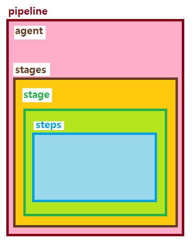

# 젠킨스와 CI/CD

# 1. CI/CD란?

- Continuous Integration - 지속적 통합
    - 여러 개발자들의 코드 베이스를 계속해서 통합하는 것
- Continuous Deployment - 지속적 배포
    - 코드 베이스를 사용자가 사용가능한 환경에 배포하는 것을 자동화한다.

→ 즉, CI/CD란 각각의 개발자들이 개발을 하는 개발 환경을 사용자가 사용 가능한 서비스로 전달하는 모든 과정을 지속 가능한 형태로 또 가능하다면 자동으로 해서 개발자와 사용자 사이의 격차를 없애는 것이다.

# 2. 젠킨스의 기본 개념과 동작 방식

## 젠킨스

- 자바 런타임 위에서 동작하는 자동화 서버
- 빌드, 테스트, 배포 등 모든 것을 자동화해주는 자동화 서버

## 파이프라인

파이프라인이란 CI/CD 파이프라인을 젠킨스에 구현하기 위한 일련의 플러그인들의 집합이자 구성이다. 즉, 여러 플러그인들을 이 파이프라인에서 용도에 맞게 사용하고 정의함으로써 파이프라인을 통해 서비스가 배포된다.

<p align="center">
	<br>
</p>

## 파이프라인 신택스

```
pipeline {
    agent any

    stages {
        stage('build') {
            steps {
                sh 'build check'
            }
        }
    }

    post {
        always {
            junit '**/target/*.xml'
        }
        failure {
            mail to: team@gmail.com, subject: 'Pipeline fail email'
        }
    }
}
```

### Agent Section

젠킨스는 많은 일들을 해야하기 때문에 혼자하기 버겁다.

여려 slave node를 두고 일을 시킬 수 있는데, 이처럼 어떤 젠킨스가 일을 하게 할 것인지를 지정한다.

### Post Section

스테이지가 끝난 이후의 결과에 따라서 후속 조치를 취할 수 있다.

### Stages Section

어떤 일들을 처리할건지 일련의 stage를 정의한다.

### Steps Section

한 스테이지 안에서의 단계로 일련의 스텝을 보여준다.

### Declaratives

Environment, stage, options, parameters, triggers, when 등의 Declarative가 있음

- Environment → 어떤 pipeline이나 stage scope의 환경 변수 설정
- Parameter → 파이프라인 실행 시 파라미터 받음
- Triggers → 어떤 형태로 트리거 되는가
- When → 언제 실행되는가

# 3. 개발 환경 및 CI/CD의 기본 동작 이해

## 개발 환경의 종류

- 개발자가 개발을 하는 Local 환경
- 개발자들끼리 개발 내용에 대한 통합 테스트를 하는 Development 환경
- 개발이 끝나고 QA 엔지니어 및 내부 사용자들이 사용해 보기 위한 QA 환경
- 실제 유저가 사용하는 Production 환경

## 개발 프로세스

1. 개발자가 자신의 PC에서 개발을 진행한다.
2. 다른 개발자가 작성한 코드와 차이가 발생하지 않는지 내부 테스트를 진행한다.
3. 진행한 내용을 다른 개발자들과 공유하기 위해 git과 같은 SCM에 올린다.
4. dev 브랜치의 내용을 개발 환경에 배포하기 전에 테스트와 Lint 등 코드 포맷팅을 한다.
5. 배포하기 위한 빌드 과정을 거친다.
6. 코드를 배포한다.
7. 테스트를 진행한다.

## 여러 배포 환경의 관리

인프라를 모듈화하여 어떤 것이 변수인지 잘 설정하고 이를 잘 설계하는 것이 핵심이다.