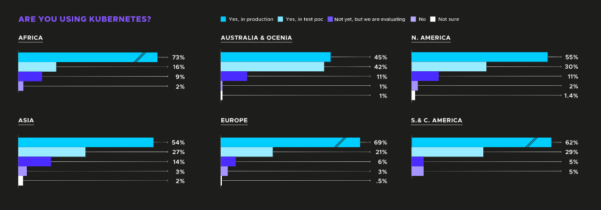
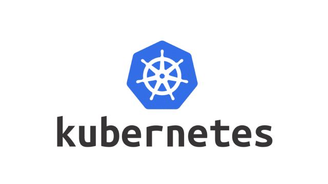
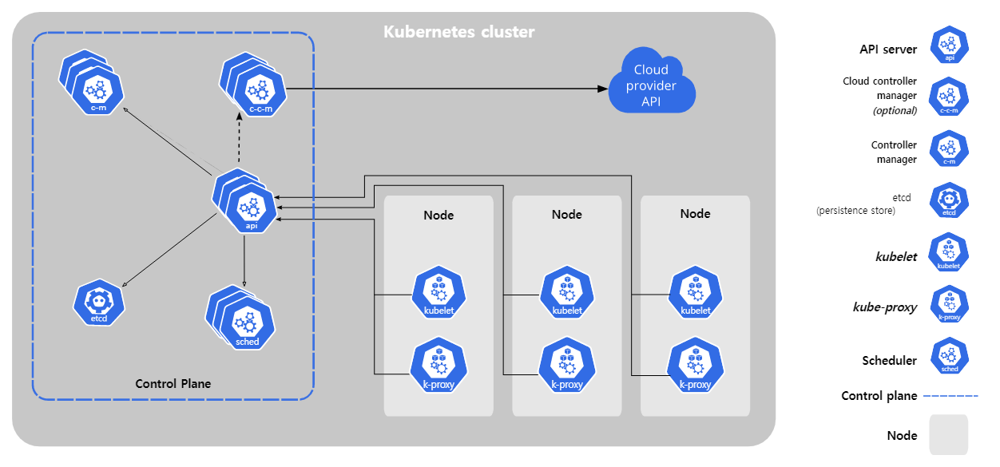

# 1. 컨테이너 오케스트레이션이란?

본래 오케스트레이션은 음악 분야에서 쓰이는 용어이다. 오케스트라에서 바이올린, 첼로, 트럼펫 등 여러 악기들의 연주를 조화롭게 들리도록 작곡하는 것을 말한다. 이처럼 온라인 인프라 환경에서 수많은 컨테이너들의 배포, 관리, 확장, 네트워킹 등의 이슈를 자동으로 관리해주면서 안정적으로 운영될 수 있도록 만들어주는 것을 `컨테이너 오케스트레이션`이라 한다.

요즘 많은 서비스들이 모놀리식 아키텍처에서 마이크로서비스 아키텍처(MSA)로 전환되고있다. MSA에서는 프로젝트의 세부적인 기능들이 작은 서비스 단위로 분리되어 컨테이너의 형태로 구축된다. 간단한 프로젝트라면 모르겠지만 대규모 프로젝트라면 컨테이너가 상당히 많아질 것이다. 특히 Google은 매주 **수십억 개**가 넘는 컨테이너를 생성한다고 한다. 이를 개발자가 하나하나 관리할 수 있을까? 컨테이너 오케스트레이션은 이러한 개발자의 고민을 해결해주기 위해 등장했다.

---

## 컨테이너 오케스트레이션 도구

<p align="center">
	<br>
	<em>그림 1) 컨테이너 오케스트레이션 도구</em>
</p>

컨테이너 오케스트레이션 도구는 정말 다양하다. CNCF에 따르면 109개의 컨테이너를 관리하는 도구가 있다고 말한다. 그 중에서도 자주 언급되는 세 가지 도구가 있다.

- 도커 스웜
- 쿠버네티스
- 아파치 메소스

각각의 특징을 기능별로 간단히 알아보겠다.

### 클러스터 설치

- 도커 스웜 : 설치와 설정이 아주 쉽다. 모든 요소가 도커기반이고 `systemd` 내부에 통합되어있다.
- 쿠버네티스 : 설정이 조금 더 복잡하다. `yaml`을 활용하여 클러스터의 모든 서비스를 정의할 수 있다.
- Mesos : 규모가 커질수록 설정이 복잡해진다.

### 컨테이너 배포

- 도커 스웜 : 도커 기반이기 때문에 설정도 간단하다.
- 쿠버네티스 : 위와 마찬가지로 `yaml`을 기반으로 하여 어플리케이션의 모든 구성 요소를 설정할 수 있다.
- 메소스 : `json`을 기반으로 하여 메소스와 마라톤 REST API에 전달할 설정 파일을 정의할 수 있다.

### 장점

- 도커 스웜 : 사용이 쉽다. 도커 기반이다.
- 쿠버네티스 : `POD` 스케줄링을 통해 복잡한 어플리케이션 배포 관리를 용이하게 만들어준다.
- 메소스 : 초대형 클러스터와 수천 개의 서버를 목표로 할 때 적합하다.

<p align="center">
	<br>
	<em>그림 2) 쿠버네티스를 사용하고 계신가요?</em>
</p>

현재에는 쿠버네티스가 구글, AWS, Red Hat 등의 지원을 받아 압도적인 점유율을 차지하고 있다. [CNCF](https://www.cncf.io/reports/cncf-annual-survey-2021/)에 따르면 96%의 조직이 쿠버네티스를 사용하거나 평가하고 있다.

그래서 쿠버네티스에 대해 조금 더 자세히 알아보고자 한다.

# 2. 쿠버네티스란?

쿠버네티스는 Google에서 개발하고 설계한 오픈 소스 컨테이너 오케스트레이션이다.

<p align="center">
	<br>
	<em>그림 3) 쿠버네티스</em>
</p>

쿠버네티스가 제공하는 기능은 다음과 같다.

- 컨테이너 배포 / 실행 (Immutable, Declarative, Scheduling)
- 서비스 디스커버리 & 로드 밸런싱
  - 쿠버네티스는 DNS 이름을 사용하거나 자체 IP 주소를 사용하여 컨테이너를 노출할 수 있다. (컨테이너는 죽었다 살아나면 IP가 변하기 때문에 보통 내부 DNS를 사용한다.)
  - 트래픽이 많으면 네트워크 트래픽을 로드밸런싱하고 배포하여 안정적인 배포를 할 수 있다.
- 보안 및 구성 관리
  - 암호, OAuth 토큰, SSH 키와 같은 보안 측면에서 중요한 정보를 저장하고 관리할 수 있다.
- 자가 복구
  - 실패한 컨테이너를 다시 시작하고, 교체하며 또 상태 검사에 응답하지 않는 컨테이너를 죽이는 등 서비스 준비가 마무리 되기 전까지 그 과정을 클라이언트에 보여주지 않는다.
- 자동화된 롤아웃과 롤백
  - 컨테이너의 히스토리를 가지고 현재 상태를 원하는 상태로 변경할 수 있다.
- 스토리지 오케스트레이션
  - 로컬 저장소, 클라우드 공급자 등 원하는 저장소 시스템을 자동으로 탑재할 수 있다.

---

## 쿠버네티스 아키텍처

<p align="center">
	<br>
	<em>그림 4) 쿠버네티스 아키텍처</em>
</p>

쿠버네티스 아키텍처에서는 크게 두 가지 컴포넌트로 나뉜다.

- 컨트롤 플레인(Control Plane) : 전체적인 기능 제어 담당
- 노드(Node) : 컨트롤 플레인 컴포넌트의 요청을 받아 각 노드에서 동작

### 컨트롤 플레인

- kube-apiserver : 쿠버네티스 컨트롤 플레인의 프론트 엔드이다. 즉 쿠버네티스 클러스터로 들어오는 요청을 가장 앞에서 확인하는 역할을 한다. 그리고 전달받은 요청을 처리 흐름에 따라 적절한 컴포넌트로 전달하는 역할까지 맡는다.
- etcd : 모든 클러스터 데이터를 담는 쿠버네티스의 key-value 저장소이다. 쿠버네티스 클러스터가 동작하기 위해 필요한 클러스터 및 리소스의 구성 정보, 상태 정보 등이 저장된다.
- kube-scheduler : 노드가 배정되지 않은 새로 생성된 `POD`를 감지하고 실행할 노드를 선택하는 컴포넌트이다. 이 때 위의 작업을 `스케줄링`이라고 말한다.
- kube-controller-manager : 컨트롤러 프로세스를 실행하는 컨트롤 플레인 컴포넌트이다. 노드의 상태를 관리하는 역할을 맡는다. 현재 상태와 희망 상태를 비교해보고 일치하지 않으면 조정해주는 역할을 한다. (이를 자가 복구라고 한다.)

### 노드

- kubelet : 각 노드에서 실행되는 에이전트로 `POD`에서 컨테이너가 확실하게 동작하도록 관리한다.
- kube-proxy : `POD`의 IP가 매번 바뀌는데서 오는 어려움을 해결하기 위해 프록시 기법을 활용하여 고정적으로 파드에 접근할 수 있도록 관리하는 컴포넌트이다.

---

## POD

쿠버네티스에서 생성하고 관리할 수 있는 배포 가능한 가장 작은 컴퓨터 단위이다. `POD`는 여러 컨테이너의 묶음으로 스케줄링된다. 즉, `POD`의 컨텐츠는 항상 함께 배치되고, 스케줄링되며 컨텍스트 또한 공유하며 실행된다. 또한 같은 namespace와 ip를 가지게 되고, 각 컨테이너는 포트 번호로 구분한다.

```java
apiVersion: v1
kind: Pod
metadata:
	name: nginx-pod
	namespace: default
spec:
	containers:
	- name: nginx
		image: nginx:1.21.0
		ports:
		- containerPort: 80
```

위의 파일은 간단한 POD 배포 파일이다.

- apiVersion : 스크립트를 실행하기 위한 API 버전이다.
- kind : 리소스의 종류를 정의한다. Pod, Service, Deployment, ReplicaSet 등이 있고, 우리는 POD를 생성할 것이기 때문에 Pod를 입력한다.
- metadata : 리소스의 메타데이터를 작성한다. Pod를 구분지을 name과 Pod를 띄울 namespace를 입력한다.
- spec : 생성할 리소스에 대한 스펙을 정의한다. nginx 컨테이너를 띄우기 위해 `nginx:1.21.0`이라는 이미지를 도커 허브에서 가져온다. 컨테이너 포트는 80번으로 띄운다.
