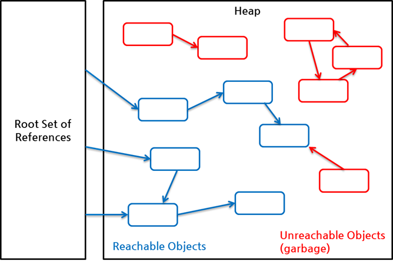
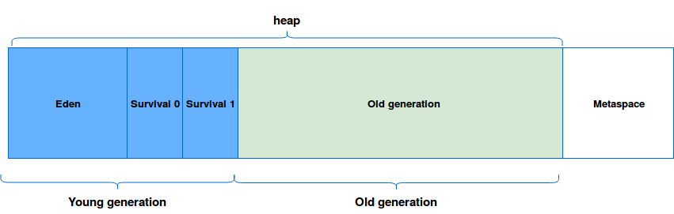

# 1. Garbage Collection이란?

JVM에는 여러 메모리 영역이 존재한다. 클래스 정보가 저장되는 메서드 영역, 메서드 실행과 관련되는 스택 영역과 객체의 정보가 담겨 있는 힙 영역 등이 있는데, 그 중에서도 힙 영역은 메모리 해제 방식이 되게 독특하다.

```java
// (1) 참조 변수가 객체를 참조하고 있음
Member member = new Member();
// (2) 참조 변수가 더 이상 객체를 참조하지 않음
member = null;
```

위의 코드를 보면 (1)번 라인까지는 `member`라는 참조 변수가 힙 영역에 새로 생성된 객체를 참조하고 있다. 이를 `Reachable Objects`라고 한다. 그 후 (2)번 라인에 접근하게 되면 이 변수가 더 이상 저 객체를 참조하지 않게 되면서 클라이언트에서 더 이상 객체에 접근할 방법이 사라지게 된다. 이를 `Unreachable Objects`라고 한다.

<p align="center">
     <a href="https://d2.naver.com/helloworld/329631">
          <br>
          <em>그림 1) Reachable Objects와 Unreachable Objects</em>
     </a>
</p>

Garbage Collector는 작업할 때 Unreachable Objects를 인식하고 메모리를 해제시켜버린다. 이게 바로 `Garbage Collection`이라는 작업이다.

GC는 다음과 같은 조건이 하나라도 충족되면 실행된다.

1. 운영체제로부터 할당받은 메모리가 부족한 경우
2. 관리하고 있는 힙에서 사용되는 메모리가 허용된 임계값을 초과하는 경우
3. 프로그래머가 직접 GC를 실행하는 경우(`System.gc()`)

# 2. GC의 동작 방식

GC는 크게 두 가지 과정을 거친다. 우선 작업을 멈춘다. 그 후 GC 작업을 실행한다. 이 때 작업을 멈추는 방식인 `stop-the-world`는 대부분의 GC 알고리즘에서 동일하게 사용한다. 그런데 Unreachable Objects를 메모리에서 해제하는 방식은 점점 발전하여 여러가지 방식이 존재한다. 그 중 우리는 대표적인 `mark-and-sweep`에 대해서 알아볼 것이다.

## 2.1. stop-the-world

GC를 실행하기 전, JVM이 애플리케이션 실행을 멈추는 것이다. GC를 실행하는 쓰레드를 제외한 나머지 쓰레드의 작업을 전부 멈추고 GC 작업이 끝나면 일시정지해 둔 작업을 다시 시작하게 된다. 최근 나온 GC 알고리즘은 정말 많은데 어떠한 알고리즘을 사용하더라도 이 stop-the-world 과정은 반드시 거친다.

## 2.2. mark-and-sweep

사실 이 방법은 굉장히 옛날 방법이다. 그렇지만 또한 가장 유명하고 간단한 방법이기에 이 방법을 소개하겠다. 우선 2개의 페이즈로 나뉜다. 처음은 `Mark Phase`이다. 우선 루트 레퍼런스를 알아야 한다. 루트 레퍼런스가 될 수 있는 조건은 다음 중 하나이다.

1. 힙 내의 다른 객체에 의한 참조
2. 스택에서 메서드 실행 시에 사용하는 지역 변수나 파라미터에 의한 참조
3. JNI에 의해 생성된 객체에 대한 참조
4. 메서드 영역의 정적 변수에 의한 참조

이러한 루트 레퍼런스부터 시작해서 그들이 참조할 수 있는 객체들은 전부 1비트를 증가시키는 방식의 마킹을 해 놓는다.

그 후 `Sweep Phase`를 실행한다. 마킹되지 않은 객체를 메모리에서 제거한다.

# 3. GC의 동작 영역

GC는 위에서도 살짝 말했지만 메모리의 Heap 영역에서 동작한다. Heap도 효율적인 GC를 위해 `Young Generation` 영역과 `Old Generation` 영역으로 나뉜다.

<aside>
💡 추가로 원래 Permanent Generation이라는 메타데이터를 저장하는 영역이 존재했는데 Java 8부터 Metaspace라는 영역으로 대체되었다. Metaspace는 메모리의 native static 영역을 사용하므로 Java 8부터는 heap 영역에는 young과 old만 남아있다.

</aside>

<p align="center">
     <a href="http://www.waitingforcode.com/off-heap/on-heap-off-heap-storage/read">
          <br>
          <em>그림 2) Heap 세부 구조</em>
     </a>
</p>

## 3.1. Young Generation

Young Generation은 객체가 처음 생성되었을 때 적재되는 영역이다. 이 영역은 또 다시 Eden와 Survivor 0, 1(이하 S0, S1)로 나뉘어진다. 각 영역은 다음과 같이 처리된다.

1. 우선 새로 생성된 객체들은 대부분 Eden 영역에 위치한다.
2. Eden 영역이 가득차면 Minor GC가 발생한다. 이 때 Unreachable Objects는 Eden 영역이 청소될 때 함께 메모리에서 해제되고 GC 후 살아남은 객체는 S0 영역으로 이동한다.
3. 그 후 또 Eden 영역이 가득차면 Minor GC가 발생하는데, 이 때는 살아남은 객체가 S1 영역으로 이동한다. 그리고 S0 영역에 있던 객체들에 대해서도 GC가 발생하는데 이 때 살아남은 객체도 S1 영역으로 이동하는데, 이 때 S0에서 살아남은 객체들은 이동하기 전 `age`라는 상태를 1 증가시킨 후 보낸다.
4. 다음 Minor GC에서도 동일한 프로세스가 반복된다. 그러나 이번에는 S1에서 S0으로 이동한다.
5. 계속 1 ~ 4번의 과정을 거치고 `age`가 특정 임계값을 넘어서면 해당 객체는 Young Generation에서 Old Generation 영역으로 옮겨진다. 이 단계를 `Promotion`이라고 한다.

## 3.2. Old Generation

Young Generation에서 오랫동안 살아남은 객체가 여기에 적재된다. Young Generation보다 많은 메모리를 할당받으며, 크기가 큰 만큼 GC는 비교적 적게 발생한다. 그래도 Promotion이 반복되면 Old Generation 영역도 가득차게 되는데 이 때 발생하는 GC를 Major GC라고 한다.

## 3.3. 성능상 이점

GC는 두 가지 전제 조건을 기반으로 만들어졌다.

-   대부분의 객체는 금방 참조 불가능한 상태(Unreachable)가 된다.
-   오래된 객체에서 젊은 객체로의 참조는 아주 적게 존재한다.

이 전제 조건을 바탕으로 각각의 영역에 대해서 다시 생각해보면 대부분의 객체가 금방 참조 불가능한 상태가 되기 때문에 GC를 자주 발생시켜 참조 불가능한 객체를 계속 해제 시켜주어야 할 것이다. GC를 할 때마다 메모리의 전체 영역을 처리해야 한다면 stop-the-world로 인해 애플리케이션이 일시적으로 정지하는 시간이 길어질 것이다. Young Generation 영역에 대해서만 GC를 실행하면 GC가 전체 영역을 처리하는 것보다 시간이 덜 걸리기 때문에 애플리케이션 성능이 좋아질 것이다.

또 Young Generation 영역을 한 번에 모두 비우기 때문에 연속된 여유 공간이 만들어 지고, 메모리 파편화를 방지할 수 있다.

# 4. 출처

[Naver D2 - Java Reference와 GC](https://d2.naver.com/helloworld/329631)

[Naver D2 - Java Garbage Collection](https://d2.naver.com/helloworld/1329)

[Oracle - Java Garbage Collection Basics](https://www.oracle.com/webfolder/technetwork/tutorials/obe/java/gc01/index.html)

[Plumbr - Metaspace](https://plumbr.io/outofmemoryerror/metaspace)
