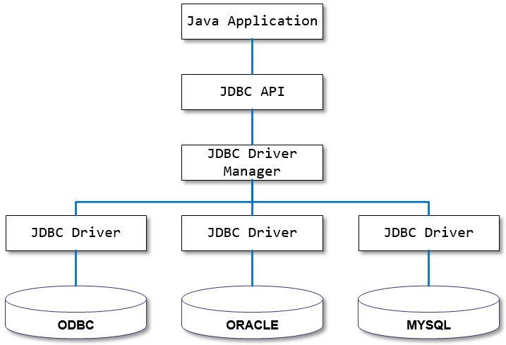
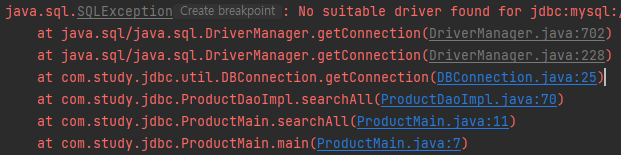
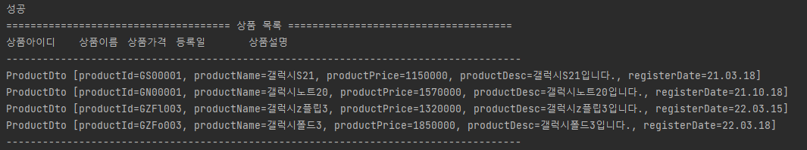

# 1. JDBC 구조

<p align="center">
	<br>
	<em>그림 1) JDBC 구조 도식화</em>
</p>

자바는 JDBC API를 통해 DBMS 서버에 연결하여 데이터베이스를 사용할 수 있다.

# 2. JDBC 동작 방식

## 2.1 클래스 구조

```
├─jdbc
│  ├─util
│  │  ├─DBConnection.java
│  │  ├─DBClose.java
│  ├─ProductDao.java
│  ├─ProductDaoImpl.java
│  ├─ProductDto.java
│  ├─ProductMain.java
```

- jdbc.util.DBConnection → MySQL Driver를 통해 실제 DBMS 서버와 연결하는 역할
- jdbc.util.DBClose → DB와 연결하기 위해 사용한 객체들의 연결을 끊어주는 역할.
- jdbc.ProductDao → 실제 데이터베이스에 접근하는 역할. 인터페이스임.
- jdbc.ProductDaoImpl → ProductDao의 구현체
- jdbc.ProductDto → 클라이언트와 서버간 데이터 전달을 위해 사용하는 역할.
- jdbc.ProductMain → 실제 비즈니스 로직이 실행되는 위치

## 2.2 동작 방식

우리는 ProductMain 클래스에 searchAll() 메서드를 구현하여 사용하였기 때문에 이 메서드의 동작 방식으로 JDBC의 흐름을 알아보고자 한다.

ProductDaoImpl 클래스에서 searchAll() 메서드를 한번 보자.

```java
@Override
public List<ProductDto> searchAll() {
	List<ProductDto> list = new ArrayList<>();

	try (Connection conn = DBConnection.getConnection()) {

		String sql = "select product_id, product_name, product_price, product_desc, ";
		sql += "date_format(register_date, '%y.%m.%d') register_date \n";
		sql += "from product";

		try (PreparedStatement pstmt = conn.prepareStatement(sql);
				 ResultSet rs = pstmt.executeQuery()) {
			while (rs.next()) {
				ProductDto productDto = new ProductDto();
				productDto.setProductId(rs.getString("product_id"));
				productDto.setProductName(rs.getString("product_name"));
				productDto.setProductPrice(rs.getInt("product_price"));
				productDto.setProductDesc(rs.getString("product_desc"));
				productDto.setRegisterDate(rs.getString("register_date"));

				list.add(productDto);
			}
		} catch (SQLException e) {
			e.printStackTrace();
		}
	} catch (SQLException e) {
		e.printStackTrace();
	}
	return list;
}
```

이 코드를 보면 우선 처음에 Connection 객체를 가져오고, conn 객체에서 preparedStatement 객체를 가져오고, 또 pstmt 객체로 ResultSet 객체를 가져온다.

그럼 여기 나온 각각의 클래스는 어떤 역할을 하길래 이러한 순서로 가져오는지 알아보자.

### 2.2.1 Connection 클래스

```java
private static final String URL = "jdbc:mysql://127.0.0.1:3306/ssafydb?serverTimezone=UTC&useUniCode=yes&characterEncoding=UTF-8";
private static final String DB_ID = "ssafy";
private static final String DB_PASS = "1234";

public static Connection getConnection() throws SQLException {
		return DriverManager.getConnection(URL, DB_ID, DB_PASS);
}
```

Connection 객체는 java.sql API가 제공하는 DriverManager 클래스에서 내부 로직을 거친 후 반환받아 사용한다.

하지만 이 코드만으로 코드를 실행하면 다음과 같은 Exception이 뜬다!

<p align="center">
	<br>
	<em>그림 2) 드라이버를 찾지 못함</em>
</p>

DriverManager 내부에서는 ClassLoader를 통해 JDBC Driver를 읽어 Driver 구현체를 등록하는데, 위의 코드같은 경우에는 Driver 구현체를 등록하는 메서드가 없기 때문에 DriverManager가 드라이버를 찾지 못했다는 예외를 던진 것이다.

쉽게 말해 **드라이버의 위치를 찾지 못하는 것**이다!!

따라서 아래와 같은 코드를 추가해주어야 한다.

```java
private static final String DRIVER = "com.mysql.cj.jdbc.Driver";
private static final String URL = "jdbc:mysql://127.0.0.1:3306/ssafydb?serverTimezone=UTC&useUniCode=yes&characterEncoding=UTF-8";
private static final String DB_ID = "ssafy";
private static final String DB_PASS = "1234";

static {
	try {
		Class.forName(DRIVER);
		System.out.println("성공");
	} catch (ClassNotFoundException e) {
		// TODO Auto-generated catch block
		System.out.println("실패");
		e.printStackTrace();
	}
}

public static Connection getConnection() throws SQLException {
	return DriverManager.getConnection(URL, DB_ID, DB_PASS);
}
```

여기서 DRIVER는 MySQL Driver 구현체의 위치이다. Class.forName() 메서드를 통해서 JVM에 등록되고 DriverManager가 읽을 수 있다. → [Class.forName()의 자세한 설명](https://kyun2.tistory.com/23)

<aside>
💡 **그런데 사실 JDBC 4.0부터는 자동으로 드라이버를 초기화해주기 때문에 (코드 2)만으로도 실행 가능하다고 합니다!!**

</aside>

> 이전 버전의 JDBC에서 연결을 얻으려면 먼저 Class.forName 메소드를 호출하여 JDBC 드라이버를 초기화해야했습니다. 이 메소드에는 java.sql.Driver 유형의 오브젝트가 필요합니다. 각 JDBC 드라이버는 java.sql.Driver 인터페이스를 구현하는 하나 이상의 클래스를 포함합니다.
> ...
> 클래스 경로에있는 JDBC 4.0 드라이버는 자동으로 로드됩니다. (그러나 Class.forName 메서드를 사용하여 JDBC 4.0 이전의 드라이버를 수동으로 로드해야 합니다.)

### 2.2.2 PreparedStatement 클래스

이제 Connection 객체를 성공적으로 불러오면서 DBMS 서버와 연결하는 데 성공했다. 이제 자바에서 원하는 쿼리를 날려 그 결과값을 자바로 받아오는 과정이 남았다. 우선 자바에서 DBMS로 쿼리를 날리기 위해서는 PreparedStatement 클래스가 필요하다.

아까 (코드 1)에 보면 아래와 같은 코드가 있었다.

```java
try (PreparedStatement pstmt = conn.prepareStatement(sql);
		 ResultSet rs = pstmt.executeQuery())
```

여기서 보면 PreparedStatement는 Connection 객체에서 내부 로직을 거친 후 반환받아 사용한다. PreparedStatement는 AutoCloseable 인터페이스를 상속받아 사용하기 때문에 try 문의 소괄호 안에서 선언하였다. (사용 완료 후 자동 close 가능)

prepareStatement()에서 파라미터로 받은 sql은 사용할 쿼리문에 대한 정보가 담겨있다.

### 2.2.3 ResultSet 클래스

PrepareStatement 객체를 받은 후 executeQuery() 메서드를 실행하면 SELECT 문을 실행한 결과가 ResultSet 객체에 담겨서 반환받을 수 있다.

```java
while (rs.next()) {
	ProductDto productDto = new ProductDto();
	productDto.setProductId(rs.getString("product_id"));
	productDto.setProductName(rs.getString("product_name"));
	productDto.setProductPrice(rs.getInt("product_price"));
	productDto.setProductDesc(rs.getString("product_desc"));
	productDto.setRegisterDate(rs.getString("register_date"));

	list.add(productDto);
}
```

ResultSet은 초기화되었을 때 받아온 테이블의 첫 번째 행을 가리키고 있으며 next()를 실행할 때마다 다음 행으로 갈 수 있다.

그리고 get~~() 메서드의 경우에는 열의 인덱스(정수형)을 파라미터로 받아도 되고, 아니면 행의 라벨 이름을 받아도 된다. (코드 5)는 라벨 이름을 통해서 현재 행의 value를 받아온 것이다.

이 3개의 클래스를 사용하여 selectAll()의 로직을 구현하는데 완성했다. 만들어진 리스트를 클라이언트에 반환한다.

```java
private void searchAll() {
		List<ProductDto> list = ProductDaoImpl.getProductDao().searchAll();
		showList(list);
	}
```

만들어진 리스트로 다음과 같이 View를 만들어 출력하였다.

<p align="center">
	<br>
	<em>그림 3) showList(list) 메서드를 통해 만든 view</em>
</p>
