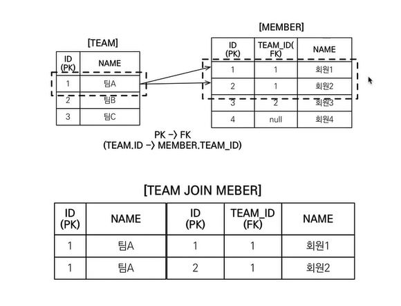

# JPQL 심화

## 경로 표현식

- 점을 찍어 객체 그래프를 탐색하는 것
    
    ```java
    select m.username -> 상태 필드
    from Member m
    join m.team t     -> 단일 값 연관 필드
    join m.orders o   -> 컬렉션 값 연관 필드
    where t.name = '팀A'
    ```
    
- 상태 필드 : 단순히 값을 저장하기 위한 필드이다.
- 연관 필드 : 연관관계를 위한 필드이다.
    - 단일 값 연관 필드 : `@ManyToOne`, `@OneToOne`과 같은 대상이 엔티티인 필드
    - 컬렉션 값 연관 필드 : `@OneToMany`, `@ManyToMany`와 같은 대상이 컬렉션인 필드

### 특징

- 상태 필드 : 경로 탐색의 끝, 더이상 탐색이 이루어지지 않는다.
- 단일 값 연관 경로: 묵시적 내부 조인(inner join) 발생, 추가로 탐색 가능하다.
- 컬렉션 값 연관 경로 : 묵시적 내부 조인이 마찬가지로 발생, 추가 탐색은 불가능하다.

---

## 페치 조인

- SQL 조인이 아님
- JPQL에서 성능 최적화를 위해 제공하는 기능
- 연관된 엔티티나 컬렉션을 SQL 한 번에 함께 조회하는 기능
- 페치 조인 ::= [LEFT [OUTER] | INNER] JOIN FETCH 조인경로

### 엔티티 페치 조인

- 회원을 조회하면서 연관된 팀도 함께 조회

### 컬렉션 페치 조인

- 일대다 관계
- 일대다 관계에서 조인은 데이터가 뻥튀기되어 들어올 수 있다.

<p align="center">
  
</p>

### 페치 조인의 특징과 한계

**특징**

- 연관된 엔티티들을 SQL 한 번으로 조회하여 성능을 최적화한다.
- 엔티티에 직접 작용하는 글로벌 로딩 전략보다 우선한다.
- 실무에서 글로벌 로딩 전략은 모두 지연 로딩으로 적용한다.
- 최적화가 필요한 곳은 페치 조인을 적용한다.

**한계**

- 페치 조인 대상에는 별칭을 줄 수 없다.
    - 하이버네이트는 가능하지만 가급적 사용하지는 않는다.
    - 페치 조인은 기본적으로 연관된 필드를 전부 가져오기 위한 기능인데 별칭을 통해 조건을 넣게 되면 에러가 발생할 수 있다.
- 둘 이상의 컬렉션은 페치 조인 할 수 없다.
- 컬렉션을 페치 조인하면 페이징 API를 사용할 수 없다.
    - 일대일, 다대일 같은 단일 값 연관 필드들은 페치 조인해도 페이징 가능