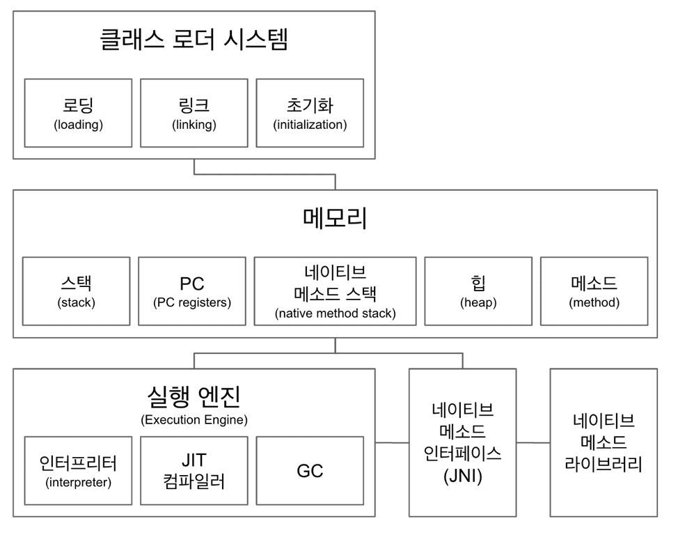
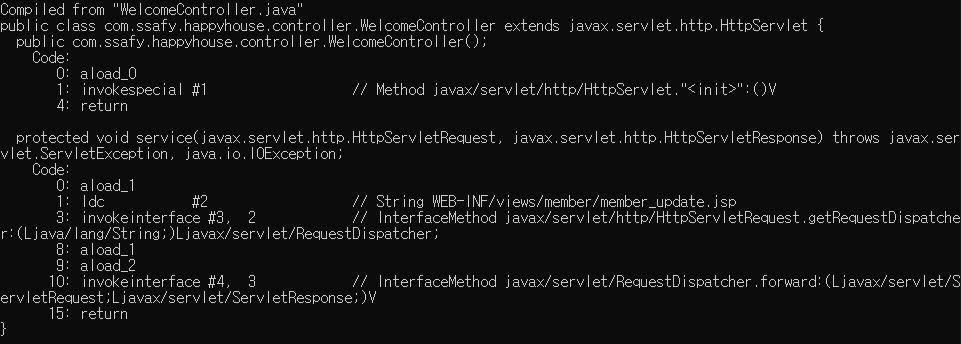
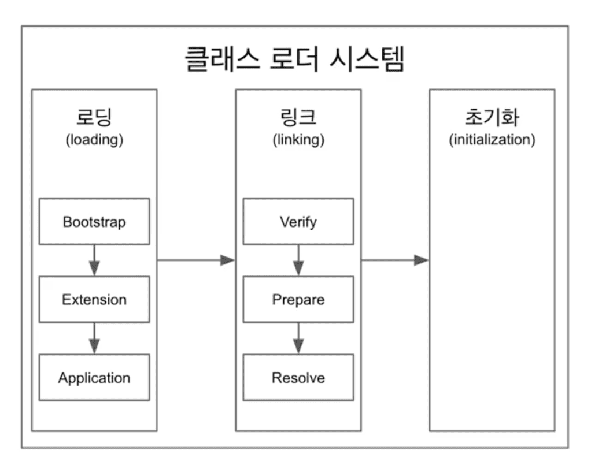

# 1. JVM(Java Virtual Machine)이란?

	 
	<em>그림 1) JVM의 구조</em>

JVM(Java Virtual Machine)은 자바 가상 머신으로 자바 실행 환경에서 돌아가며, 자바 바이트 코드를 OS에 특화된 코드로 변환하여 실행시켜주는 역할을 한다. JVM 자체는 바이트 코드를 실행하는 표준 스펙을 의미하지만, 그 구현체도 JVM이라고 부른다.

	 
	<em>그림 2) javap로 disassemble한 자바 클래스 파일</em>

## 1.1. 클래스 로더 시스템

	 
	<em>그림 3) 클래스 로더 시스템 구조</em>

클래스 로더는 말 그대로 컴파일된 클래스 파일을 읽어들여 메모리에 적재하는 시스템이다. 이 시스템은 로딩, 링크, 초기화 순서로 진행된다.

-   로딩(Loading)
    -   클래스를 파일에서 가져와서 JVM의 메모리에 로드. 메서드 영역에 클래스 정보를 적재한다.
    -   그리고 로딩이 끝나면 해당 클래스 타입을 제네릭으로 가지는 Class<> 객체를 생성해서 힙 영역에 저장한다.
-   링크(Linking)
    -   링크는 검증(Verifying), 준비(Preparing), 분석(Resolving)으로 나뉜다.
    -   **검증**은 로딩한 클래스가 JVM 스펙에 따라 잘 구성되어 있는지 검사하는 과정이다. 클래스 로드의 전 과정 중 가장 까다로운 검사를 수행하기 때문에 복잡하고, 시간도 많이 걸린다.
    -   **준비**는 클래스가 필요로 하는 메모리를 할당하고, 클래스에서 정의된 필드, 메서드, 인터페이스들을 나타내는 데이터 구조를 준비한다.
    -   **분석**은 심볼릭 메모리 레퍼런스를 메서드 영역에 있는 실제 레퍼런스로 변경하는 것을 말한다.
        예를 들면 `Member member = new Member()`라는 객체를 생성할 때, 링크 과정 중에는 `member`라는 참조 변수가 실제 레퍼런스를 가리키고 있는 것이 아니다. 분석 과정이 되어서야 힙에 메모리를 할당하고 그 메모리의 주소를 참조할 수 있게 되는 것이다.
-   초기화(Initializing)
    -   클래스 변수들을 적절한 값으로 초기화 하는 것을 말한다. 이 때 스태틱 변수들이 설정된 값으로 할당되는 것이다.

## 1.2. 메모리

-   메서드 영역
    -   클래스 로더가 바이트 코드를 메모리에 적재하는 공간이 바로 이 영역이다.
    -   이 곳에는 보통 클래스 이름을 비롯하여, 내부의 메서드나 변수 등 클래스 수준의 정보가 저장된다.
-   힙 영역
    -   힙 영역은 `new`를 통해 생성된 객체에 관한 정보가 저장되는 영역이다.
-   스택 영역
    -   쓰레드마다 각각 영역이 생성된다. 현재 쓰레드가 메서드를 호출할 때마다 스텍 프레임이 한 블럭씩 쌓이게 된다.
    -   나중에 예외가 발생하면 이 스택을 trace해서 예외를 발생한 부분을 찾아낼 수 있다.
-   PC 레지스터
    -   쓰레드마다 쓰레드 내 현재 실행할 instruction을 가리키는 포인터이다.

## 1.3. 실행 엔진

실행 엔진은 인터프리터, JIT(Just In Time) 컴파일러, GC(Garbage Collector)로 나뉜다.

-   **인터프리터**는 (그림 2)와 같은 바이트 코드를 해석하고 실행하는 역할을 한다. 한 줄 씩 해석하고 실행하기 때문에 느리다는 단점을 가지고 있다.
-   **JIT 컴파일러**는 자바의 단점을 보완하기 위해 도입된 컴파일러이다. 자바는 현재 .java를 .class로 컴파일 하고 .class 파일로 만들어진 바이트 코드를 인터프리터로 해석하는 2가지 과정을 진행해야했다. 특히 인터프리터는 너무 느렸기 때문에 java 1.1에 JIT 컴파일러가 등장하게 되었다.
    JIT 컴파일러는 인터프리터가 반복되는 코드를 발견하면 그 코드를 JIT가 네이티브 코드로 바꿔둔 후 캐시에 보관하고 다음에 사용할 때에는 인터프리터가 캐싱해서 사용한다.
-   **GC**(Garbage Collector)는 힙 영역에서 더 이상 참조되지 않는 객체를 메모리에서 지워버리는 역할을 한다.

# 2. 참고 자료

[백기선 - 더 자바, 코드를 조작하는 다양한 방법](https://www.inflearn.com/course/the-java-code-manipulation)

[Naver D2 - JVM Internal](https://d2.naver.com/helloworld/1230)
