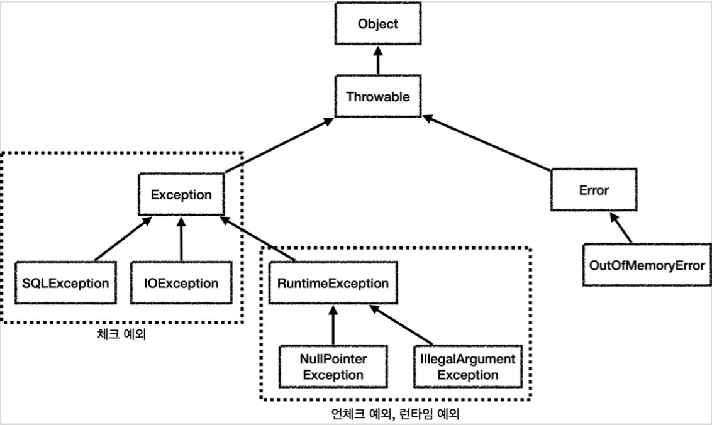

# Exception

     
    <em>그림 1) 자바 예외 계층</em>

- Object : 모든 객체의 최상위 부모는 Object이므로 예외의 최상위 부모도 Object이다.
- Throwable : 최상위 예외이다. 하위에 Exception과 Error가 있다.
- Error : 메모리 부족이나 심각한 시스템 오류와 같이 애플리케이션에서 복구 불가능한 시스템 예외이다. 애플리케이션 개발자는 이 예외를 잡으려고 하면 안된다.
- Exception : 체크 예외
  - RuntimeException을 제외한 Exception의 하위 예외는 모두 컴파일러가 체크하는 체크 예외이다.
- RuntimeException: 언체크 예외, 런타임 예외

## 예외 기본 규칙

예외에 대해서 2가지 기본 규칙을 기억해야한다.

- 예외는 잡아서 처리하거나 던져야 한다.
- 예외를 잡거나 던질 때 지정한 예외뿐만 아니라 그 예외의 자식들도 함께 처리된다.
