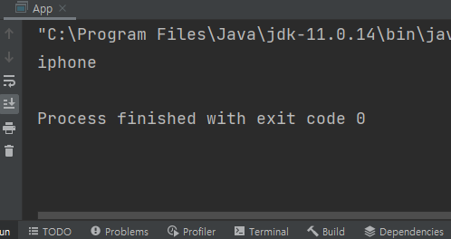

# 리플렉션 API

구체적인 클래스 타입을 몰라도 그 클래스의 메서드, 타입, 변수들에 접근할 수 있도록 도와주는 자바 API를 말한다.

다음과 같이 Phone 클래스를 한번 살펴보자.

```java
public class Phone {
	private String name;

	public Phone(String name) {
		this.name = name;
	}

	public String getName() {
		return name;
	}
}
```

자바는 다형성으로 인해 상위 클래스 변수로 참조를 할 수 있다.

```java
Object phone = new Phone("iphone");
```

이 때 위의 객체는 `Phone` 타입의 메서드인 `getName()`을 당연히 사용할 수 없다. `Object` 타입은 그 메서드를 가지고 있지 않기 때문이다. 이 때, 런타임 환경에서 `Object` 타입 객체가 `getName()` 메서드를 사용할 수 있게 해주는 API가 바로 리플렉션이다.

그러면 이 때 Object 타입에서 `getName()` 메서드를 실행시키기 위한 Reflection API를 한번 알아보자.

## 1. 클래스 정보 조회

```java
// 1. .class를 사용한 조회 - 클래스 타입을 이용
Class<Phone> phoneClass1 = Phone.class;

// 2. getClass() 메서드를 사용한 조회 - 인스턴스를 이용
Phone phone = new Phone("iphone");
Class<? extends Phone> phoneClass2 = phone.getClass();

// 3. fully-qualified class name을 사용한 조회
Class<?> phoneClass3 = Class.forName("com.ssafy.Phone");
```

위의 코드는 클래스 타입의 객체를 생성하는 세 가지 방법이다. 클래스 타입의 객체를 생성하는 것 말고도 생성자 타입 필드 타입 등 다양한 기능을 제공하는 타입이 정말 많으니 필요한 기능은 API 문서에서 찾아보면 좋을 것 같다.

## 2. 메서드 정보 조회

```java
// 1. public 접근제한자의 메서드만 가져옴
Method getName1 = Phone.class.getMethod("getName");

// 2. 접근제한자를 구분하지 않고 가져옴
Method getName2 = Phone.class.getDeclaredMethod("getName");
```

위의 코드는 메서드 타입의 객체를 생성하는 방법이다. `getMethod()` 메서드는 public으로 되어있는 접근제한자의 메서드만 가져올 수 있다. 만약 private이나 protected 등 다른 접근제한자의 메서드를 가져오고 싶다면 `getDeclaredMethod()`를 이용하면 된다.

---

위의 리플렉션 API를 이용해서 `Object` 인스턴스에서 `getName()` 메서드를 실행하도록 만들어보겠다.

```java
public static void main(String[] args) throws NoSuchMethodException, InvocationTargetException, IllegalAccessException {
  Object phone = new Phone("iphone");

  // .class를 이용해서 Class 타입의 객체 생성
  Class<Phone> phoneClass = Phone.class;

  // getMethod() 메서드를 이용해서 Phone 클래스의 getName() 메서드 객체를 가져온다.
  Method getName = phoneClass.getMethod("getName");

  // invoke() 메서드를 이용해서 실행한다. 이 때 실행할 객체인 phone을 파라미터로 넣어준다. 
  System.out.println(getName.invoke(phone));
}
```

결과는 다음과 같다.

<p align="center">
	<br>
	<em>그림 1) iphone이 출력되는 모습</em>
</p>

정상적으로 iphone이 출력되는 것을 확인할 수 있다.
