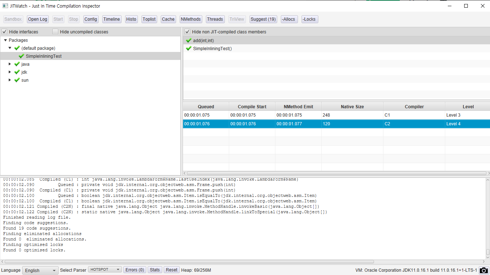
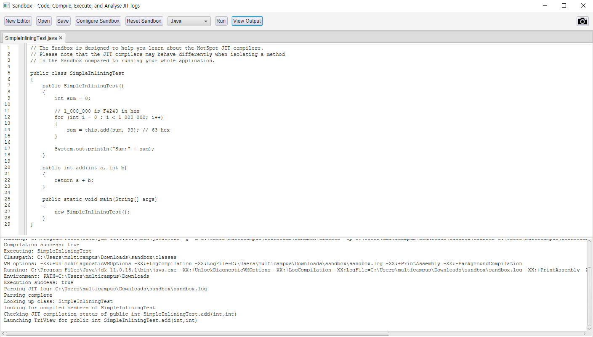
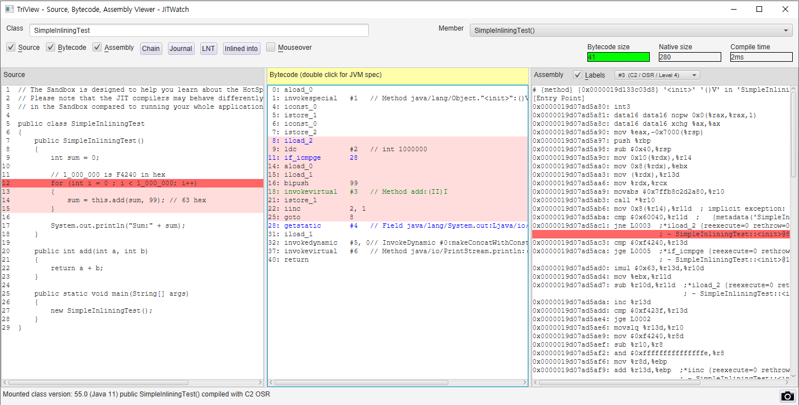

# 10. JIT 컴파일의 세계로

## 10.1. JITWatch란?

크리스 뉴랜드가 개인 프로젝트로 구축한 [오픈 소스](https://github.com/AdoptOpenJDK/jitwatch) 자바FX 툴이다. JITWatch를 이용하면, 애플리케이션 실행 중에 핫스팟이 실제로 바이트코드에 무슨 일을 했는지 이해하는 데 도움이 된다.

```
-XX:+UnlockDiagnosticVMOptions -XX:+TraceClassLoading -XX:+LogCompilation
```

세 스위치를 켜면 JVM이 JITWatch에 입력할 로그를 생성하기 시작합니다.

### 10.1.1. 기본적인 JITWatch 뷰

<p align="center">
	<br>
</p>

JITWatch른 실행시킨 프로그램에서 로그를 적재하는 일뿐만 아니라, JIT 작동을 시험해볼 수 있는 `샌드박스`라는 환경을 제공한다.

<p align="center">
	<br>
</p>

샌드박스 워크플로를 이용하면 로그파일 대신, 자바/JVM을 지원하는 언어로 작성된 프로그램을 생성하거나 로드할 수 있다.

위의 `Run` 버튼을 클릭하면 다음 작업이 수행된다.

1. 프로그램을 바이트코드로 컴파일한다.
2. JIT 로그를 켜 놓고 JVM에서 프로그램을 실행한다.
3. 분석용 JIT 로그파일을 JITWatch에 로드한다.

JITWatch는 `3단뷰`라는 다재다능한 뷰를 메인으로 제공한다. 이 뷰는 소스 코드가 바이트코드, 어셈블리 양쪽으로 어떻게 컴파일되었는지 확인할 수 있다.

<p align="center">
	<br>
</p>

## 10.2. JIT 컴파일 개요

성능 엔지니어는 VM이 데이터를 어떻게 수집하는지, 실행 프로그램에 어떤 최적화를 수행하는지 잘 알고 있어야 툴에서 컴파일드 코드를 보면서 올바르게 해석할 수 있다.

핫스팟은 프로파일 기반 최적화(PGO)를 이용해 JIT 컴파일 여부를 판단한다. 내부적으로는 핫스팟이 실행 프로그램 정보를 메서드 데이터 객체(MDO)라는 구조체에 저장한다.

MDO는 바이트코드 인터프리터와 C1 컴파일러에서 JIT 컴파일러가 언제, 무슨 최적화를 할지 결정하는 데 필요한 정보를 기록한다.

모은 프로파일링 데이터로 컴파일 결정을 내린 후, 컴파일러별 세부 처리 절차로 넘어간다. 핫스팟 JIT 컴파일러는 다양한 최신 컴파일러 최적화 기법을 동원한다.

- 인라이닝
- 루프 펼치기
- 탈출 분석
- 락 생략/확장
- 단일형 디스패치
- 인트린직
- 온-스택 치환

## 10.3 인라이닝

`인라이닝`은 호출된 메서드(피호출부)의 콘텐츠를 호출한 지점(호출부)에 복사한다. 메서드 호출 시 다음과 같은 오버헤드를 제거할 수 있다.

- 전달할 매개변수 세팅
- 호출할 메서드를 정확하게 룩업
- 새 호출 프레임에 맞는 런타임 자료 구조 생성
- 새 메서드로 제어권 이송
- 호출부에 결과 반환

인라이닝은 JIT 컴파일러가 제일 먼저 적용하는 최적화라서, `관문 최적화`라고 한다.

```java
int result = add(a, b);

private int add(int x, int y) {
	return x + y;
}
```

인라이닝 최적화 후 `add()` 메서드 바디는 호출부에 합쳐진다.

```java
int result = a + b;
```

인라이닝 최적화 덕분에 개발자는 잘 조직된, 재사용 가능한 코드를 작성할 수 있다.

### 10.3.1. 인라이닝 제한

VM 차원에서 인라이닝 서브시스템에 제한을 걸어야 할 경우도 있다. 이를테면, VM에서 다음 항목을 조정해야 할 때이다.

- JIT 컴파일러가 메서드를 최적화하는 데 소비하는 시간
- 생성된 네이티브 코드 크기

제약 조건이 하나도 없으면 컴파일러는 아주 깊은 호출 체인까지 파헤치며 인라이닝 할 것이고, 결국 코드 캐시를 거대한 네이티브 메서드로 가득 채울 것이다.

핫스팟은 다음 항목을 따져보며 어떤 메서드를 인라이닝할지 결정한다.

- 인라이닝할 메서드의 바이트코드 크기
- 현재 호출 체인에서 인라이닝할 메서드의 깊이
- 메서드를 컴파일한 버전이 코드 캐시에서 차지하는 공간

## 10.4 루프 펼치기

루프 내부의 메서드 호출을 전부 인라이닝하면, 컴파일러는 루프를 한번 순회할 때마다 비용이 얼마나 드는지, 반복 실행되는 코드는 크기가 얼마나 되는지 더 분명해진다.

`백 브랜치`가 일어나면 그때마다 CPU는 유입된 명령어 파이프라인을 덤프하기 때문에 성능상 바람직하지 않다. 보통 루프 바디가 짧을수록 백 브랜치 비용은 상대적으로 높기 때문에 핫스팟은 다음 기준에 따라 루프 펼치기 여부를 결정한다.

- 루프 카운터 변수 유형(대부분 객체 아닌 int나 long과 같은 primitive type을 사용)
- 루프 보폭(한번 순회할 때마다 루프 카운터 값이 얼마나 바뀌는가)
- 루프 내부의 탈출 지점 개수(return 또는 break)

배열에서 데이터를 차례대로 가져와 합계를 구하는 메서드가 있다고 하자. 어셈블리어는 이러한 엑세스 패턴을 `[base, index, offset]` 조합으로 나타낼 수 있다.

- base 레지스터: 배열 데이터의 시작 주소
- index 레지스터: 루프 카운터
- offset: 주소 오프셋

### 10.4.1. 루프 펼치기 정리

- 카운터가 int, short, char형일 경우 루프를 최적화한다.
- 루프 바디를 펼치고 세이프포인트 폴을 제거한다.
- 루프를 펼치면 백 브랜치 횟수가 줄고 그만큼 분기 예측 비용도 덜 든다.
- 세이프포인트 폴을 제거하면 루프를 순회할 때마다 하는 일도 줄어든다.

## 10.5 탈출 분석

핫스팟은 어떤 메서드가 내부에서 수행한 작업을 그 메서드 경계 밖에서도 볼 수 있는지, 또는 부수 효과를 유발하지는 않는지 `범위 기반 분석`을 통해 판별한다. 이러한 기법을 `탈출 분석`이라고 하며, 메서드 내부에서 할당된 객체를 메서드 범위 밖에서 바라볼 수 있는지를 알아보는 용도로 쓰인다.

핫스팟은 탈출 분석 단계 도중 잠재적으로 탈출한 객체를 세 가지 유형으로 분류한다.

```java
typedef enum {
	No Escape = 1, // 객체가 메서드/스레드를 탈출하지 않고
								 // 호출 인수로 전달되지 않으며,
								 // 스칼라로 대체 가능하다.

	ArgEscape = 2, // 객체가 메서드/스레드를 탈출하지 않지만,
								 // 호출 인수로 전달되거나 레퍼런스로 참조되며,
								 // 호출 도중에는 탈출하지 않는다.

	GlobalEscape = 3, // 객체가 메서드/스레드를 탈출한다.
}
```

### 10.5.1. 힙 할당 제거

빡빡한 루프 안에서 객체를 새로 만들면 그만큼 메모리 할당 서브시스템을 압박하게 되고, 단명 객체가 끊임없이 양산되면 이를 정리할 마이너 GC 이벤트가 자주 발생할 것이다. 할당률이 너무 높아 영 세대가 꽉 차면 단명 객체가 올드 세대로 조기 승격될 가능성도 있다. 핫스팟의 탈출 분석 최적화는 개발자가 객체 할당률을 신경 쓰지 않고도 자바 코드를 자연스레 작성할 수 있도록 설계되었다.

할당된 객체가 메서드를 탈출하지 않는다는 사실을 밝히면 VM은 `스칼라 치환`이라는 최적화를 적용해 객체 필드를 마치 처음부터 객체 필드가 아닌 지역 변수였던 것처럼 스칼라 값으로 바꾼다. 그런 다음 `레지스터 할당기`라는 핫스팟 컴포넌트에 의해 CPU 레지스터 속으로 배치된다.

탈출 분석의 목표는 힙 할당을 막을 수 있는지 추론하는 것이다. 만약 그럴 수 있다면 객체는 스택에 자동 할당되고 GC 압박을 덜 수 있다.

### 10.5.2. 락과 탈출 분석

핫스팟은 탈출 분석 및 관련 기법을 통해 락 성능도 최적화한다. (`synchronized`에만 적용)

- 비탈출 객체에 있는 락은 제거한다. - `락 생략`
- 같은 락을 공유한, 락이 걸린 연속된 영역은 병합한다. - `락 확장`
- 락을 해제하지 않고 같은 락을 반복 획득한 블록을 찾아낸다. - `중첩 락`

### 10.5.3. 탈출 분석의 한계

힙이 아니라도 다른 어딘가에는 할당을 해야 하는데, CPU 레지스터나 스택 공간은 상대적으로 희소한 리소스이다. 또 기본적으로 원소가 64개 이상인 배열은 핫스팟에서 탈출 분석의 혜택을 볼 수 없다.

## 10.6 단형성 디스패치

핫스팟 C2 컴파일러가 수행하는 추측성 최적화는 대부분 경험적 연구 결과를 토대로 한다. `단형성 디스패치` 기법도 그런 부류이다.

<aside>
💡 사람이 작성한 코드를 보면 십중팔구 각 호출부마다 딱 한 가지 런타임 타입이 수신자 객체 타입이 된다.

</aside>

즉, 어떤 객체에 있는 메서드를 호출할 때, 그 메서드를 최초로 호출한 객체의 런타임 타입을 알아내면 그 이후의 모든 호출도 동일한 타입일 가능성이 크다.

이 때, 해당 호출부의 메서드 호출을 최적화할 수 있다. 특히, vtable에서 메서드를 찾을 필요가 없어진다. 다시 말해, klass 포인터 및 vtable을 통해 가상 룩업을 하고 에둘러 참조하는 일은 딱 한번만 하면 된다.

일반 애플리케이션에서는 절대 다수가 단형적 호출이지만, `이형성 디스패치`라는 최적화도 지원한다. 서로 다른 두 타입을 단형성 디스패치와 같은 방법으로, 호출부마다 상이한 두 klass 워드를 캐시해서 처리한다.

그리고 단형도, 이형도 아닌 호출부를 `다형성`이라고 한다. 극히 소수의 관측된 타입을 지닌 다형성 호출부를 찾아내면 성능 향상을 도모할 묘기를 부릴 수 있다.

## 10.7. 인트린직

인트린직은 JIT 서브시스템이 동적 생성하기 이전에 JVM이 이미 알고 있는, 고도로 튜닝된 네이티브 메서드 구현체를 가리키는 용어이다. 주로 OS나 CPU 아키텍처의 특정 기능을 응용하는, 성능이 필수적인 코어 메서드에 쓰인다. 따라서 인트린직은 플랫폼에 따라 지원되는 것도 있고 안 되는 것도 있다.

## 10.8. 온-스택 치환

컴파일을 일으킬 정도로 호출 빈도가 높지는 않지만 메서드 내부에 핫 루프가 포함된 경우가 있다. 이를테면 자바 프로그램의 `main()`.

핫스팟은 이런 코드를 `온-스택 치환`을 이용해 최적화한다. 인터프리터가 루프 백 브랜치 횟수를 세어보고 특정 한계치를 초과하면 루프를 컴파일한 후 치환해서 실행한다.

컴파일러는 컴파일 이전의 루프 내에서 액세스하는 지역 변수와 락 등의 상태 변화가 컴파일 이후에도 반영되도록 보장해야 한다. 또 컴파일드 루프를 벗어난 후 실행을 재개하는 지점에서 모든 상태 변화가 가시적이어야 한다.

## 10.9 세이프포인트 복습

GC STW 이벤트 뿐만 아니라, 다음 경우에도 전체 쓰레드가 세이프포인트에 걸린다.

- 메서드를 역최적화
- 힙 덤프를 생성
- 바이어스 락을 취소
- 클래스를 재정의

컴파일드 코드에서 세이프포인트 체크 발급은 JIT 컴파일러가 담당하며, 핫스팟에서는 다음 지점에 세이프포인트 체크 코드를 넣는다.

- 루프 백 브랜치 지점
- 메서드 반환 지점

따라서 경우에 따라 쓰레드가 세이프포인트에 도달하려면 어느 정도 시간이 소요될 수 있다. 루프가 펼쳐져 있으면 세이프포인트에 이르기까지 적지않은 시간이 걸릴 수 있다. 컴파일러는 세이프포인트를 폴링하며 체크하는 비용을 감수하느냐, 이미 세이프포인트에 닿은 쓰레드가 다른 쓰레드도 세이프포인트에 모두 닿을 때까지 대기해야 하는 긴 세이프포인트 시간을 회피하느냐를 고민할 것이다.