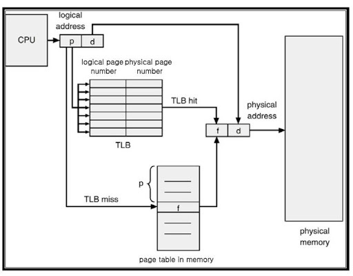

# 3. 하드웨어와 운영체제

## 3.1. 메모리

- `[무어의 법칙](https://www.nnpc.re.kr/bbs/board.php?bo_table=02_01_02&wr_id=70&sca=%EB%82%98%EB%85%B8%EC%A0%84%EC%9E%90)` - 반도체칩 기술의 발전속도에 관한 것으로, 반도체칩에 집적할 수 있는 트랜지스터의 숫자가 18개월마다 두 배씩 증가한다는 법칙

증가한 트랜지스터를 이용해서 CPU의 클록 속도를 빠르게 증가시킬 수 있었지만 메모리는 그 속도를 따라가지 못했다.

### 3.1.1. 메모리 캐시

캐시는 CPU에 있는 메모리 영역이다. 자주 사용하는 메모리 위치는 CPU 내부에 저장하자는 아이디어이다.

최근 CPU는 메모리 액세스 빈도가 높을수록 프로세스 코어와 더 가까이 위치하게 만든다. 그 순서는 `L1`, `L2`, `L3` 순서로 되어있다.

- `캐시 일관성 프로토콜` : 멀티 프로세서 환경에서 캐시의 갱신으로 인한 데이터 불일치 문제를 해결하기 위한 일종의 규약이다. → `MESI 프로토콜`을 자주 사용
    - `Modified(수정)` : 데이터가 수정된 상태
    - `Exclusive(배타)` : 이 캐시에만 존재하고 메인 메모리 내용과 동일한 상태
    - `Shared(공유)` : 둘 이상의 캐시에 데이터가 들어 있고 메모리 내용과 동일한 상태
    - `Invalid(무효)` : 다른 프로세스가 데이터를 수정하여 무효한 상태
    - 멀티 프로세서는 동시에 공유 상태에 있을 수 있지만 어느 한 프로세서가 배타나 수정 상태로 바뀌면 다른 프로세서는 모두 강제로 무효 상태가 된다.
- 캐시 연산 결과 기록(`write-buffer`)
    - `동시 기록(write-through)` : 캐시 연산 결과를 매번 메모리에 기록하는 것 → `Data Loss`가 발생하면 안되는 상황에서 사용하면 좋다.
        - 장점 : 캐시와 메모리에 업데이트를 같이 하여 데이터 일관성을 지킬 수 있다.
        - 단점 : CPU가 대기하는 시간이 필요하기 때문에 성능이 떨어진다.
    - `후기록(write-back)` : CPU 데이터를 사용할 때 데이터는 먼저 캐시로 기록되는데, 캐시 내에 일시적으로 저장된 후에 블록 단위에 캐시로부터 해제되는 때에만 주기억장치 또는 보조기억장치에 기록되는 방식이다.
        - 장점 : `write-through`보다 훨신 빠르다.
        - 단점 : 속도가 빠르지만 캐시에 업데이트하고 메모리에는 바로 업데이트를 하지 않기 때문에 캐시와 메모리가 서로 값이 다른 경우가 있다. → `Inconsistency`

<br>

## 3.2. 최신 프로세서의 특성

### 3.2.1. 변환 색인 버퍼(TLB)

페이지 테이블의 캐시 역할을 하는 버퍼이다.

<p align="center">
	<br>
</p>


위의 사진과 같이 `TLB hit`하는 경우 그대로 물리 메모리의 주소를 CPU에 전달하면 되기 때문에 굉장히 빠르다.

`TLB miss`하는 경우에는 MMU를 통해 메인 메모리에 있는 페이지 테이블에 접근한 후, 변환 정보를 가져오고 가상 메모리가 유효한지 체크한 후 가져오게 된다. 그리고 해당 변환 정보를 TLB로 읽어온다.

### 3.2.2. 분기 예측과 추측 실행

CPU는 발생 가능성이 큰 브랜치를 미리 예측하고 결정한다. 예측에 대한 성공률은 거의 90%정도라고 한다.

<br>

## 3.3. 운영체제

### 3.3.1. 스케줄러

프로세스 스케줄러는 CPU 액세스를 통제한다. 이 때 실행큐라는 큐를 이용한다.

### 3.3.2. 시간 문제

`os::javaTimeMillis()` 함수는 호스트 OS가 제공하는 기능에 의존하는 함수라서 네이티브 메서드로 구현한다.

다음은 BSD 유닉스에서의 구현체이다.

```cpp
jlong os::javaTimeMillis() {
	timeval time;
	int status = gettimeofday*&time, NULL);
	assert(status != -1, "bsd error");
	return jlong(time.tv_sec) * 1000 + jlong(time.tv)usec / 1000);
}
```

솔라리스, 리눅스, AIX도 위와 거의 비슷하다.

다음은 Windows OS이다.

```cpp
jlong os ::javaTimeMillis() {
	if (UseFakeTimers) {
		return fake_time++;
	} else {
		FiLETIME wt;
		GetSystemTimeAsFileTime(&wt);
		return windows_to_java_time(wt);
	}
}
```

윈도우는 유닉스의 `timeval` 구조체 대신 64비트 `FiLETIME` 구조체를 이용해 1601년 이후 경과한 시간을 100ns 단위로 기록한다.

### 3.3.3. 컨텍스트 스위칭

컨텍스트 스위칭은 OS 스케줄러가 현재 실행 중인 쓰레드의 작업을 중단하고 대기 중인 다른 쓰레드의 작업으로 대체하는 프로세스이다.컨텍스트 스위칭은 쓰레드 실행 명령과 스택 상태를 교체하는 모든 일에 연관되어있다.

컨텍스트 스위칭은 비용이 비싸다. 특히 유저 모드에서 커널 모드로 바꾸어 어떤 기능을 실행해야 하는 경우가 있는데, 이 때 유저 영역과 커널 영역의 메모리는 분리되어 있기 때문에 TLB를 비롯한 캐시를 강제로 비워야한다

<br>

## 3.4. 기본 감지 전략

애플리케이션이 잘 돌아간다는 것 CPU 사용량, 메모리, 네트워크, I/O 대역폭 등 시스템 리소스를 효율적으로 잘 이용하고 있다는 뜻이다.

### 3.4.1. CPU 사용률

CPU의 효율적 사용은 성능 향상의 지름길이다. 부하가 집중되는 도중에는 사용률이 가능한 한 100%에 가까워야 한다.

### 3.4.2 Garbage Collector

핫스팟 JVM은 시작 시 메모리를 유저 공간에 할당/관리하기 때문에 메모리를 할당하느라 시스템 콜을 할 필요가 없다. 따라서 GC로 인해 유저 모드에서 커널 모드로 스위칭되는 일이 거의 없다.

따라서 CPU 사용률이 높게 나타난다고 해도 GC는 대부분의 시간을 소비하는 주범이 아니다. 하지만 유저 공간에서 CPU를 100% 사용하고 있다면 그때는 GC를 의심해야 한다.

### 3.4.3. 입출력

파일 I/O는 추상화되어있지 않기 때문에 전체 시스템 성능에 좋지 않은 영향을 끼쳐왔다.

하지만 다행히 자바 프로그램은 대부분 단순한 I/O만 처리하며 I/O 서브시스템을 심하게 가동하는 애플리케이션 클래스도 적은 편이다.

<br>

## 3.5. 가상화

가상화의 특징은 다음과 같다.

- 가상화 OS에서 실행하는 프로그램은 베어메탈에서 실행할 때와 동일하게 작동해야 한다.
- 하이퍼바이저는 모든 하드웨어 리소스 액세스를 조정해야 한다.
- 가상화 오버헤드는 가급적 작아야 하며 실행 시간의 상당 부분을 차지해선 안된다.

## 3.6. JVM과 운영체제

JVM은 자바 코드에 공용 인터페이스를 제공하여 OS에 독립적인 휴대용 실행 환경을 제공한다.

그런데 시스템에 관련된 함수를 사용하는 경우 `native` 키워드를 붙인 네이티브 메서드를 사용해야 하는데, 이 메서드는 C 언어로 작성되지만 자바 메서드처럼 액세스할 수 있다. 이러한 작업을 대행하는 공통 인터페이스를 `자바 네이티브 인터페이스(JNI)`라고 한다.