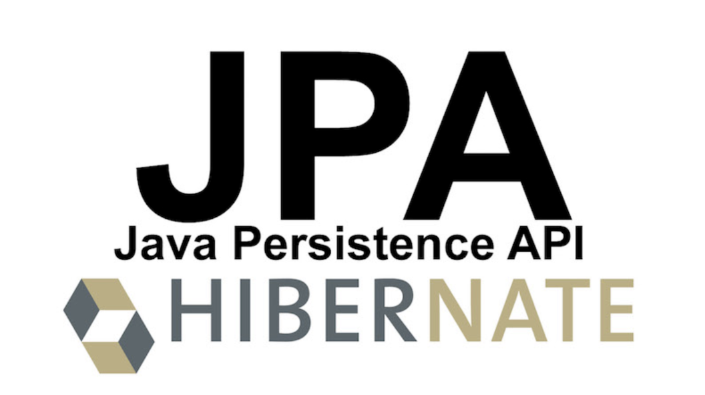

# 하이버네이트란?

하이버네이트는 자바 환경에서의 ORM 매핑 프레임워크이다.

	 
	<em>그림 1) JPA와 하이버네이트</em>

실제 DB 테이블과 자바의 객체는 실제로 완전히 매핑되지 않는다. 다른 Object와 관계를 맺을 때, DB에서는 객체의 Key값만을 가지고 있는데 자바에서는 그 객체의 참조 변수를 가지고 있다. 이렇게 서로 완전히 매핑되지 않는데 이를 `패러다임의 불일치`라고 불린다.

이러한 불일치를 해결하고자 나온 기술이 바로 Object-Relational Mapping, 줄여서 ORM이라는 기술이고 현재 자바에서는 JPA(Java Persistence API)라는 스펙으로 이를 사용할 수 있다.

그리고 이를 JPA는 인터페이스이므로 구현체가 있을텐데, 그 중 하나가 바로 하이버네이트이다.
