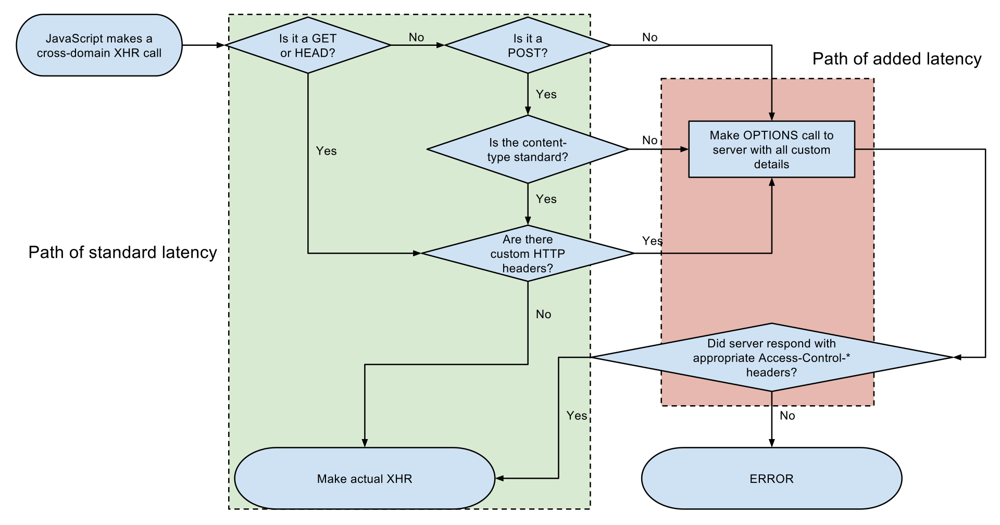

# 1. CORS란?

CORS란 교차 출처 리소스 공유라는 이름으로 불리며 [위키백과](https://ko.wikipedia.org/wiki/%EA%B5%90%EC%B0%A8_%EC%B6%9C%EC%B2%98_%EB%A6%AC%EC%86%8C%EC%8A%A4_%EA%B3%B5%EC%9C%A0)에서 이렇게 설명한다.

> **교차 출처 리소스 공유**(Cross-origin resource sharing, CORS), **교차 출처 자원 공유**는 [웹 페이지](https://ko.wikipedia.org/wiki/%EC%9B%B9_%ED%8E%98%EC%9D%B4%EC%A7%80) 상의 제한된 [리소스](https://ko.wikipedia.org/wiki/%EC%9B%B9_%EB%A6%AC%EC%86%8C%EC%8A%A4)를 최초 자원이 서비스된 도메인 밖의 다른 [도메인](https://ko.wikipedia.org/wiki/%EB%8F%84%EB%A9%94%EC%9D%B8_%EB%84%A4%EC%9E%84)으로부터 요청할 수 있게 허용하는 구조이다. 웹 페이지는 교차 출처 이미지, [스타일시트](https://ko.wikipedia.org/wiki/%EC%8A%A4%ED%83%80%EC%9D%BC%EC%8B%9C%ED%8A%B8), 스크립트, [iframe](https://ko.wikipedia.org/wiki/HTML_%EC%9A%94%EC%86%8C), 동영상을 자유로이 임베드할 수 있다. 특정한 도메인 간(cross-domain) 요청, 특히 [Ajax](https://ko.wikipedia.org/wiki/Ajax) 요청은 [동일-출처 보안 정책](https://ko.wikipedia.org/wiki/%EB%8F%99%EC%9D%BC-%EC%B6%9C%EC%B2%98_%EC%A0%95%EC%B1%85)에 의해 기본적으로 금지된다.

     
    <em>그림 1) CORS의 동작 원리</em>

위의 글에 보면 기본적으로 도메인 간의 요청은 동일 출처 정책에 의해 금지된다고 적혀있다. 우리도 실제로 싸피에서 하던 프로젝트에서 localhost에서 공공 데이터에 ajax 요청을 할 때 CORS 때문에 접근에 실패한 적이 있었다. 그게 바로 동일 출처 정책 때문이다.

동일 출처 정책은 어떤 출처에서 불러온 문서나 스크립트가 다른 출처로부터 스크립트를 가져오는 것을 제한함으로써, 잠재적으로 해가 되는 문서를 분리함으로써 공격받을 수 있는 경로를 줄여준다. 이 때 출처는 `프로토콜`, `포트`, `호스트`가 모두 같아야 동일한 출처라고 말한다.

그런데 우리는 ajax를 자주 사용하게 되면서 종종 다른 출처에서도 리소스를 제공받아야 할 때도 있기 때문에 이 때는 CORS에 의해 요청과 응답을 제어함으로써 위험성을 완화시키는 것이다.

## CORS 해결 - 서버에서 Access-Control-Allow-* 세팅

- `Access-Control-Allow-Origin` - 헤더에 작성된 출처만 브라우저가 리소스를 접근할 수 있도록 허용한다.
- `Access-Control-Allow-Methods` - Preflight Request에 대한 응답으로 실제 요청 중에 사용할 수 있는 메서드를 나타낸다.
- `Access-Control-Allow-Headers` - Preflight Request에 대한 응답으로 실제 요청 중에 사용할 수 있는 헤더 필드 이름을 나타낸다.
    - 기본값은 Origin, Accept, X-Requested-With, Content-Type, Access-Control-Request-Method, Access-Control-Request-Headers, Custom Header, *
- `Access-Control-Allow-Credentials` - 실제 요청에 쿠키나 인증 등의 사용자 자격 증명이 포함될 수 있음을 나타낸다.
- `Access-Control-Max-Age` - Preflight 요청 결과를 캐시할 수 있는 시간을 나타낸 것으로 해당 시간 동안은 Preflight 요청을 다시 하지 않게 된다.

## CorsConfigurer

- 필터 체인에 CorsFilter를 추가한다.
- corsFilter라는 이름의 빈이 제공되면 해당 CorsFilter가 사용된다.
- corsFilter라는 이름의 빈이 없고 CorsConfigurationSource 빈이 정의된 경우 해당 CorsConfiguration이 사용된다.

## CorsFilter

- CORS 예비 요청을 처리하고 CORS 단순 및 본 요청을 가로채고, 제공된 CorsConfigurationSource를 통해 일치된 정책에 따라 CORS 응답 헤더와 같은 응답을 업데이트하기 위한 필터이다.