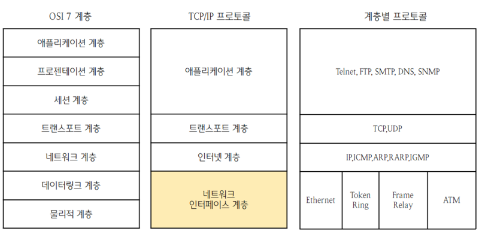
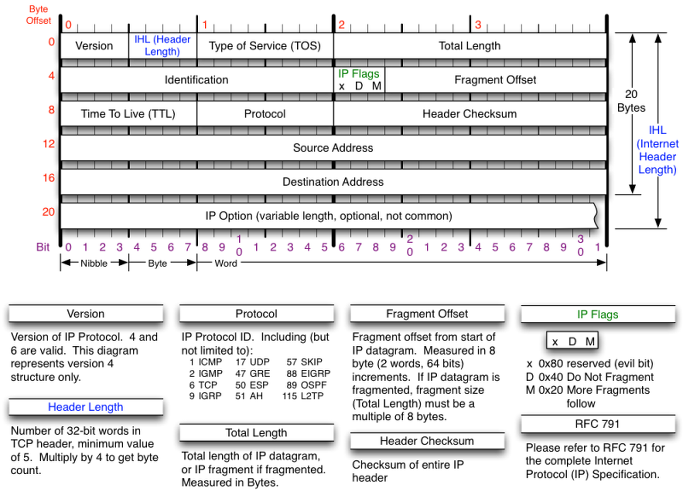
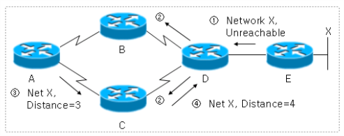
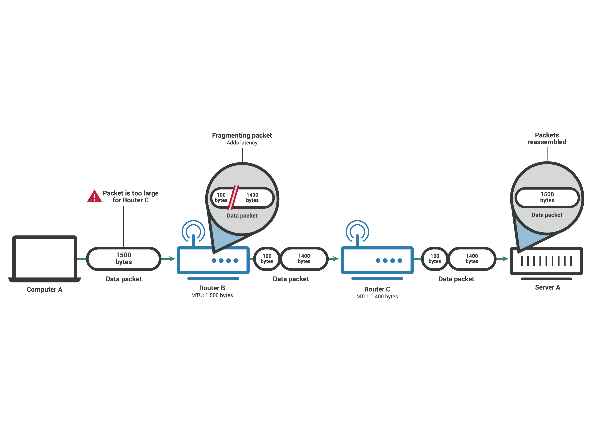
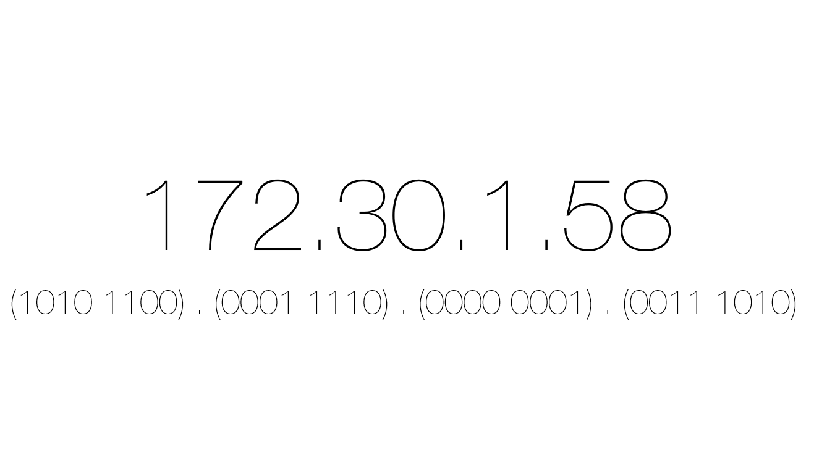
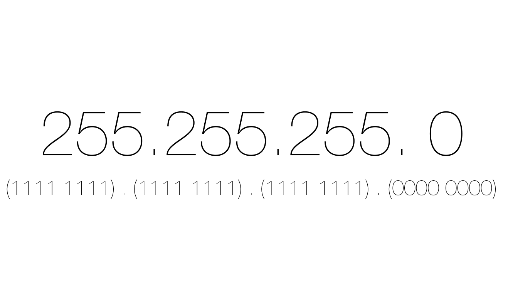
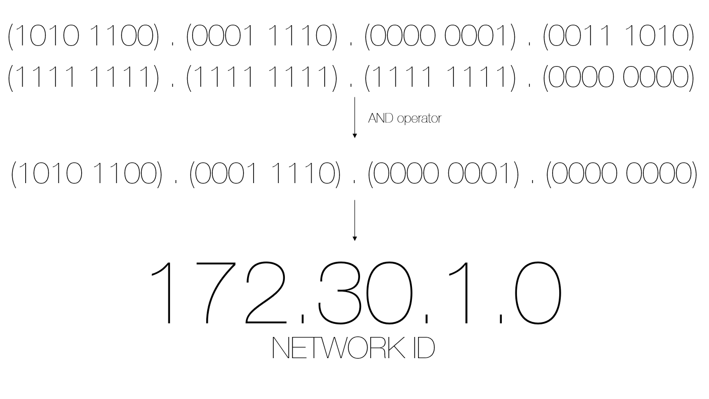
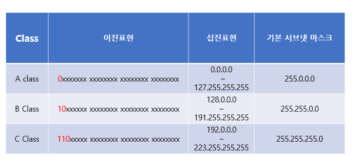

# 1. IP란?

IP는 인터넷 프로토콜의 약자이다. IP는 송신 호스트와 수신 호스트간 패킷을 교환하는 네트워크에서 패킷을 조립하고 분할하는 역할을 한다.

패킷이라는 용어가 자주 나오는데, 패킷은 무엇일까?

우선 아래의 그림을 보자.

   
  <em>그림 1) OSI 7 계층과 TCP/IP 4계층</em>

여기서 TCP/IP 계층을 보자. 네트워크 통신을 하는 과정에서 애플리케이션은 소켓을 열고 파일을 스트림 형태로 TCP에 전달한다. 이 때 파일의 크기가 커서 한번에 전송하는게 어려울 경우에 TCP에서 파일을 MSS만큼 잘라낸 데이터에 TCP 헤더를 붙여 세그먼트로 만들어 준다. 그리고 세그먼트를 네트워크 계층에 전달해 IP 헤더를 붙이게 되면 패킷이 만들어지게 된다.

즉, 위에서 말한 패킷을 조립하고 분할한다는 뜻은 세그먼트에 IP 헤더를 붙이거나 제거하는 것을 말한다.

# 2. IP 헤더

   
  <em>그림 2) IP 헤더</em>

그렇다면 IP 헤더에 대해서 자세히 알아보자.

- VER : IP 주소의 버전을 뜻한다. 보통 IPv4를 사용하기 때문에 대부분 값이 4로 되어있다.
- HLEN : 헤더의 길이를 뜻한다. 필드값은 대부분 5이지만, 옵션이 추가될 경우 더 커질 수 있다.
- Service type(TOS) : 서비스의 우선 순위를 제공한다.
- Total length : 데이터의 길이를 뜻한다. 총 16비트로 65536 bytes까지 가질 수 있지만 보통 MSS가 1460bytes이기 때문에 그 이상의 값을 받는 일은 적다.
- Identification & Flag & Fragment Offset : 단편화에 관련된 헤더이다.
- Time To Live(TTL) : 패킷이 살아있는 시간이다. Router를 방문할 때마다 1씩 감소하여 0이 되면 패킷이 사라진다.
- Protocol : Transport 계층의 프로토콜이 무엇인지 확인할 수 있다.
- Checksum : 오류 확인을 위한 체크섬이 들어간다.
- Source Address : 출발지 IP 주소가 들어간다.
- Destination Address: 도착지 IP 주소가 들어간다.

# 3. TTL(Time To Live)

TTL은 말 그대로 패킷이 살아남을 수 있는 유효기간이 얼마나 남았는지를 나타내는 값이다.

   
  <em>그림 3) 라우터 루프</em>

다음과 같은 라우터 구조에서 패킷이 수신 호스트에 제대로 도달하지 못하고 A → C → D → B를 지속적으로 순환한다고 가정해보자. 이 경우에 패킷은 무한으로 이 라우터를 돌게 될 것이다. 이런 쓰레기 패킷들이 쌓이고 쌓이다보면 라우터의 흐름에 문제를 일으키게 될 것이다.

따라서 IP 헤더에는 TTL이라는 값을 줄 수 있는데, 라우터는 패킷이 방문하면 TTL 값을 체크한다. 만약 TTL이 0보다 큰 수이면 1을 줄인 후 다음 라우터로 라우팅하지만, 만약 0이라면 라우팅하지 않고 패킷을 버린다. 그 후 ICMP 메세지로 현재 패킷이 버려졌다는 에러 메세지를 발신 호스트에 전송한다.

헤더에서 8비트를 차지하므로 0~255의 값을 가진다. 즉, 패킷은 256개 이상의 라우터를 통과할 수 없다.

Windows OS는 128을 기본값으로 가진다.

# 4. 단편화

단편화에 알기 앞서 MTU에 대해서 알아야 한다. MTU는 네트워크 계층의 프로토콜에서 지원되는 패킷의 최대 크기를 의미한다. 즉, 네트워크에 연결된 호스트나 라우터가 받아들일 수 있는 패킷의 최대 데이터량을 말한다.

   
  <em>그림 4) 호스트와 라우터 구조</em>

위의 그림을 보자. Computer A와 Server A가 통신을 시작한다. 처음에 3-way handshake를 통해 서로의 MTU를 체크한다. 그 후 MTU를 1500으로 설정한 후 패킷을 전송하게 된다.

우선, 첫 패킷이 Router B에 도달한다. Router B는 MTU가 1500으로 똑같기 때문에 문제없이 패킷을 받을 수 있다.

문제는 Router C로 갈 때 발생한다. Router C의 MTU는 1400 bytes이다. 즉, 1500 bytes의 데이터 패킷을 받을 능력이 없다. 그렇기 때문에 패킷을 더 작은 패킷으로 분리해야 한다. 이 과정을 `단편화(Fragamentation)`라고 한다.

단편화의 과정은 다음과 같다.

1. 우선 MTU의 크기만큼 페이로드를 자른다. 그럼 1400 bytes 패킷과 100 bytes의 패킷이 생긴다. 이때 각각 큰 패킷, 작은 패킷이라고 지칭하겠다.
2. 큰 패킷은 헤더를 이미 가지고 있는데, 작은 패킷은 헤더가 없다. 헤더가 없는 경우에는 제대로 라우팅을 할 수 없으므로 큰 패킷의 헤더를 작은 패킷에 복사해서 붙여준다.
3. 그 후 Router C에 전송한다.
4. Router C에서도 서버로 패킷들을 전송한다.
5. 서버에서 단편화된 패킷들을 받아 재조립을 한다. (라우터에서도 재조립은 가능하지만 보통 호스트에서 진행한다.)

다음 과정을 통해 MTU가 상대적으로 작은 라우터를 무사히 통과할 수 있었다.

그러면 재조립을 해야하는데 재조립은 어떻게 할 수 있을까?

IP 헤더에 보면 Identification과 Fragment Offset이라는 옵션이 있다.

이름만 봐도 대충 감이 온다. Identification은 식별자이다. 하나였던 패킷은 단편화되어도 같은 식별자를 가지고 있기 때문에 재조립하는 호스트가 단편화되어 흩어져있는 패킷들을 식별자를 통해 하나로 묶을 수 있다.

또한 데이터의 순서는 Offset이라는 옵션에 들어있다. 헤더를 제외했을 때 데이터는 1380번째 바이트에서 잘렸다. Offset은 8 bytes 단위로 표시되기 때문에 `1380 / 8 = 172` 즉, Offset 값은 172이다. 이 정보를 통해 호스트는 단편화된 패킷을 재조립할 수 있다.

단편화는 데이터를 자르고 재조립하는데 리소스가 들기 때문에 최대한 발생하지 않는 것이 좋다.

# 5. 서브넷팅

IPv4는 Host에 대한 식별자이며 32bits의 주소 길이를 가지고 있다. ( ↔ IPv6는 128bits)

   
  <em>그림 5) 명령 프롬프트에 ipconfig 입력</em>

IPv4 주소가 `172.30.1.58`일 경우, 172를 이진수로 변환하면 `1010 1100` 이다.

Network ID와 Host ID에 대해서 알아보자. 위의 cmd 사진을 보면 서브넷 마스크라는 부분이 있다. 이 서브넷 마스크는 네트워크 ID의 길이를 나타낸다. 이 사진의 IPv4 주소에서 `172.30.1`까지는 Network ID이고 `58`을 Host ID라고 부른다. IPv4의 길이가 32bits이므로 Network ID의 길이는 24bits이다.

글만 보고서는 이해하기가 어렵다. 그림으로 한번 알아보자.

   
  <em>그림 6) IPv4 주소와 이진수로 나타낸 IPv4</em>

   
  <em>그림 7) 서브넷 마스크과 이진수로 나타낸 서브넷 마스크</em>

위의 두 그림을 보면 각각의 주소를 모두 비트로 표현한 것을 볼 수 있다. 이 때 이 비트들에 대해 서로 `AND` 연산을 진행한 결과를 보자.

 
<em>그림 8) IPv4 주소와 서브넷 마스크를 AND 연산한 결과</em>

보면 아까 위에서 `172.30.1`까지가 Network ID라고 말했는데 and 연산한 결과와 동일한 것을 알 수 있다. 이처럼 서브넷마스크는 IPv4의 주소 중 네트워크 아이디의 길이를 말한다는 것을 알 수 있다.

또한 서브넷마스크는 다음과 같이 표현할 수도 있다. `172.30.1.58/24`는 24bits 길이의 Network ID를 가진다는 의미이다. 기본적으로 소규모 네트워크(C class)의 디폴트 서브넷 마스크는 위와 같이 255.255.255.0이다.

 
<em>그림 9) 기본 서브넷 마스크</em>

참고로 Host ID가 0일 때는 Network Address로 사용되고 1은 Broadcast Address로 사용되기 때문에 호스트로 가질 수 있는 IP는 254개이다. (`256-2)`

**그러면 서브넷팅이란 무엇일까?**

어떤 소규모 회사 A가 있다고 가정하자. 이 회사에서 총 100개의 host를 사용하기 위해 ISP에게 100개의 IP가 필요하다고 요청한다. 이 때 ISP는 하나의 고민이 생긴다. C Class의 기본 Host ID의 개수는 위에도 말했듯이 254개이다. 저 회사에 기본 호스트를 모두 주게 되면 154개의 IP가 낭비된다.

구체적으로 예를 들면, 회사 A에 주려고 한 기본 네트워크가 `172.30.1.x/24`라고 가정하자. 잠깐 얘기했듯이 회사 A는 100개의 호스트만 필요한데 기본 네트워크를 그대로 제공하면 `172.30.1.1 ~ 172.30.1.254`의 호스트를 다 가져가게 되는 것이다.

이러한 낭비를 줄이기 위해 원본 네트워크를 여러 개의 서브넷으로 분리하는 것을 바로 `서브넷팅`이라고 한다. 이러한 서브넷팅은 아까 위에서 설명했던 서브넷 마스크의 bit 수를 증가시키는 것을 말한다.

위의 예시로 다시 올라가서 보면, 서브넷팅을 통해서 회사 A에 줄 네트워크 ID를 25bits(`172.30.1.x/25`)로 설정하는 것이다. 이렇게 되면 회사 A는 7bits의 Host ID를 가지게 되고 총 126개의 IP를 사용하게 되고 26개의 IP만 낭비되는 것이다.

`172.30.1.1 ~ 172.30.1.126` 과 `172.30.1.129 ~ 172.30.1.254` 둘 중 하나의 서브넷만 회사 A가 사용하고 다른 하나의 서브넷은 또 다른 사용자에게 제공된다.
