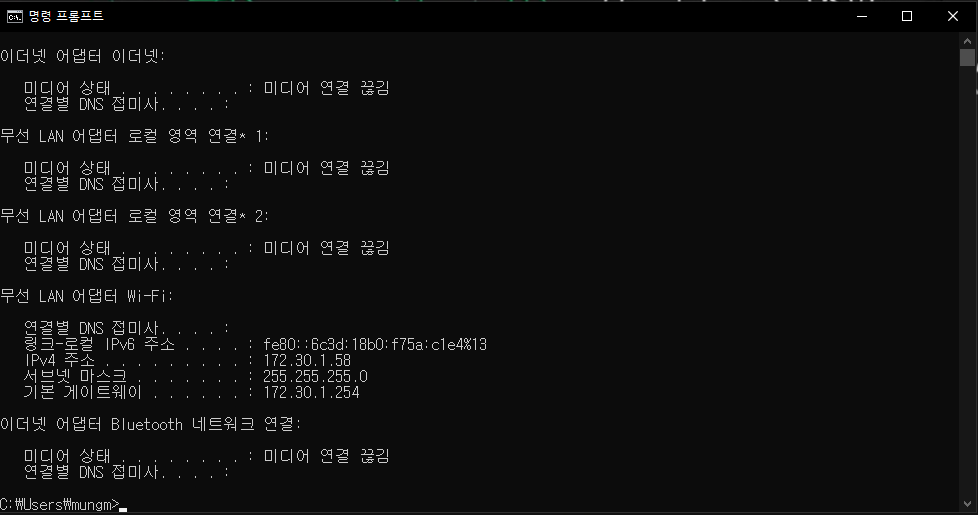
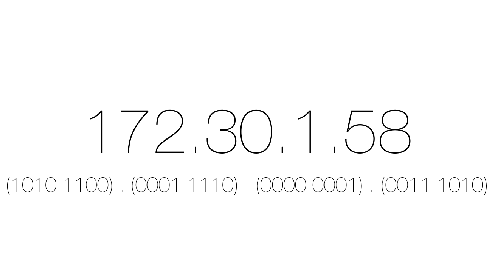
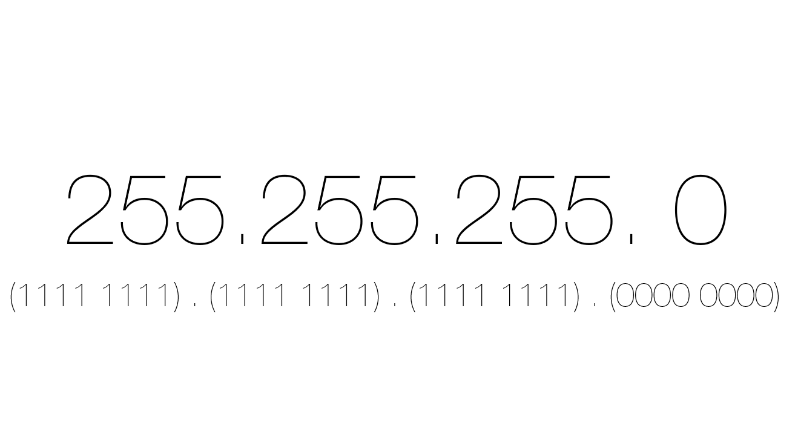
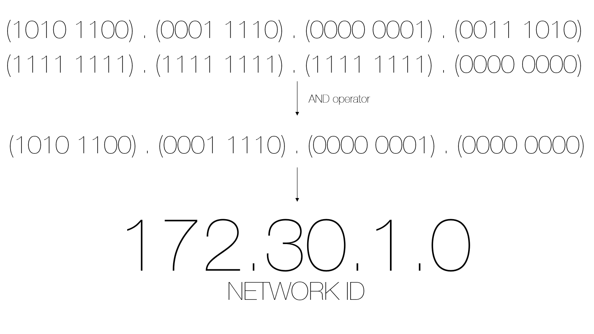

# IPv4 주소

Host에 대한 식별자, 32bits의 주소 길이를 가지고 있다. ( ↔ IPv6는 128bits)

     
    <em>그림 1) 명령 프롬프트에 ipconfig 입력</em>

IPv4 주소가 `172.30.1.58`일 경우, 172를 이진수로 변환하면 `1010 1100` 이다

Network ID와 Host ID에 대해서 알아보자. IPv4 주소에서 `172.30.1`까지는 Network ID이고 `58`을 Host ID라고 부른다. IPv4의 길이가 32bits이므로 Network ID의 길이는 24bits이다. 이 때 Network ID의 길이가 바로 서브넷 마스크이다.

글만 보고서는 이해하기가 어렵다. 그림으로 한번 알아보자.

     
    <em>그림 2) IPv4 주소와 이진수로 나타낸 IPv4</em>

     
    <em>그림 3) 서브넷 마스크과 이진수로 나타낸 서브넷 마스크</em>

위의 두 그림을 보면 각각의 주소를 모두 비트로 표현한 것을 볼 수 있다. 이 때 이 비트들에 대해 서로 `AND` 연산을 진행한 결과를 보자.

     
    <em>그림 4) IPv4 주소와 서브넷 마스크를 AND 연산한 결과</em>

보면 아까 위에서 `172.30.1`까지가 Network ID라고 말했는데 and 연산한 결과와 동일한 것을 알 수 있다. 이처럼 서브넷마스크는 IPv4의 주소 중 네트워크 아이디의 길이를 말한다는 것을 알 수 있다.

또한 서브넷마스크는 다음과 같이 표현할 수도 있다. `172.30.1.58/24`는 24bits 길이의 Network ID를 가진다는 의미이다.
