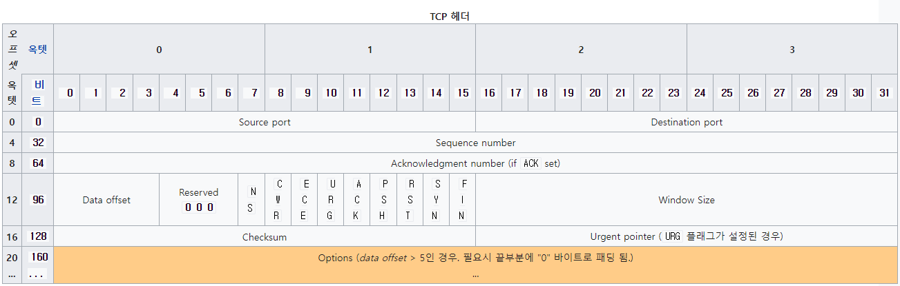
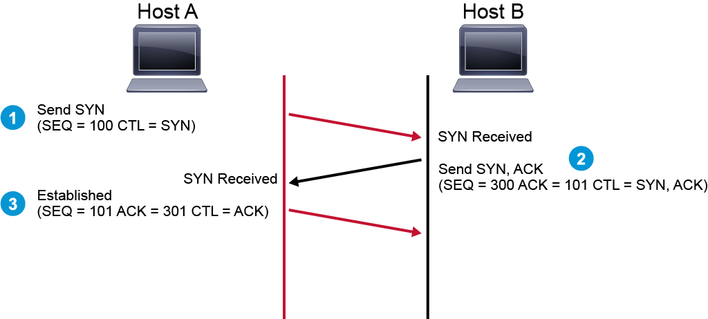
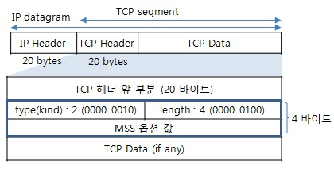

# 1. 3-way handshake

<p align="center">
    <a href="https://ko.wikipedia.org/wiki/%EC%A0%84%EC%86%A1_%EC%A0%9C%EC%96%B4_%ED%94%84%EB%A1%9C%ED%86%A0%EC%BD%9C">
        <br>
        <em>그림 1) TCP 헤더 구조</em>
    </a>
</p>

3-way handshake는 TCP가 두 엔드포인트간의 전송 과정에서 시퀀스 넘버를 동기화해서, 신뢰성 있는 연결을 하기 위해 가장 처음에 진행되는 프로세스이다.

TCP 헤더에서 Sequence number와 Acknowledgement number를 활용한다.

<p align="center">
    <a href="https://www.ccna6rs.com/secfnd/tcp-three-way-handshake/">
        <br>
        <em>그림 2) 3-way handshake</em>
    </a>
</p>

Host A에서 Host B의 리소스를 얻기 위해 네트워크 통신을 하고자 할 때 3-way handshake가 어떤 프로세스로 이루어지는지 알아보자.

1. Host A에서 세그먼트의 SEQ 넘버를 100으로 설정하고 패킷, 프레임으로 감싸 Host B로 전송한다.
2. Host B에서 수신한 세그먼트의 SEQ 넘버가 100이라는 것을 확인하고, 확인했다는 의미로 ACK 넘버를 101(수신한 SEQ 넘버에 1을 더한 값)으로 설정하고, 자신의 SEQ 넘버인 300을 헤더에 설정한 후 Host A에게 전송한다.
3. Host A에서도 이를 확인하고 SEQ 넘버를 101, ACK 넘버를 301로 설정한 후 다시 Host B에 전송하면 TCP의 가상 연결이 완료된다.

이를 [Microsoft Docs](https://docs.microsoft.com/ko-kr/troubleshoot/windows-server/networking/three-way-handshake-via-tcpip)에서 제공하는 예시를 통해 실제 TCP 헤더에서는 어떻게 적용되는지 한번 알아보자.

```
1 2.0785 NTW3 --> BDC3 TCP ....S., len: 4, seq: 8221822-8221825, ack: 0,
win: 8192, src: 1037 dst: 139 (NBT Session) NTW3 --> BDC3 IP

TCP: ....S., len: 4, seq: 8221822-8221825, ack: 0, win: 8192, src: 1037
dst: 139 (NBT Session)

TCP: Source Port = 0x040D
 TCP: Destination Port = NETBIOS Session Service
 TCP: Sequence Number = 8221822 (0x7D747E)
 TCP: Acknowledgement Number = 0 (0x0)
 TCP: Data Offset = 24 (0x18)
 TCP: Reserved = 0 (0x0000)
 TCP: Flags = 0x02 : ....S.

TCP: ..0..... = No urgent data
 TCP: ...0.... = Acknowledgement field not significant
 TCP: ....0... = No Push function
 TCP: .....0.. = No Reset
 TCP: ......1. = Synchronize sequence numbers
 TCP: .......0 = No Fin

TCP: Window = 8192 (0x2000)
 TCP: Checksum = 0xF213
 TCP: Urgent Pointer = 0 (0x0)
 TCP: Options

TCP: Option Kind (Maximum Segment Size) = 2 (0x2)
 TCP: Option Length = 4 (0x4)
 TCP: Option Value = 1460 (0x5B4)

TCP: Frame Padding

00000: 02 60 8C 9E 18 8B 02 60 8C 3B 85 C1 08 00 45 00 .`.....`.;....E.
00010: 00 2C 0D 01 40 00 80 06 E1 4B 83 6B 02 D6 83 6B .,..@....K.k...k
00020: 02 D3 04 0D 00 8B 00 7D 74 7E 00 00 00 00 60 02 .......}t~....`.
00030: 20 00 F2 13 00 00 02 04 05 B4 20 20 .........
```

`NTW3`이라는 클라이언트는 `BDC3`이라는 서버와 TCP/IP 통신을 하기 위해 3-way handshake를 통해 연결을 하고자 한다. 운영체제가 세그먼트를 위와 같이 생성해준다. 이 때, 초기 시퀀스 넘버(ISN)을 지정해준다. 현재 ISN은 8221822로 서버에 초기 시퀀스 넘버로 보내질 정보이다.

그리고 SYN 플래그 비트도 1로 설정해준다. 위에 보면 Synchronize sequence numbers가 1로 설정되어있는 것을 확인할 수 있다.

참고로 SYN 플래그는 연결 시작, 회선 개설 용도로 3-way handshake에서 양쪽 엔드포인트가 시퀀스 넘버를 동기화할 때 사용되는 플래그이다.

- SYN=1, ACK=0 : 연결 요청
- SYN=1, ACK=1 : 연결 허락
- SYN=0, ACK=1 : 연결 설정

이런 의미로 받아들이면 된다.

그런데 위의 세그먼트를 보면 `seq: 8221822-8221825`라고 되어있다. 즉, 길이가 4인 어떤 정보를 더 보낸다는 의미인데 아래를 보면 `TCP: Options`가 있다.

기본적으로 TCP 헤더는 20 bytes이다. 하지만 필요할 경우 옵션을 사용하여 최대 60bytes까지 사용할 수 있게 된다. 옵션에 관련된 정보는 이 [링크](http://www.ktword.co.kr/test/view/view.php?m_temp1=1031)에서 공부해보자.

3-way handshake에서 처음 왕복하는 2개의 세그먼트에서는 MSS(Maximum Segment Size)에 대한 값을 양쪽 엔드포인트에서 통보하고 협상을 하게 되는데 이 때 사용하는 옵션이 type 2이다. 그래서 위의 코드를 보면 `TCP: Option Kind (Maximum Segment Size) = 2 (0x2)` 옵션 종류를 2로 설정해두었다. 그리고 아래로 `Option Length`와 `Option Value`를 설정해서 전송하게 된다. 보통 최대 MTU(Maximum Transmission Unit)가 1500 Bytes이기 때문에 거기서 IP Header와 TCP Header가 차지하는 크기를 뺀 1460 Bytes를 MSS로 주로 사용한다. `(MSS = MTU(1500) - IP(20) - TCP(20) = 1460 Bytes)`

<p align="center">
    <a href="http://www.ktword.co.kr/test/view/view.php?m_temp1=836&id=995">
        <br>
        <em>그림 3) MSS 옵션</em>
    </a>
</p>

그래서 3-way handshake의 첫 번째 과정에서 보내는 정보에는 SEQ 넘버, MSS를 설정해 전송한다.

```
2 2.0786 BDC3 --> NTW3 TCP .A..S., len: 4, seq: 1109645-1109648, ack:
8221823, win: 8760, src: 139 (NBT Session) dst: 1037 BDC3 --> NTW3 IP

TCP: .A..S., len: 4, seq: 1109645-1109648, ack: 8221823, win: 8760,
src: 139 (NBT Session) dst: 1037

TCP: Source Port = NETBIOS Session Service
TCP: Destination Port = 0x040D
TCP: Sequence Number = 1109645 (0x10EE8D)
TCP: Acknowledgement Number = 8221823 (0x7D747F)
TCP: Data Offset = 24 (0x18)
TCP: Reserved = 0 (0x0000)
TCP: Flags = 0x12 : .A..S.

TCP: ..0..... = No urgent data
TCP: ...1.... = Acknowledgement field significant
TCP: ....0... = No Push function
TCP: .....0.. = No Reset
TCP: ......1. = Synchronize sequence numbers
TCP: .......0 = No Fin

TCP: Window = 8760 (0x2238)
TCP: Checksum = 0x012D
TCP: Urgent Pointer = 0 (0x0)
TCP: Options

TCP: Option Kind (Maximum Segment Size) = 2 (0x2)
TCP: Option Length = 4 (0x4)
TCP: Option Value = 1460 (0x5B4)

TCP: Frame Padding

00000: 02 60 8C 3B 85 C1 02 60 8C 9E 18 8B 08 00 45 00 .`.;...`......E.
00010: 00 2C 5B 00 40 00 80 06 93 4C 83 6B 02 D3 83 6B .,[.@....L.k...k
00020: 02 D6 00 8B 04 0D 00 10 EE 8D 00 7D 74 7F 60 12 ...........}t`.
00030: 22 38 01 2D 00 00 02 04 05 B4 20 20 "8.-......
```

두 번째 세그먼트는 서버에서 보낼 세그먼트이다. 여기서 서버는 연결을 허락한다는 의미로 SYN=1, ACK=1로 플래그 비트를 설정한다. 그리고 이 때는 SEQ 넘버와 ACK 넘버를 설정하는데 ACK 넘버는 클라이언트로부터 받은 SEQ 넘버에 1을 더한 값(8221823)으로 설정한다.

이 때도 MSS의 협상을 위해 MSS 옵션을 설정하고 클라이언트로 전송한다. 클라이언트와 서버 모두 MSS가 1460 bytes이기 때문에 최대 1460 bytes만큼 데이터를 전송할 수 있다.

그런데 만약 클라이언트의 MSS는 1460 bytes인데 서버의 MSS가 1300 bytes라고 가정해보자. 이 때는 하향 평준화하여 1300 bytes로 설정된다. 클라이언트에서 1460 bytes의 세그먼트를 보낼 경우, 서버에서는 이를 받을 수 없기 때문이다.

```
3 2.787 NTW3 --> BDC3 TCP .A...., len: 0, seq: 8221823-8221823, ack:
1109646, win: 8760, src: 1037 dst: 139 (NBT Session) NTW3 --> BDC3 IP

TCP: .A...., len: 0, seq: 8221823-8221823, ack: 1109646, win: 8760,
src: 1037 dst: 139 (NBT Session)

TCP: Source Port = 0x040D
TCP: Destination Port = NETBIOS Session Service
TCP: Sequence Number = 8221823 (0x7D747F)
TCP: Acknowledgement Number = 1109646 (0x10EE8E)
TCP: Data Offset = 20 (0x14)
TCP: Reserved = 0 (0x0000)
TCP: Flags = 0x10 : .A....

TCP: ..0..... = No urgent data
TCP: ...1.... = Acknowledgement field significant
TCP: ....0... = No Push function
TCP: .....0.. = No Reset
TCP: ......0. = No Synchronize
TCP: .......0 = No Fin

TCP: Window = 8760 (0x2238)
TCP: Checksum = 0x18EA
TCP: Urgent Pointer = 0 (0x0)
TCP: Frame Padding

00000: 02 60 8C 9E 18 8B 02 60 8C 3B 85 C1 08 00 45 00 .`.....`.;....E.
00010: 00 28 0E 01 40 00 80 06 E0 4F 83 6B 02 D6 83 6B .(..@....O.k...k
00020: 02 D3 04 0D 00 8B 00 7D 74 7F 00 10 EE 8E 50 10 .......}t....P.
00030: 22 38 18 EA 00 00 20 20 20 20 20 20 "8....
```

3-way handshake의 마지막 프로세스이다. 연결이 잘 설정되었다는 의미로 SYN=0, ACK=1로 플래그 비트를 설정하고, SEQ 넘버와 ACK 넘버를 적절하게 설정하여 서버로 다시 전송한다.
