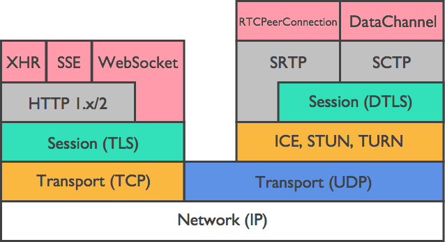
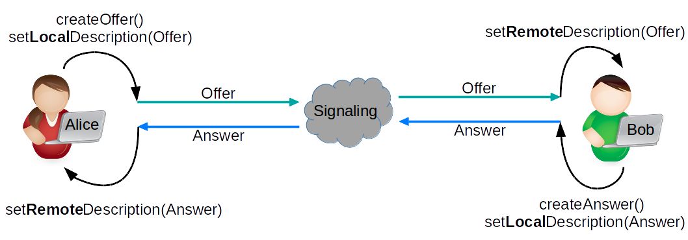
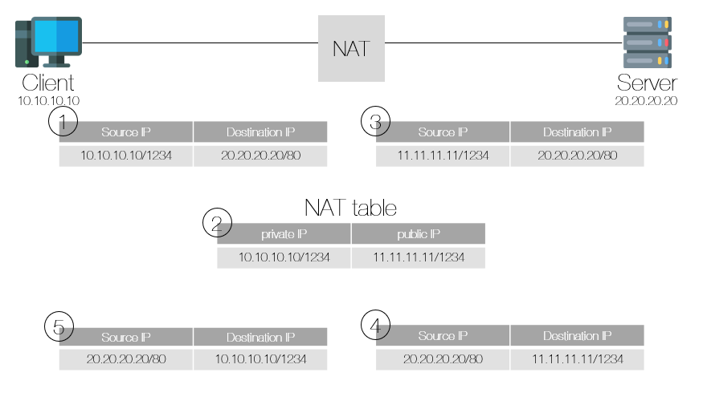
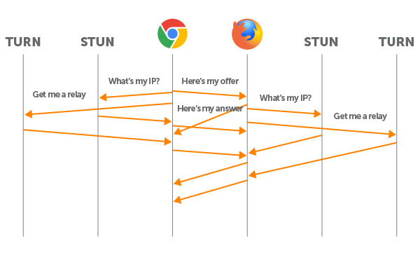

# WebRTC란?

WebRTC는 2011년 구글에 의해서 제안된 화상회의를 목적으로 하는 프로토콜이다. 서버를 최대한 거치지 않고 P2P로 브라우저나 단말간에 데이터를 주고받는 기술이다.

WebRTC는 4단계로 나뉜다.

1. 시그널링
2. 연결
3. 보안
4. 통신

각각의 단계는 기존에 존재했었던 여러 프로토콜로 구성되어 있다. 즉 WebRTC는 예전부터 잘 알려진 기술들의 조합이다.

<p align="center">
    <a href="https://medium.com/monday-9-pm/%EC%B4%88%EB%B3%B4-%EA%B0%9C%EB%B0%9C%EC%9E%90-webrtc-%EC%8B%9C%EB%8F%99%EA%B1%B8%EA%B8%B0-ebefe6feadf7">
        <br>
        <em>그림 1) WebRTC 프로토콜</em>
    </a>
</p>

## 1. 시그널링

WebRTC로 P2P 통신을 하기 위해서는 각 단말의 위치를 찾아야 하고 또 어떤 미디어 포맷을 사용할지도 서로 합의해야만 한다. 이러한 과정을 `시그널링`이라고 부르고 각 단말들을 `시그널링 서버`에 연결시키고 각 단말들이 메세지들을 교환해서 협의한다.

시그널링은 SDP(Session Description Protocol)이라는 프로토콜을 통해 연결을 설정하는 데 필요한 모든 상태를 공유한다. SDP는 스트리밍 미디어를 초기화할 때 사용되는 메타데이터(해상도, 포맷, 코덱, 암호화 등)들을 기술하기 위한 포맷이다. 모든 값이 key-value로 이루어져 있으며 key는 하나의 알파벳으로 되어있다.

```java
Session description
   v=  (protocol version)
   o=  (originator and session identifier)
   s=  (session name)
   i=* (session information)
   u=* (URI of description)
   e=* (email address)
   p=* (phone number)
   c=* (connection information -- not required if included in
        all media descriptions)
   b=* (zero or more bandwidth information lines)
   One or more time descriptions:
     ("t=", "r=" and "z=" lines; see below)
   k=* (obsolete)
   a=* (zero or more session attribute lines)
   Zero or more media descriptions

Time description
   t=  (time the session is active)
   r=* (zero or more repeat times)
   z=* (optional time zone offset line)

Media description, if present
   m=  (media name and transport address)
   i=* (media title)
   c=* (connection information -- optional if included at
        session level)
   b=* (zero or more bandwidth information lines)
   k=* (obsolete)
   a=* (zero or more media attribute lines)
```

WebRTC는 이중 일부 key만 사용한다.

- `v` : SDP의 버전으로 보통 0을 값으로 사용한다.
- `o` : session description에 대한 고유한 식별자 역할을 한다.
- `s` : 세션 이름이다. session description 당 하나만 가질 수 있고 WebRTC의 경우 대부분 `-`를 값으로 사용한다.
- `t` : 세션의 시작 및 종료 시간을 지정한다. `t=<시작 시간> <종료 시간>`의 포맷으로 지정한다. 값이 `t=0 0`과 같이 설정되면 세션이 영구적으로 간주된다. WebRTC의 경우 `0 0`을 사용한다.
- `m` : 미디어 타입, 포트번호, 프로토콜, 미디어 포맷에 대한 설명에 대한 정보를 표현한다.
- `a` : 속성에 관한 내용이다. SDP에 가장 많은 부분을 차지하는 라인으로 IANA에 등록된 속성을 사용할 수 있다. WebRTC에서 사용되는 속성은 [여기](https://webrtcforthecurious.com/docs/02-signaling/#sdp-values-used-by-webrtc)에서 확인해보자!
- `c` : 연결 데이터에 관한 내용이다. WebRTC에서는 `IN IP4 0.0.0.0`이라는 값을 사용한다. 여기서 `IN`은 인터넷, `IP4`는 IPv4, `0.0.0.0`은 연결 IP 주소이다.

**그러면 WebRTC에서 이 SDP를 어떻게 전달할까?**

<p align="center">
   <br>
   <em>그림 2) Offer/Answer 모델</em>
</p>

우선 `Offer/Answer` 모델에 대해서 알아보자. 하나의 단말이 통화를 시작하기 위해 `제안`하고 다른 단말이 수락할 의사가 있는 경우 `응답`한다는 의미이다. 이 때 `Offer`과 `Answer`는 특별한 description이다. 여기에는 SDP를 포함한 단말의 호출 구성에 대한 모든 정보가 포함된다.

이 과정이 완료되면 두 단말은 WebRTC 통신에서 어떤 코덱과 어떤 비디오 파라미터들이 사용될지 알게 되었다.

## 2. 연결

WebRTC는 P2P 연결이기 때문에 피어끼리 단순하게 연결하는 것으로는 제대로 작동하지 않을 가능성이 높다.

그 이유는 일반적인 컴퓨터는 사설 IP를 사용하기 때문이다. IP 주소는 인터넷으로 라우팅이 불가능한 사설 IP 대역과 라우팅이 가능한 공인 IP 대역으로 나뉜다. 사설 IP를 사용하는 일반 컴퓨터가 문제없이 인터넷의 서비스를 활용할 수 있는 이유는 NAT라는 기술 때문이다. NAT는 네트워크 주소를 번역해주는 기술인데, 사설 IP 주소와 공인 IP 주소 간의 매핑 테이블을 생성하여 상호 변환해주는 기술이다.

이 부분에 대해서는 서버-클라이언트 모델과의 비교를 통해서 한번 자세히 알아보자.

### NAT

`서버-클라이언트` 모델에서 NAT의 대략적인 동작 방식은 다음과 같다.

<p align="center">
   <br>
   <em>그림 3) NAT 동작 방식</em>
</p>

1. 사설 IP `10.10.10.10`을 사용하는 클라이언트가 `20.20.20.20` 서버에 접속하기 위해 패킷을 생성한다.
2. 라우터가 패킷의 사설 IP를 공인 IP인 `11.11.11.11`로 변경시킨다. 그리고 매핑한 값을 NAT 테이블에 저장시켜둔다.
3. 공인 IP로 변환된 패킷이 서버에 도착하고 이에 대해 응답한다.
4. 응답 패킷이 라우터에 도착하고 라우터는 포트 번호 `1234`를 인식하고 매핑된 사설 IP를 찾는다.
5. 라우터가 사설 IP `10.10.10.10`을 찾아 클라이언트에 응답을 돌려준다.

이 과정에서 알아두어야 할 부분은 **사설 IP에서 공인 IP로 변환될 때 NAT 테이블에 매핑 값이 등록된다는 것과 이 매핑값을 이용해야만 외부에서 내부 IP로 데이터를 전달할 수 있다는 부분**이다.

그러면 이제 P2P 모델을 보자.

`P2P`는 또 다른 말로는 클라이언트와 클라이언트가 통신하는 것이다. 즉 둘 다 사설 IP를 사용하는 것이다. 인터넷은 공인 IP로 통신할 수 있는데 어떻게 서로 각자의 공인 IP를 찾아서 통신할 수 있을까?

### STUN

이를 해결하기 위한 방법이 바로 `STUN 서버`를 이용하는 것이다.

클라이언트에서 `STUN 서버`에 패킷을 하나 보낸다. 서버는 패킷을 보낸 클라이언트가 어디서 접속했는지 알 수 있으므로 클라이언트의 공인 IP와 포트번호를 알 수 있다. 그리고 알아낸 공인 IP와 포트번호를 다시 클라이언트로 반환한다. 이렇게 되면 클라이언트는 자신의 공인 IP와 포트번호를 확인할 수 있게 되는 것이다!!

WebRTC를 통해 통신하고자 하는 또다른 피어도 이 과정을 무사히 거친다면 WebRTC 통신을 할 수 있게 될 것이다.

거의 대부분 STUN으로 가능하지만 가끔 연결할 수 없는 경우가 있다. 그 때 `TURN 서버`를 이용한다.

### TURN

우선 두 단말이 같은 NAT 환경에 있을 경우 STUN은 동작하지 않는다. 또한, Symmetric NAT로 동작하는 사설망 환경에서는 패킷을 보내는 목적지 IP가 달라지면 NAT 매핑 테이블이 바뀌기 때문에 사용할 수 없다. 이 때는 P2P로 해결할 수 없기 때문에 그에 대한 대책이 필요하다. 그게 바로 `TURN 서버`를 이용한 방식이다. 이 방식은 피어와 피어 사이에 서버를 두고 데이터를 릴레이로 전송하는 방식이라 이 때는 더 이상 P2P가 아니고 구조상 지연이 발생할 수 밖에 없다. 하지만 보안 정책이 엄격한 NAT를 사용하는 클라이언트들과 통신하는 유일한 방법이기 때문에 최후의 방법으로 사용해야 한다.

### ICE

이제 위에서 이야기한 STUN, TURN 서버를 이용해서 획득한 IP 주소와 포트의 조합으로 구성된 가능한 모든 네트워크 주소들을 ICE Candidate라고 한다.

이렇게 후보들을 수집하면 일반적으로 3개의 주소를 얻는다.

- 자신의 사설 IP와 포트 넘버
- 자신의 공인 IP와 포트 넘버
- TURN 서버의 IP와 포트 넘버

이 모든 과정은 ICE(Interactive Connectivity Establishment)라는 프레임워크 위에서 이루어지고 두 개의 단말이 P2P 연결을 가능하게 하도록 최적의 경로를 찾아주는 역할을 한다.

아까 위에서 언급한 `Offer/Answer`에서 응답을 받은 후 각자의 피어가 수집한 ICE Candidate 중 최적의 경로를 결정하고 협상하는 프로세스가 발생한다. 여러 경우의 수에 대해 가장 지연 시간이 적고 안정적인 경로를 찾는 것이다. 이 과정을 마치면 마침내 P2P 연결이 완전히 설정되고 활성화된다.

<p align="center">
    <a href="https://www.wowza.com/blog/webrtc-signaling-servers">
        <br>
        <em>그림 4) ICE 프레임워크 작업 프로세스</em>
    </a>
</p>

## 3. 보안

모든 WebRTC 연결은 인증 및 암호화된다. 제 3자는 내가 보내는 내용을 볼 수 없거나 가짜 메세지를 삽입할 수 없다. 이는 DTLS와 SRTP라는 두 가지 프로토콜을 사용함으로써 가능하다.

### DTLS(Datagram Transport Layer Security)

DTLS는 UDP 기반 통신에서 TLS 프로토콜과 유사하게 설계된 프로토콜이다. TLS 프로토콜은 TCP와 같은 신뢰할 수 있는 전송 채널에서만 사용할 수 있기 때문에 UDP 환경에서는 DTLS를 사용한다.

### SRTP(Secure Real-time Transport Protocol)

WebRTC가 오디오/비디오 전송을 위한 통신을 할 떄 RTP라는 프로토콜을 사용한다. 이 때 RTP 패킷에 보안 매커니즘이 강화된 프로토콜이 바로 SRTP이다.

## 4. 통신

이제 보안도 적용했고, 통신이 가능해졌다. WebRTC에서는 RTP와 SCTP라는 프로토콜을 사용하여 미디어를 전송한다.

# 참고자료

[https://webrtc.org/getting-started/peer-connections#signaling](https://webrtc.org/getting-started/peer-connections#signaling)

[https://developer.mozilla.org/ko/docs/Web/API/WebRTC_API#guides](https://developer.mozilla.org/ko/docs/Web/API/WebRTC_API#guides)

[https://www.wowza.com/blog/webrtc-signaling-servers](https://www.wowza.com/blog/webrtc-signaling-servers)

[https://wormwlrm.github.io/2021/01/24/Introducing-WebRTC.html](https://wormwlrm.github.io/2021/01/24/Introducing-WebRTC.html)

[https://medium.com/monday-9-pm/초보-개발자-webrtc-시동걸기-ebefe6feadf7](https://medium.com/monday-9-pm/%EC%B4%88%EB%B3%B4-%EA%B0%9C%EB%B0%9C%EC%9E%90-webrtc-%EC%8B%9C%EB%8F%99%EA%B1%B8%EA%B8%B0-ebefe6feadf7)
