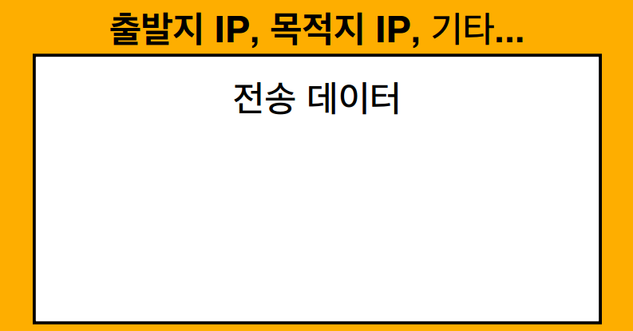
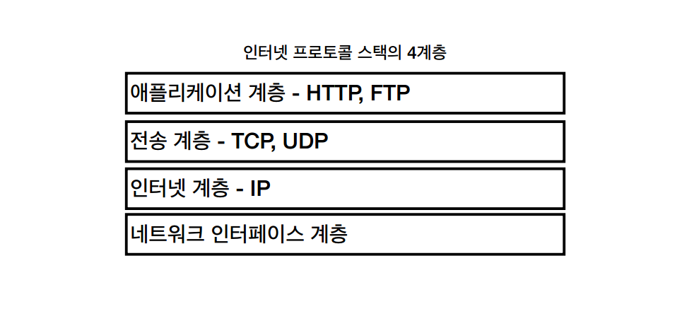
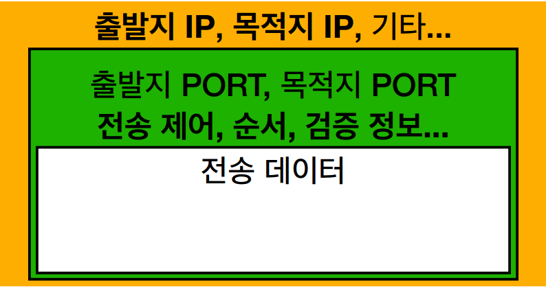
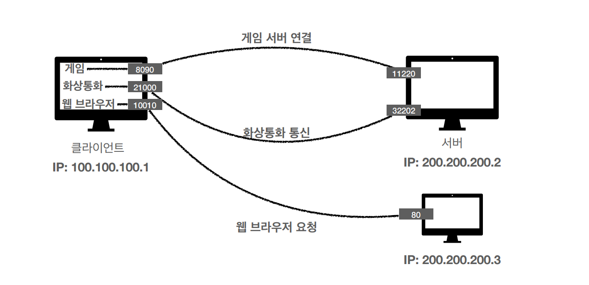

# 인터넷 네트워크

# 인터넷 통신

클라이언트에서 서버로 메세지를 보내는 경우, 우리가 보내는 메세지는 인터넷 망을 거쳐서 가게 된다. 이 때 인터넷에는 어떠한 규칙으로 메세지가 보내지게 된다.

---

# IP(인터넷 프로토콜)

- 지정한 IP 주소(IP Address)에 데이터 전달
- 패킷(Packet)이라는 통신 단위로 데이터 전달

	 
    <em>그림 1) IP 패킷 정보</em>

### IP 프로토콜의 한계

- 비연결성
  - 패킷을 받을 대상이 없거나 서비스 불능 상태여도 패킷 전송
- 비신뢰성
  - 중간에 패킷이 사라지면?
  - 패킷이 순서대로 안오면?
- 프로그램 구분
  - 같은 IP를 사용하는 서버에서 통신하는 애플리케이션이 둘 이상이면?

---

# TCP, UDP

### 인터넷 프로토콜의 4계층

	 
    <em>그림 2) 인터넷 프로토콜 4계층</em>

### TCP/IP 패킷 정보

	 
    <em>그림 3) TCP/IP</em>

### TCP 특징(전송 제어 프로토콜 Transmission Control Protocol)

- 연결지향 - 3 way handshake (가상 연결)
- 데이터 전달 보증
- 순서 보장
- 신뢰할 수 있는 프로토콜
- 현재는 대부분 TCP 사용

### UDP 특징(사용자 데이터그램 프로토콜 User Datagram Protocol)

- IP와 거의 같음 + PORT + Checksum
- 최근에 HTTP 3.0이 나오면서 채택됨

---

# PORT

### 같은 IP 내에서 프로세스 구분

	 
    <em>그림 4) 프로세스 구분</em>

- 0 ~ 65535 → 할당 가능
- 0 ~ 1023 → 잘 알려진 포트, 사용하지 않는 것이 좋음
  - FTP - 20, 21
  - TELNET - 23
  - HTTP - 80
  - HTTPS - 443

---

# DNS

- 전화번호부
- 도메인 명을 IP 주소로 변환
