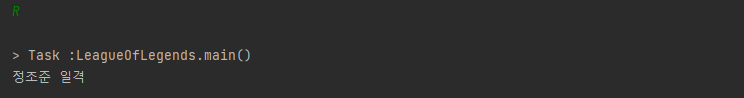
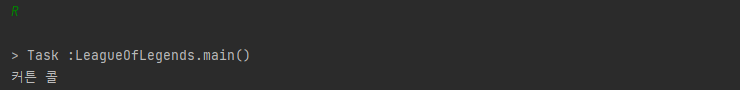

# 1. 객체 지향(Object-Oriented)이란?

우선 객체(Object)란 무엇일까? 우리 주변에는 많은 물체들이 있다. 옷, 컴퓨터, 물 등과 같은 사물부터 사람, 고양이와 같은 동물까지 이러한 물체 하나하나를 우리는 객체라고 부른다. 따라서 객체 지향은 실생활에서 사용되는 물체를 하나의 단위로써 나누고, 이들간의 상호작용을 통해 프로그램을 설계하고 개발하는 것을 의미한다.

다음은 [위키백과](https://ko.wikipedia.org/wiki/%EA%B0%9D%EC%B2%B4_%EC%A7%80%ED%96%A5_%ED%94%84%EB%A1%9C%EA%B7%B8%EB%9E%98%EB%B0%8D)에서 정의한 객체 지향 프로그래밍의 의미이다.

> **객체 지향 프로그래밍**(Object-Oriented Programming, OOP)은 [컴퓨터 프로그래밍](https://ko.wikipedia.org/wiki/%EC%BB%B4%ED%93%A8%ED%84%B0_%ED%94%84%EB%A1%9C%EA%B7%B8%EB%9E%98%EB%B0%8D)의 [패러다임](https://ko.wikipedia.org/wiki/%ED%8C%A8%EB%9F%AC%EB%8B%A4%EC%9E%84) 중 하나이다. 객체 지향 프로그래밍은 [컴퓨터 프로그램](https://ko.wikipedia.org/wiki/%EC%BB%B4%ED%93%A8%ED%84%B0_%ED%94%84%EB%A1%9C%EA%B7%B8%EB%9E%A8)을 [명령어](<https://ko.wikipedia.org/wiki/%EB%AA%85%EB%A0%B9%EC%96%B4_(%EC%BB%B4%ED%93%A8%ED%8C%85)>)의 목록으로 보는 시각에서 벗어나 여러 개의 독립된 단위, 즉 "[객체](<https://ko.wikipedia.org/wiki/%EA%B0%9D%EC%B2%B4_(%EC%BB%B4%ED%93%A8%ED%84%B0_%EA%B3%BC%ED%95%99)>)"들의 모임으로 파악하고자 하는 것이다. 각각의 객체는 [메시지](https://ko.wikipedia.org/wiki/%EB%A9%94%EC%8B%9C%EC%A7%80)를 주고받고, [데이터](https://ko.wikipedia.org/wiki/%EB%8D%B0%EC%9D%B4%ED%84%B0)를 처리할 수 있다.
> 객체 지향 프로그래밍은 프로그램을 유연하고 변경이 쉽게 만들기 때문에 대규모 [소프트웨어 개발](https://ko.wikipedia.org/wiki/%EC%86%8C%ED%94%84%ED%8A%B8%EC%9B%A8%EC%96%B4_%EA%B0%9C%EB%B0%9C)에 많이 사용된다.

여기서 핵심 키워드는 **유연하고 변경이 용이**하다는 점이다. 이 말은 곧 컴포넌트의 변경이 필요할 때 쉽게 갈아끼울 수 있다라는 말과 일맥상통한데 이게 바로 객체 지향의 중요한 특징 중 하나인 다형성(Polymorphism)이다. 다른 특징들(상속, 캡슐화, 추상화)도 있지만, 가장 중요하다고 생각이 드는 특징이 다형성이기 때문에 다형성만 이야기하도록 하겠다.

## 1.1. 다형성(Polymorphism)

자바에서는 인터페이스와 클래스를 통해 역할과 구현을 분리함으로써 유연하고 변경에 용이한 개발을 할 수 있게 된다.

내가 좋아하는 게임인 리그오브레전드를 예로 들어보겠다. 롤에서는 매 게임마다 자신이 플레이할 챔피언을 선택해야 한다. 이 챔피언이라는 인터페이스는 역할과 구현으로 나누었을 때 역할을 의미한다.

```java
public interface Champion {
    void qSkill();
    void wSkill();
    void eSkill();
    void rSkill();
}
```

<p align="center">
	<em>코드 1) 인터페이스로 구현한 리그오브레전드 챔피언</em>
</p>

롤의 챔피언은 Q, W, E, R 스킬을 가지고 있다.

그리고 이 챔피언 인터페이스를 상속하는 이즈리얼과 진이라는 클래스가 있다. (내가 좋아함)

-   이즈리얼 클래스를 구현한 코드

```java
public class Ezreal implements Champion {

    @Override
    public void qSkill() {
        System.out.println("신비한 화살");
    }

    @Override
    public void wSkill() {
        System.out.println("정수의 흐름");
    }

    @Override
    public void eSkill() {
        System.out.println("비전 이동");
    }

    @Override
    public void rSkill() {
        System.out.println("정조준 일격");
    }
}
```

<p align="center">
	<em>코드 2) Champion 인터페이스를 상속하는 Ezreal 클래스</em>
</p>

-   진 챔피언을 구현한 코드

```java
public class Jhin implements Champion{

    @Override
    public void qSkill() {
        System.out.println("춤추는 유탄");
    }

    @Override
    public void wSkill() {
        System.out.println("살상 연희");
    }

    @Override
    public void eSkill() {
        System.out.println("강제 관람");
    }

    @Override
    public void rSkill() {
        System.out.println("커튼 콜");
    }
}
```

<p align="center">
	<em>코드 3) Champion 인터페이스를 상속하는 Jhin 클래스</em>
</p>

이즈리얼이라는 클래스는 자신만의 스킬을 가지고 있다. 그리고 이를 가지고 다음과 같이 리그오브레전드에서 게임을 즐길 수 있다.

```java
public class LeagueOfLegends {
    public static void main(String[] args) {
        Champion pickedChampion = new Ezreal();

        char event = new Scanner(System.in).next().toUpperCase().charAt(0);

        switch(event){
            case 'Q':
                pickedChampion.qSkill();
                break;
            case 'W':
                pickedChampion.wSkill();
                break;
            case 'E':
                pickedChampion.eSkill();
                break;
            case 'R':
                pickedChampion.rSkill();
                break;
        }
    }
}
```

<p align="center">
	<em>코드 4) 리그오브레전드를 플레이하는 코드</em>
</p>

<p align="center">
	<br>
	<em>그림 1) R 스킬을 사용하여 이즈리얼 궁극기를 사용하는 모습</em>
</p>

이번 판은 다 즐겼다. 그런데 다음 번에는 진이라는 챔피언을 플레이하고 싶으면 어떻게 하면 될까? 단순하다. 현재는 `pickedChampion`이 `new Ezreal()`이라는 객체를 의존하고 있지만 `new Jhin()`이라는 객체를 의존하도록 만들면 되는 것이다!

<p align="center">
	<br>
	<em>그림 2) R 스킬을 사용하여 진 궁극기를 사용하는 모습</em>
</p>

만약에 이런 식으로 설계하지 않았다면 어떻게 됐을까?

**첫 번째**로 수정해야 할 부분이 많아진다. 위의 예시인 경우 작은 프로젝트이기 때문에 참조 변수 타입과 구현체만 갈아끼워주면 되지만 큰 프로젝트일 경우에는 여기저기 변경해야 할 사항이 많아진다.

**두 번째**로 구현체의 기능들이 일관성이 비교적 떨어질 가능성이 높다. 인터페이스에 맞춰 구현하면 그 명세에 맞게 기능들을 오버라이딩하여 구현하기 때문에 일관적일 수 밖에 없는데, 만약 그렇지 않으면 누군가는 tSkill로 구현할 수도 있고, 누군가는 f로 구현하는 등 뒤죽박죽이 될 가능성도 있다.

그렇기 때문에 우리는 다형성을 적극 활용하여 리팩토링에 용이한 코드를 만들어야 한다.

# 2. 객체 지향의 5가지 원칙(SOLID)

SOLID란 클린 코드의 저자로 유명한 로버트 마틴이 객체 지향을 잘 설계하기 위한 5가지 원칙을 각각 앞글자를 따서 만든 용어이다.

## 2.1. SRP 단일 책임 원칙(Single Responsibility Priniciple)

하나의 클래스는 하나의 책임만을 가져야 한다는 원칙이다. 근데 이 때, 하나의 책임이란게 되게 모호한 표현인데, 이 책임은 클 수 있고 작을 수도 있다. 컨텍스트나 상황에 따라 이러한 범위가 달라지는데 중요한 건 리팩토링할 때 그로 인한 파급 효과가 적으면 단일 책임 원칙을 잘 따랐다고 볼 수 있다.

## 2.2. OCP 개방-폐쇄 원칙(Open/Closed Principle)

소프트웨어 요소는 확장에는 열려있으나 변경에는 닫혀있어야 한다는 원칙이다. 아까 위에서 예로 들었던 챔피언(interface)와 이즈리얼(class)의 관계에서도 내가 이즈리얼이 아닌 진을 플레이하고 싶다고해서 이즈리얼 내부 로직을 변경하는 것이 아닌, 새로운 클래스를 만들어서(확장) 사용하라는 의미이다.

그런데 사실 이것만으로는 부족하다. 다음 코드를 보자.

```java
public class LeagueOfLegends {
    public static void main(String[] args) {
        // Champion pickedChampion = new Ezreal();
        // 챔피언을 이즈리얼에서 진으로 변경
        Champion pickedChampion = new Jhin();
    }
}
```

<p align="center">
	<em>코드 5) 사용 챔피언을 이즈리얼에서 진으로 변경한 모습</em>
</p>

위의 코드를 보면 클라이언트 코드에서 구현 객체를 `new Ezreal()`에서 `new Jhin()`으로 **변경**하는 모습을 볼 수 있다. 다형성을 이용했음에도 불구하고 OCP 원칙을 지키지 못하는 것이다. 이를 해결하기 위해서는 별도의 설정 클래스가 필요하다.

## 2.3. LSP 리스코프 치환 원칙(Liskov Substitution Principle)

상위 타입의 객체가 하위 타입의 객체로 치환되어도 프로그램 내부의 동작에는 문제가 없어야 한다는 원칙이다. 이 내용도 아까 위의 챔피언과 이즈리얼 관계로 예를 들면 챔피언이라는 인터페이스에는 Q, W, E, R 스킬이라는 메서드를 오버라이딩 할 수 있게 만들어두었는데, 이즈리얼이라는 구현체에서 Q 스킬 메서드를 점멸이 나가도록 구현하면 리스코프 치환 원칙에 위배되는 것이다.

```java
public class Ezreal implements Champion {

    @Override
    public void qSkill() {
        System.out.println("점멸 사용!");
    }
}
```

<p align="center">
	<em>코드 6) Q 스킬을 사용했을 때 신비한 화살이 아니라 점멸 사용 시 리스코프 치환 원칙 위반</em>
</p>

## 2.4. ISP 인터페이스 분리 원칙(Interface Segregation Principle)

클라이언트가 자신이 이용하지 않는 메서드에 의존하면 안된다는 원칙이다. 롤 챔피언 중 아펠리오스라는 챔피언은 E스킬이 없다.

<p align="center">
	<br>
	<em>그림 3) 롤 챔피언 아펠리오스의 스킬</em>
</p>

그런데 만약 아펠리오스라는 클래스에서 챔피언이라는 인터페이스를 상속받으면 어떻게 될까?

```java
public class Aphelios implements Champion{
    @Override
    public void qSkill() {
        System.out.println("달빛 탄");
    }

    @Override
    public void wSkill() {
        System.out.println("위상 변화");
    }

    @Override
    public void eSkill() {
    }

    @Override
    public void rSkill() {
        System.out.println("월광 포화");
    }
}
```

<p align="center">
	<em>코드 7) 아펠리오스가 챔피언을 상속받아 구현한 모습</em>
</p>

이 경우에 아펠리오스는 E스킬을 이용하지 않지만, 인터페이스를 상속받기 때문에 의존해야만 한다. 이럴 경우 인터페이스를 분리한 다음 여러 개를 상속받는 방식을 써야 의존을 없앨 수 있다.

## 2.5. DIP 의존관계 역전 원칙(Dependency Inversion Principle)

객체는 저수준 모듈보다 고수준 모듈에 의존해야 한다는 원칙을 말한다. 간단하게 얘기하면 인터페이스에 의존하라는 뜻이다. 이것은 앞서 OCP에서 얘기한 문제와도 연관된다. 현재의 리그오브레전드 클라이언트 코드는 챔피언을 고를 때 이즈리얼과 진이라는 저수준 모듈(클래스)에 의존하고 있다. 그렇기 때문에 DIP를 지키지 못한다.

# 3. OCP와 DIP를 지키기 위한 방법

리그오브레전드의 클라이언트 코드에서 OCP와 DIP를 지키게 만들기 위한 방법은 간단한다. 이즈리얼과 진이라는 저수준 모듈 대신 인터페이스를 의존하도록 하게 만들면 된다.

그 방법은 바로 설정 파일을 따로 만드는 것이다.

```java
public class Config {
    public static Champion pick() {
        return new Ezreal();
    }
}
```

<p align="center">
	<em>코드 8) Config 설정 파일</em>
</p>

위와 같이 Champion이라는 인터페이스를 반환하는 메서드를 가지고 있는 Config 클래스를 생성한다.

그리고 클라이언트 코드도 다음과 같이 변경해준다.

```java
public class LeagueOfLegends {
    public static void main(String[] args) {
        Champion pickedChampion = Config.pick();
    }
}
```

<p align="center">
	<em>코드 9) 변경된 클라이언트 코드</em>
</p>

이런 방식으로 구현하면 나중에 내가 이즈리얼을 플레이하든, 진을 플레이하든 간에 리그오브레전드 클라이언트 코드는 전혀 수정할 필요가 없다. 위의 설정 클래스의 값만 변경해주면 게임을 즐길 수 있다.

이러한 방법을 바로 **의존성 주입(Dependency Injection)**이라고 얘기하는데, 이 개념은 우리가 앞으로 배울 스프링에서 **핵심 중의 핵심 키워드**이다. 스프링과 처음과 끝이 스프링 DI 컨테이너이므로 알아두면 좋을 것 같다!!
