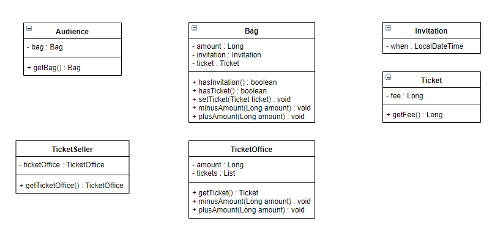

# 객체, 설계

# 이론이 먼저일까, 실무가 먼저일까?

우리는 보통 이론이 먼저 정립되고 이를 바탕으로 실무가 발전한다고 생각하는데 이를 반대라고 주장하는 사람이 있다. 바로 `로버트 L. 글래스`라는 소프트웨어 엔지니어이다.

이 사람의 주장은 초기 단계에서는 아무것도 없는 상태에서 이론을 정립하기보다는 실무를 관찰한 결과를 바탕으로 이론을 정립하는 것이 최선이라고 한다.

특히, 소프트웨어 분야는 다른 공학 분야에 비해 역사가 짧다. 아직 걸음마 단계이기 때문에 이론보다 실무가 앞서 있으며 실무가 더 중요하다고 말한다.

즉, 개발자는 개념과 이론을 공부하는 것보다 실제 코드를 만질 때 가장 많은 것을 얻어간다.

→ 그렇기때문에 실제 애플리케이션을 먼저 구현해보자!

# 티켓 판매 애플리케이션 구현

클래스 다이어그램은 다음과 같다.

<p align="center">
	<br>
	<em>그림 1) 클래스 다이어그램</em>
</p>

해당 애플리케이션을 활용하여 소극장에서 관람객에게 티켓을 제공하는 로직은 다음과 같다.

소극장은 `Bag` 클래스의 `hasInvitation()` 메서드를 활용하여 관람객의 가방 안에 초대장이 들어있는지 확인한다.

1. 만약 초대장이 있으면 이벤트에 당첨된 관람객이므로 `TicketOffice` 클래스의 티켓 리스트에서 하나를 `Bag` 클래스에 제공한다.
2. 만약 초대장이 없으면 현금으로 판매해야하므로 `Bag` 클래스에서 티켓 가격만큼 `amount` 필드를 차감한 후 `TicketOffice` 클래스의 `amount` 필드에 증가시킨다.

   2-1. 그 후 `TicketOffice` 클래스의 티켓 리스트에서 하나를 `Bag` 클래스에 제공한다.

```java
public void enter(Audience audience) {
    if (audience.getBag().hasInvitation()) {
        Ticket ticket = ticketSeller.getTicketOffice().getTicket();
        audience.getBag().setTicket(ticket);
    } else {
        Ticket ticket = ticketSeller.getTicketOffice().getTicket();
        audience.getBag().minusAmount(ticket.getFee());
        ticketSeller.getTicketOffice().plusAmount(ticket.getFee());
        audience.getBag().setTicket(ticket);
    }
}
```

## 문제점

로버트 마틴의 `클린 소프트웨어: 애자일 원칙과 패턴, 그리고 실천 방법`에서는 소프트웨어 모듈이 가져야 하는 세 가지 기능에 대해 설명한다.

> 모든 소프트웨어 모듈에는 세 가지 목적이 있다.

첫 번째 목적은 실행 중에 제대로 동작하는 것이다. 이것은 모듈의 존재 이유라고 할 수 있다.
두 번째 목적은 변경을 위해 존재하는 것이다. 대부분의 모듈은 생명주기 동안 변경되기 때문에 간단한 작업만으로도 변경이 가능해야 한다. 변경하기 어려운 모듈은 제대로 동작하더라도 개선해야 한다.
모듈의 세 번째 목적은 코드를 읽는 사람과 의사소통하는 것이다. 모듈은 특별한 훈련 없이도 개발자가 쉽게 읽고 이해할 수 있어야 한다. 읽는 사람과 의사소통할 수 없는 모듈은 개선해야 한다.

>

우리는 첫 번째 목적은 만족시키지만 두 번째, 세 번째 목적은 만족시키지 못한다. 이에 대해서 한번 알아보자.

### 예상을 빗나가는 코드

`Audience` 클래스와 `TicketSeller` 클래스는 `Theater`에 의해 통제를 받는다. `enter()` 메서드가 현실에서 이루어진다고 생각해보자. 관람객은 티켓을 얻으려고 한다. 소극장에서 관람객에게 티켓을 제공하는 방식은 소극장이 관람객의 가방을 뒤지고, 초대장 여부를 확인하고 초대장이 없다면 마음대로 돈을 가져간다. 이것은 우리의 예상과는 다른 코드이다.

실제 우리가 예상한 코드는 관람객이 직접 돈을 꺼내 판매원에게 지불해야 한다. 위의 코드는 우리의 상식과는 달라 코드를 읽는 사람과 제대로 의사소통할 수 없다.

### 변경에 취약한 코드

더 큰 문제는 **변경에 취약**하다는 것이다.

만약 관람객이 가방을 들고 있지 않거나, 현금이 아니라 카드를 이용해 결제한다면 어떻게 될까? 코드를 수정해야 하는데, 현재 코드는 각각의 클래스들이 너무 여러 곳에서 묶여있다.

만약 `Audience` 클래스에서 `Bag`을 제거한다면 `Theater`의 `enter()` 메서드도 역시 수정해야 한다. 이런 객체 사이에 연관된 무언가를 `의존성(dependency)`라고 칭하며 이 의존성이 과한 경우를 흔히 `결합도(coupling)`가 높다고 말한다. 이 결합도가 높으면 높을수록 변경이 어려워지기 때문에 설계를 할 땐 객체 사이의 결합도를 낮춰야만 한다.

## 설계 개선

위에서 우리는 `Audience`와 `TicketSeller`가 `Theater` 클래스에 묶여있다고 이야기했다. 그리고 그러한 설계는 우리의 예상을 빗나간다고도 했었다. 그렇다면 우리의 예상을 벗어나지 않은 설계는 무엇일까?

바로 `Audience`와 `TicketSeller`를 자율적인 존재로 만들어주는 것이다.
