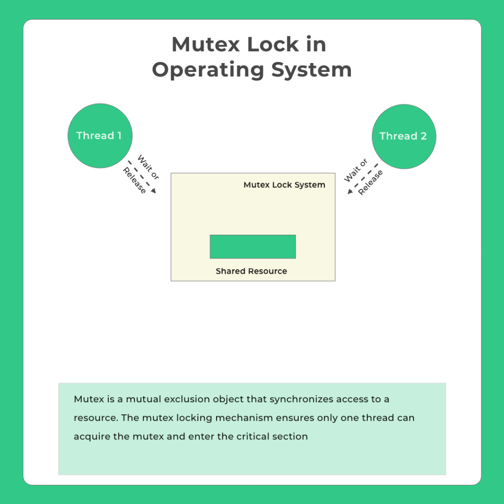
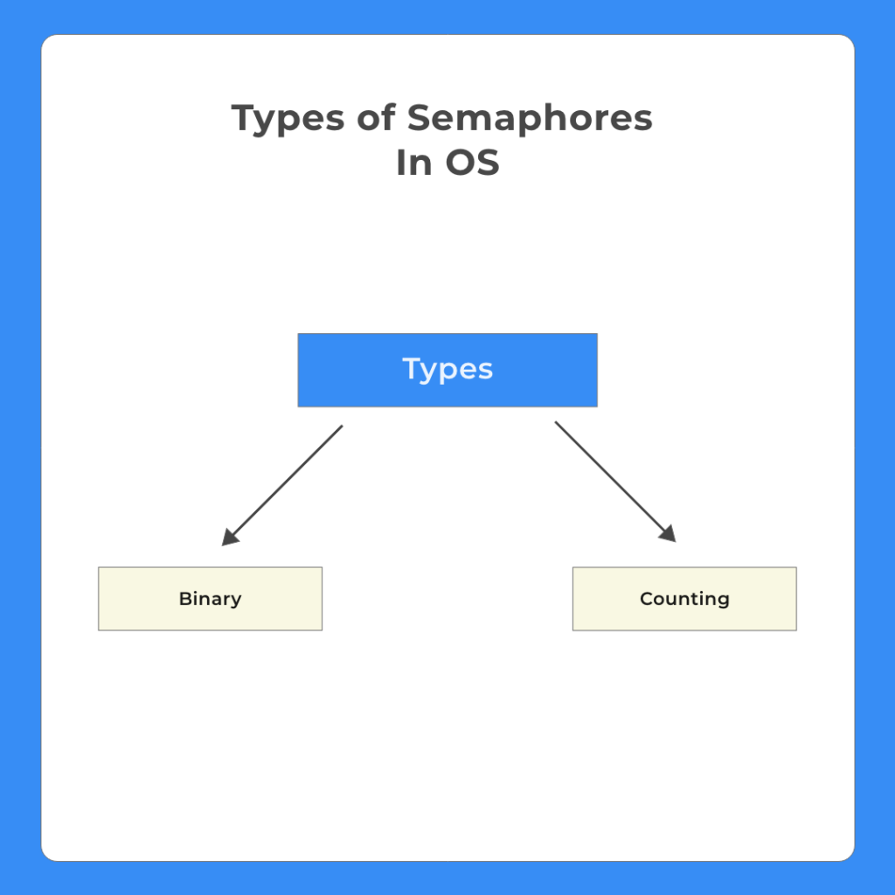

# 1. 동기화(Synchronization)란?

여러 프로세스가 동시에 작업하는 경우 같은 자원에 둘 이상의 프로세스가 동시에 접근하려는 경우가 생길 수 있다. 이 경우에 이 자원의 데이터 일관성이 깨질 수 있기 때문에 이런 상황을 방지해야만 하는데, 이 때 사용되는 기법이 `동기화`다.

# 2. 동기화 기법

## 2.1. Mutex

Mutual Exclusion의 앞의 몇 글자를 따와서 지어진 이름이고 말 그대로 상호 배제를 지키기 위해서 만들어진 커널 리소스다. Critical Section에 진입하기 전 다른 쓰레드로부터 Lock이 걸렸는지 먼저 확인한다. 그리고 잠금이 해제되면 본인의 Lock을 걸고 임계 구역을 실행한 후 빠져나갈 때 Lock을 다시 해제한다.

    <a href="https://prepinsta.com/operating-systems/mutex/">
         
        <em>그림 1) Mutex의 동작 방식</em>
    </a>

뮤텍스는 본질적으로 바이너리로 작동하며 잠금 및 해제로 공유 자원에 대한 접근을 관리하므로 잠금 메커니즘으로 본다.

## 2.2. Semaphore

세마포어는 신호기라는 뜻을 가지고 있다. 이러한 세마포어는 두 가지 타입을 가지고 있다. 첫 번째는 `Binary Semaphore`이고 두 번째는 `Counting Semaphore`이다.

    <a href="https://prepinsta.com/operating-systems/mutex/">
         
        <em>그림 1) 세마포어의 타입 두 가지</em>
    </a>

바이너리 세마포어는 true, false 혹은 0, 1로 이루어진 값을 가진다. 프로세스가 임계 영역에 접근하려고 하면 다음과 같은 순서로 접근이 이루어진다.

- 프로세스가 임계 영역에 접근하려고 한다. 세마포어의 값을 확인한다.
    1. 만약 값이 1이면 프로세스가 임계 영역에 들어간다. 그리고 `wait()` 메서드를 실행하고 세마포어의 값을 0으로 변경한다.
    2. 만약 값이 0이면 프로세스가 임계 영역에 들어가지 못하고 대기한다. `signal()` 메서드에 의해 세마포어의 값이 1로 바뀌면 프로세스가 임계 영역에 접근할 수 있게 된다.

카운팅 세마포어도 비슷한 순서로 동작한다. 대신 카운팅 세마포어의 경우 값이 2 이상이 될 수 있어 여러 프로세스가 동시에 CS에 접근할 수 있게 된다. 동시 접근 가능한 프로세스의 수는 카운팅 세마포어의 값과 같다.

## 2.3. Monitor

모니터는 쓰레드간 Mutual Exclusion을 적용하기 위해서 만들어진 동기화 기술이다. 큐와 공유 자원으로 이루어져 있으며 임계 구역을 하나의 쓰레드에서 접근할 수 있게 만들어준다.