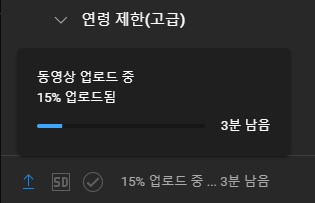
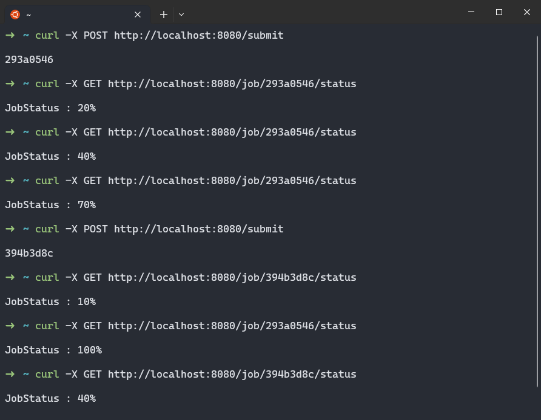

# 폴링(Polling)

날짜: 2024년 4월 22일
카테고리: pattern

## 0. 개요

HTTP 통신에서는 서버에 특정 이벤트가 발생해도, 클라이언트가 요청하지 않는 이상 이벤트를 알릴 방법이 없다. HTTP는 항상 요청이 있어야만 응답이 이루어지기 때문이다.

따라서 클라이언트와 서버의 실시간 통신을 위해 다양한 해결법이 나타났다.

그 중 하나인 Polling 방식에 대해서 알아보고자 한다.

## 1. 폴링(Polling)

폴링은 일정한 주기를 가지고 서버에 이벤트가 발생했는지 지속적으로 체크하는 방식이다. 유튜브 영상 업로드를 예시를 들어보자.

<p align="center">
  <br>
  <em>그림 1) 유튜브 영상 업로드 시 progress bar</em>
</p>

유튜브 영상을 업로드할 때 위와 같이 얼마나 업로드 되었는지, 남은 시간은 얼마나 남았는지 확인할 수 있다.

이러한 기능을 Polling으로 구현할 수 있다. 유튜브에 영상 업로드를 요청한 뒤, 해당 태스크의 ID를 받은 후 영상 업로드가 얼마나 남았는지 주기적으로 요청하는 방식으로 구현하는 것이다.

## 2. 장점

- 구현이 간단하다
- 실행하는 데 오래 걸리는 요청에 적합하다. → 긴 요청 하나를 여러 개로 나누는 느낌이다.

## 3. 단점

- 너무 요청이 많아진다. → 네트워크에 부하가 심해질 수 있다.

## 4. 간단한 구현

```java
import java.util.Map;
import java.util.UUID;
import java.util.concurrent.ConcurrentHashMap;
import java.util.concurrent.ExecutorService;
import java.util.concurrent.Executors;

import org.springframework.web.bind.annotation.GetMapping;
import org.springframework.web.bind.annotation.PathVariable;
import org.springframework.web.bind.annotation.PostMapping;
import org.springframework.web.bind.annotation.RestController;

@RestController
public class PollingController {

	Map<String, Job> jobs = new ConcurrentHashMap<>();

	ExecutorService executorService = Executors.newFixedThreadPool(4);

	@PostMapping("/submit")
	public String submit() {
		String jobId = UUID.randomUUID().toString().substring(0, 8);
		updateJob(jobId);
		return "\n" + jobId + "\n\n";
	}

	public void updateJob(String jobId) {
		Job job = new Job(jobId);
		jobs.put(jobId, job);
		executorService.execute(job);
	}

	@GetMapping("/job/{jobId}/status")
	public String checkStatus(@PathVariable String jobId) {
		Job target = jobs.get(jobId);
		return "\nJobStatus : " + target.prg + "%\n\n";
	}
}

```

- submit()은 Job을 생성한다. 이 때 Job은 5초마다 10%씩 진행되고, 100%가 되면 완료된다.
- checkStatus()는 현재 Job이 얼마나 진행되었는지 체크한다.

```java
public class Job implements Runnable {

	String jobId;
	int prg;

	public Job(String jobId) {
		this.jobId = jobId;
		this.prg = 0;
	}

	@Override
	public void run() {
		try {
			while (prg < 100) {
				Thread.sleep(5000);
				prg += 10;
			}
		} catch (InterruptedException e) {
			throw new RuntimeException(e);
		}
	}
}
```

- Job 클래스는 Runnable을 구현한다. Job을 실행 시 5초마다 prg가 10씩 증가하다 100이 되면 종료된다.

<p align="center">
  <br>
  <em>그림 2) curl을 통한 polling 실습</em>
</p>