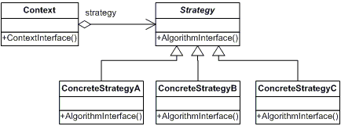
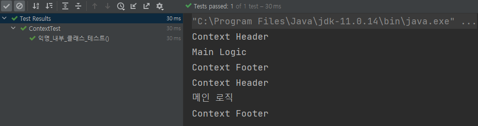
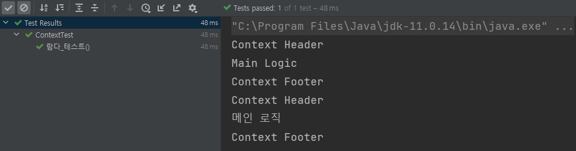
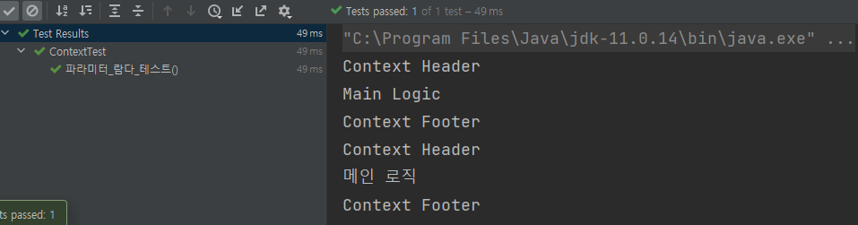

# 전략 패턴

[위키백과](https://ko.wikipedia.org/wiki/%EC%A0%84%EB%9E%B5_%ED%8C%A8%ED%84%B4)에서는 전략 패턴을 다음과 같이 정의한다.

> **전략 패턴**(strategy pattern) 또는 **정책 패턴**(policy pattern)은 실행 중에 [알고리즘](https://ko.wikipedia.org/wiki/%EC%95%8C%EA%B3%A0%EB%A6%AC%EC%A6%98)을 선택할 수 있게 하는 [행위](https://ko.wikipedia.org/w/index.php?title=%ED%96%89%EC%9C%84_%ED%8C%A8%ED%84%B4&action=edit&redlink=1) [소프트웨어 디자인 패턴](https://ko.wikipedia.org/wiki/%EC%86%8C%ED%94%84%ED%8A%B8%EC%9B%A8%EC%96%B4_%EB%94%94%EC%9E%90%EC%9D%B8_%ED%8C%A8%ED%84%B4)이다. 전략 패턴은 특정한 계열의 알고리즘들을 정의하고 각 알고리즘을 캡슐화하며 이 알고리즘들을 해당 계열 안에서 상호 교체가 가능하게 만든다.

전략은 알고리즘을 사용하는 클라이언트와는 독립적으로 다양하게 만든다.[[1]](https://ko.wikipedia.org/wiki/%EC%A0%84%EB%9E%B5_%ED%8C%A8%ED%84%B4#cite_note-1) 전략은 유연하고 재사용 가능한 객체 지향 소프트웨어를 어떻게 설계하는지 기술하기 위해 디자인 패턴의 개념을 보급시킨 [디자인 패턴](<https://ko.wikipedia.org/wiki/%EB%94%94%EC%9E%90%EC%9D%B8_%ED%8C%A8%ED%84%B4_(%EC%B1%85)>)(Gamma 등)이라는 영향력 있는 책에 포함된 패턴들 가운데 하나이다.

>

템플릿 메서드 패턴은 변하지 않는 큰 구조를 만들고, 변하는 부분을 따로 메서드로 만들어 이를 서브 클래스에서 상속하여 해결하는 방식을 사용했다.

전략 패턴은 변하지 않는 부분을 `Context`로 두고 변하는 부분을 `Strategy`라는 인터페이스를 만들고 해당 인터페이스를 구현한다.

<p align="center">
  <br>
  <em>그림 1) 클래스 다이어그램</em>
</p>

그러면 위의 다이어그램을 기준으로 어떻게 사용하는지 한번 알아보자.

## 1. 주입

- Context 클래스

```java
public class Context {
	private Strategy strategy;

  public Context(Strategy strategy) {
      this.strategy = strategy;
  }

  public void execute() {
		System.out.println("Context Header");
    strategy.call();
    System.out.println("Context Footer");
  }
}
```

`execute()` 메서드에서 Context Header나 Context Footer는 변하지 않는 부분이고, 변하는 부분은 `call()` 메서드를 통해서 런타임 때 들어갈 것이다.

- Strategy 인터페이스

```java
public interface Strategy {
  void call();
}
```

메서드를 **하나**만 가지고 있는 단순 인터페이스이다.

이제 테스트에서 사용해보겠다.

---

1. 익명 내부 클래스 사용

```java
@Test
public void 익명_내부_클래스_테스트() throws Exception {
  Context context1 = new Context(new Strategy() {
    @Override
    public void call() {
      System.out.println("Main Logic");
    }
  });

  context1.execute();

  Context context2 = new Context(new Strategy() {
    @Override
    public void call() {
      System.out.println("메인 로직");
    }
  });

  context2.execute();
}
```

<p align="center">
  <br>
  <em>그림 2) 결과 콘솔</em>
</p>

위와 같이 익명 내부 클래스를 이용해서 전략 패턴을 사용할 수 있다.

1. 람다 사용

전략 패턴에서는 인터페이스를 사용하면서 람다를 이용할 수 있게 되었다. 람다를 이용하면 조금 더 간결한 코드가 가능해질 것이다.

```java
@Test
public void 람다_테스트() throws Exception {
  Context context1 = new Context(() -> System.out.println("Main Logic"));
  context1.execute();

  Context context2 = new Context(() -> System.out.println("메인 로직"));
  context2.execute();
}
```

<p align="center">
  <br>
  <em>그림 3) 결과 콘솔</em>
</p>

람다를 이용해도 결과가 똑같이 나오는 것을 확인할 수 있다.

## 2. 파라미터 사용

- Context 클래스

```java
public class Context {
  public void execute(Strategy strategy) {
    System.out.println("Context Header");
    strategy.call();
    System.out.println("Context Footer");
  }
}
```

Strategy 인터페이스는 변하는 부분이 없으므로 새로 작성하지 않는다.

그럼 테스트 코드에서 확인해보자. 테스트 코드는 람다로만 작성해보겠다.

```java
@Test
public void 파라미터_람다_테스트() throws Exception {
  Context context = new Context();

  context.execute(() -> System.out.println("Main Logic"));
  context.execute(() -> System.out.println("메인 로직"));
}
```

<p align="center">
  <br>
  <em>그림 4) 결과 콘솔</em>
</p>

결과가 똑같이 나오는 것을 확인할 수 있다.
