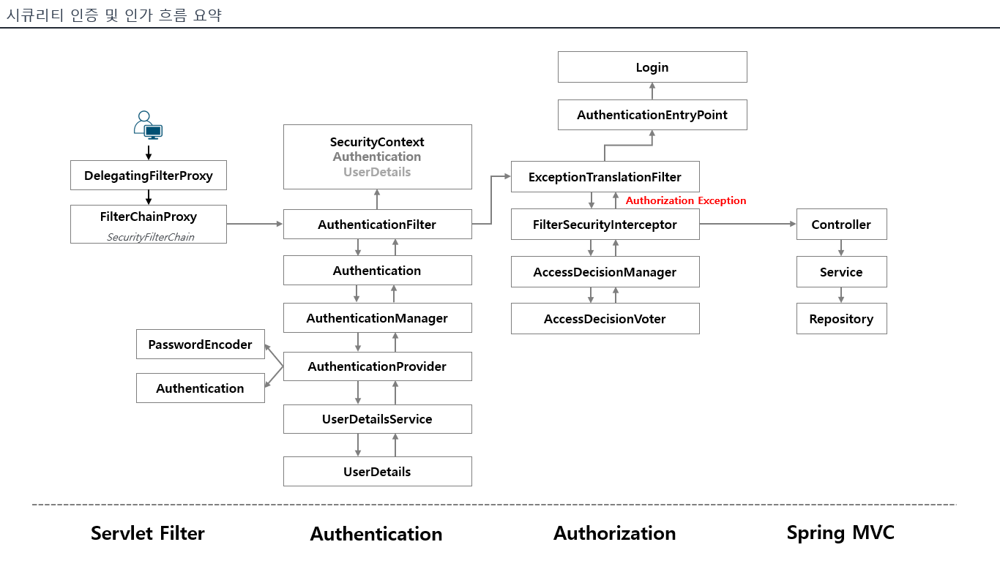

# 스프링 시큐리티 인증 및 인가 흐름

## 인증

1. 사용자가 서버에 요청을 보낸다.
2. 해당 요청을 `DelegatingFilterProxy`가 받는다.
    - 해당 클래스는 요청을 처음 받는 필터로 서블릿 컨테이너, 즉 WAS이다. 서블릿 컨테이너는 DI 기능이 없기 때문에 해당 클래스에서 요청을 받아 스프링 컨테이너에서 관리하는 클래스로 요청을 전달한다.
3. FilterChainProxy로 요청을 그대로 전달한다.
4. 인증 요청인 경우 `AuthenticationFilter`에서 인증을 진행함.
5. 요청에서 들어온 ID와 비밀번호 정보를 `Authentication` 타입의 객체에 저장한다.
6. `AuthenticationManager`에서 인증 가능한 Provider를 찾아 인증을 위임한다.
7. `AuthenticationProvider`에서 DB에 동일한 ID를 가진 유저가 있는지 확인하고, 유저가 있다면 비밀번호를 검증한 후 인증을 성공하면 `Authentication` 객체를 리턴한다.
8. `Authentication` 객체를 `SecurityContext`에 저장한다.

## 인가

1. `FilterSecurityInterceptor`에서 요청에 대한 접근이 가능할 것인지 체크하기 위해 요청을 처리함.
2. `AccessDecisionManager`가 `AccessDecisionVoter`에 인가가 되는지 물어봄
3. `AccessDecisionVoter`가 인가가 가능한지 투표함